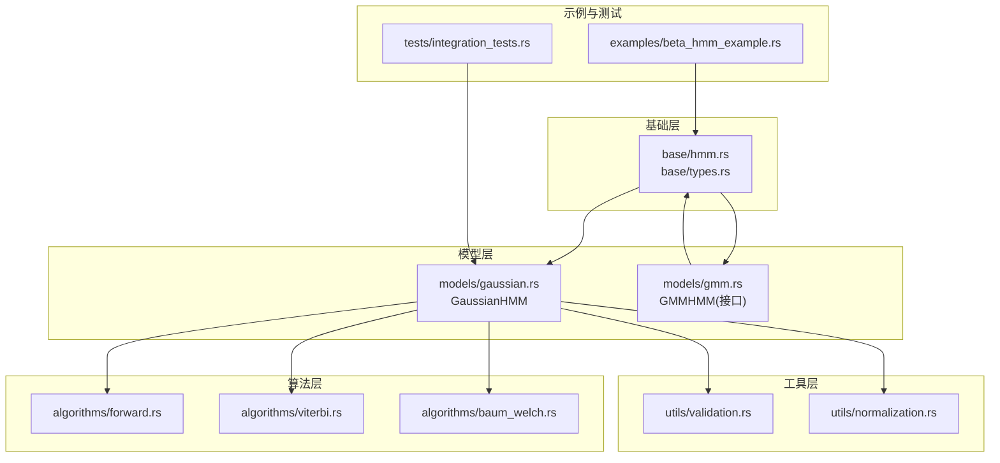

# 高斯混合模型 HMM

<cite>
**本文引用的文件**
- [README.md](file://README.md)
- [lib.rs](file://src/lib.rs)
- [hmm.rs](file://src/base/hmm.rs)
- [types.rs](file://src/base/types.rs)
- [gmm.rs](file://src/models/gmm.rs)
- [gaussian.rs](file://src/models/gaussian.rs)
- [forward.rs](file://src/algorithms/forward.rs)
- [viterbi.rs](file://src/algorithms/viterbi.rs)
- [bacon_welch.rs](file://src/algorithms/baum_welch.rs)
- [validation.rs](file://src/utils/validation.rs)
- [normalization.rs](file://src/utils/normalization.rs)
- [integration_tests.rs](file://tests/integration_tests.rs)
- [beta_hmm_example.rs](file://examples/beta_hmm_example.rs)
</cite>

## 目录
1. [简介](#简介)
2. [项目结构](#项目结构)
3. [核心组件](#核心组件)
4. [架构总览](#架构总览)
5. [详细组件分析](#详细组件分析)
6. [依赖关系分析](#依赖关系分析)
7. [性能考量](#性能考量)
8. [故障排查指南](#故障排查指南)
9. [结论](#结论)
10. [附录](#附录)

## 简介
本技术文档围绕高斯混合发射分布的隐马尔可夫模型（GMM-HMM）展开，结合仓库中已实现的高斯 HMM（GaussianHMM）与 GMM-HMM 的接口设计，系统阐述以下主题：
- 数学原理：高斯混合发射分布相较单一高斯分布的建模优势与复杂度权衡
- 参数估计：K-means 初始化策略与期望最大化（EM）流程
- 模型选择：混合成分数量 n_mix 的选取原则与过拟合预防
- 使用示例：如何在 Rust 中通过统一的 HMM 接口训练与推理
- 性能与优化：数值稳定性、内存与计算复杂度优化建议

说明：当前仓库中 GMM-HMM 的训练与推理方法仍处于占位实现（TODO），本文以 GaussianHMM 的完整实现为基础，给出 GMM-HMM 的预期行为与扩展路径。

## 项目结构
该仓库采用模块化组织，核心分为基础接口、模型实现、算法与工具模块，并提供示例与测试用例：
- 基础层：定义 HMM 核心 trait 与通用类型别名
- 模型层：GaussianHMM（已实现）、GMMHMM（接口定义，训练/推理占位）
- 算法层：前向、后向、维特比、Baum-Welch（部分占位）
- 工具层：参数校验、归一化、序列切分等
- 示例与测试：演示 Beta HMM 与集成测试覆盖 GaussianHMM

图表来源
- [lib.rs](file://src/lib.rs#L19-L28)
- [hmm.rs](file://src/base/hmm.rs#L6-L62)
- [types.rs](file://src/base/types.rs#L17-L29)
- [gaussian.rs](file://src/models/gaussian.rs#L14-L32)
- [gmm.rs](file://src/models/gmm.rs#L11-L42)
- [forward.rs](file://src/algorithms/forward.rs#L20-L47)
- [viterbi.rs](file://src/algorithms/viterbi.rs#L20-L74)
- [bacon_welch.rs](file://src/algorithms/baum_welch.rs#L25-L44)
- [validation.rs](file://src/utils/validation.rs#L58-L74)
- [normalization.rs](file://src/utils/normalization.rs#L5-L35)
- [beta_hmm_example.rs](file://examples/beta_hmm_example.rs#L11-L13)
- [integration_tests.rs](file://tests/integration_tests.rs#L7-L8)

章节来源
- [lib.rs](file://src/lib.rs#L19-L28)
- [README.md](file://README.md#L1-L303)

## 核心组件
- HMM 核心 trait：统一的 fit/predict/score/sample/deocde 接口，支持多序列长度输入
- 类型别名：转移矩阵、初始概率、观测序列、状态序列
- 高斯 HMM：完整的发射密度（含对角/球面/满/绑四种协方差类型）、参数初始化、EM 训练、Viterbi 解码、采样
- GMM-HMM：接口定义与占位实现，预留 n_mix 混合成分参数
- 算法模块：前向/后向/维特比/Baum-Welch（部分占位）
- 工具模块：参数合法性校验、概率向量/矩阵行归一化、log/exp 归一化

章节来源
- [hmm.rs](file://src/base/hmm.rs#L6-L62)
- [types.rs](file://src/base/types.rs#L17-L29)
- [gaussian.rs](file://src/models/gaussian.rs#L14-L32)
- [gmm.rs](file://src/models/gmm.rs#L11-L42)
- [forward.rs](file://src/algorithms/forward.rs#L20-L47)
- [viterbi.rs](file://src/algorithms/viterbi.rs#L20-L74)
- [bacon_welch.rs](file://src/algorithms/baum_welch.rs#L25-L44)
- [validation.rs](file://src/utils/validation.rs#L58-L74)
- [normalization.rs](file://src/utils/normalization.rs#L5-L35)

## 架构总览
下图展示了 GaussianHMM 的训练与推理主流程，以及与算法模块的交互关系。

图表来源
- [gaussian.rs](file://src/models/gaussian.rs#L337-L491)
- [forward.rs](file://src/algorithms/forward.rs#L20-L47)
- [viterbi.rs](file://src/algorithms/viterbi.rs#L20-L74)

## 详细组件分析

### 高斯 HMM（GaussianHMM）实现要点
- 发射密度与协方差类型
  - 支持对角、球面、满/绑协方差；对角/球面直接使用对角元素计算高斯密度，满/绑类型保留扩展点
- 参数初始化策略
  - 初始状态概率均匀化
  - 转移矩阵均匀化
  - 均值随机从观测中抽取
  - 方差基于整体数据特征设定并设最小阈值
- 参数估计（EM）
  - E 步：前向/后向计算，gamma（状态占用概率）与 xi（状态转移概率）统计
  - M 步：更新初始概率、转移矩阵、均值与方差
  - 收敛控制：最大迭代次数与对数似然增量阈值
- 解码与评分
  - predict 使用维特比算法
  - score 使用前向算法返回对数似然
- 采样
  - 从已学习的参数生成观测与状态序列

图表来源
- [gaussian.rs](file://src/models/gaussian.rs#L14-L32)
- [gaussian.rs](file://src/models/gaussian.rs#L102-L194)
- [gaussian.rs](file://src/models/gaussian.rs#L196-L222)
- [gaussian.rs](file://src/models/gaussian.rs#L224-L270)
- [gaussian.rs](file://src/models/gaussian.rs#L272-L325)
- [types.rs](file://src/base/types.rs#L17-L29)

章节来源
- [gaussian.rs](file://src/models/gaussian.rs#L102-L194)
- [gaussian.rs](file://src/models/gaussian.rs#L196-L222)
- [gaussian.rs](file://src/models/gaussian.rs#L224-L270)
- [gaussian.rs](file://src/models/gaussian.rs#L272-L325)
- [gaussian.rs](file://src/models/gaussian.rs#L337-L491)
- [gaussian.rs](file://src/models/gaussian.rs#L493-L544)
- [gaussian.rs](file://src/models/gaussian.rs#L546-L611)

### GMM-HMM 接口与占位实现
- 结构体字段：n_states、n_features、n_mix、协方差类型、拟合标记
- 关键方法：
  - fit：设置 n_features 并进行观测维度校验，标记 is_fitted，当前为占位（TODO）
  - predict/score/sample：检查 is_fitted 后返回占位结果（TODO）

图表来源
- [gmm.rs](file://src/models/gmm.rs#L11-L42)
- [gmm.rs](file://src/models/gmm.rs#L53-L107)

章节来源
- [gmm.rs](file://src/models/gmm.rs#L11-L42)
- [gmm.rs](file://src/models/gmm.rs#L53-L107)

### 算法模块（前向/后向/维特比/Baum-Welch）
- 前向算法：计算前向概率矩阵，用于序列对数似然估计
- 后向算法：计算后向概率矩阵，配合前向计算状态占用与转移统计
- 维特比算法：寻找最可能的状态序列
- Baum-Welch：占位实现，实际参数估计在 GaussianHMM 内部完成

图表来源
- [forward.rs](file://src/algorithms/forward.rs#L20-L47)

章节来源
- [forward.rs](file://src/algorithms/forward.rs#L20-L47)
- [viterbi.rs](file://src/algorithms/viterbi.rs#L20-L74)
- [bacon_welch.rs](file://src/algorithms/baum_welch.rs#L25-L44)

### 参数估计流程（EM）与收敛判断

图表来源
- [gaussian.rs](file://src/models/gaussian.rs#L383-L487)
- [forward.rs](file://src/algorithms/forward.rs#L20-L47)
- [bacon_welch.rs](file://src/algorithms/baum_welch.rs#L56-L74)

章节来源
- [gaussian.rs](file://src/models/gaussian.rs#L383-L487)

### 参数初始化策略（K-means 引导的启发式）
- 均值初始化：从观测中随机抽取样本作为各状态均值
- 方差初始化：基于整体数据各维度方差设定，避免退化
- 初始/转移概率：均匀分布，保证遍历性与数值稳定

章节来源
- [gaussian.rs](file://src/models/gaussian.rs#L196-L222)

### 与标准高斯 HMM 的区别与复杂度
- 发射分布：高斯 HMM 使用单一高斯；GMM-HMM 使用多个高斯混合，显著提升复杂度与表达能力
- 计算复杂度：GMM-HMM 的发射概率计算随混合成分 n_mix 线性增长，训练时 gamma/xi 统计也相应增加
- 建模精度：GMM-HMM 更适合多峰/非单峰连续分布，但需更谨慎的超参数选择与正则化

章节来源
- [gmm.rs](file://src/models/gmm.rs#L11-L42)
- [gaussian.rs](file://src/models/gaussian.rs#L102-L194)

### 使用示例与最佳实践
- 快速上手：参考 README 中 GaussianHMM 的示例，涵盖训练、预测、评分与采样
- 多序列训练：通过 lengths 参数传入各序列长度，实现跨序列边界训练
- 协方差类型：根据数据特性选择 Diagonal/Spherical/Full/Tied
- 参数校验：利用工具模块确保概率向量与转移矩阵合法

章节来源
- [README.md](file://README.md#L53-L87)
- [README.md](file://README.md#L232-L266)
- [validation.rs](file://src/utils/validation.rs#L58-L74)

## 依赖关系分析
- 模块耦合
  - GaussianHMM 依赖算法模块（前向/后向/维特比）与工具模块（校验/归一化）
  - GMMHMM 仅定义接口，当前不直接依赖具体算法实现
- 外部依赖
  - ndarray、ndarray-linalg、rand、rand_distr、thiserror、serde
- 潜在循环依赖
  - 当前模块间无循环导入；算法模块仅被模型调用，保持单向依赖

图表来源
- [lib.rs](file://src/lib.rs#L19-L28)
- [gaussian.rs](file://src/models/gaussian.rs#L3-L9)
- [gmm.rs](file://src/models/gmm.rs#L3-L6)
- [hmm.rs](file://src/base/hmm.rs#L3-L4)

章节来源
- [lib.rs](file://src/lib.rs#L19-L28)
- [gaussian.rs](file://src/models/gaussian.rs#L3-L9)
- [gmm.rs](file://src/models/gmm.rs#L3-L6)

## 性能考量
- 数值稳定性
  - 使用 log 空间与 log 归一化，避免下溢
  - 对协方差与方差设置最小阈值，防止除零与病态问题
- 计算复杂度
  - 前向/后向/维特比均为 O(T·N^2)，其中 T 为序列长度，N 为状态数
  - GMM-HMM 的发射密度计算随 n_mix 线性增加
- 内存与向量化
  - 使用 ndarray 进行向量化操作，减少中间拷贝
  - 在 E 步中累积 gamma/xi，避免重复计算
- 并行化与扩展
  - 多序列训练可独立处理每个序列，具备并行潜力（当前串行实现）

章节来源
- [normalization.rs](file://src/utils/normalization.rs#L25-L35)
- [gaussian.rs](file://src/models/gaussian.rs#L155-L194)
- [gaussian.rs](file://src/models/gaussian.rs#L383-L487)

## 故障排查指南
- 常见错误
  - 观测为空或维度不匹配：fit 前进行维度校验
  - 模型未拟合即预测/评分：is_fitted 校验
  - 初始概率/转移矩阵非法：概率向量与转移矩阵校验
- 定位方法
  - 使用集成测试中的断言模式定位问题（空观测、维度不匹配、未拟合）
  - 逐步检查 fit 流程中的 E/M 步是否收敛

章节来源
- [validation.rs](file://src/utils/validation.rs#L58-L74)
- [validation.rs](file://src/utils/validation.rs#L6-L26)
- [validation.rs](file://src/utils/validation.rs#L28-L56)
- [integration_tests.rs](file://tests/integration_tests.rs#L88-L102)

## 结论
- GaussianHMM 提供了完整的高斯发射、参数初始化与 EM 训练流程，适配多种协方差结构
- GMM-HMM 接口已就绪，训练与推理逻辑待实现；其核心在于混合成分数量 n_mix 的合理选择与正则化
- 实践中应优先保证数据质量与参数合法性，结合多序列与合适的协方差类型获得更稳健的建模效果

## 附录

### 模型选择与过拟合预防
- 混合成分数量 n_mix 的选择
  - 从小到大评估对数似然与交叉验证指标，观察拐点
  - 结合业务先验：若数据呈现明显多峰，可适当增大 n_mix
- 正则化与约束
  - 对协方差设置最小阈值，避免退化
  - 使用均匀先验或稀疏先验约束转移矩阵
- 早停与收敛
  - 设置合理的最大迭代与对数似然增量阈值
  - 多次随机初始化取最优结果

### GMM-HMM 扩展建议
- 发射密度
  - 实现每状态独立的满/绑协方差矩阵
  - 支持权重归一化的混合权重（注意权重和为 1 的约束）
- 训练
  - 将 Baum-Welch 的 E/M 步迁移到 GMMHMM
  - 实现更高效的 gamma/xi 计算与参数更新
- 推理
  - 维特比与前向算法需改为混合高斯发射密度
  - 采样需按混合权重选择子分布