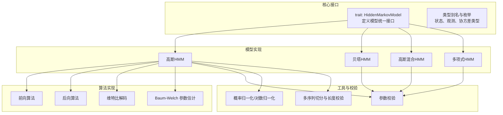
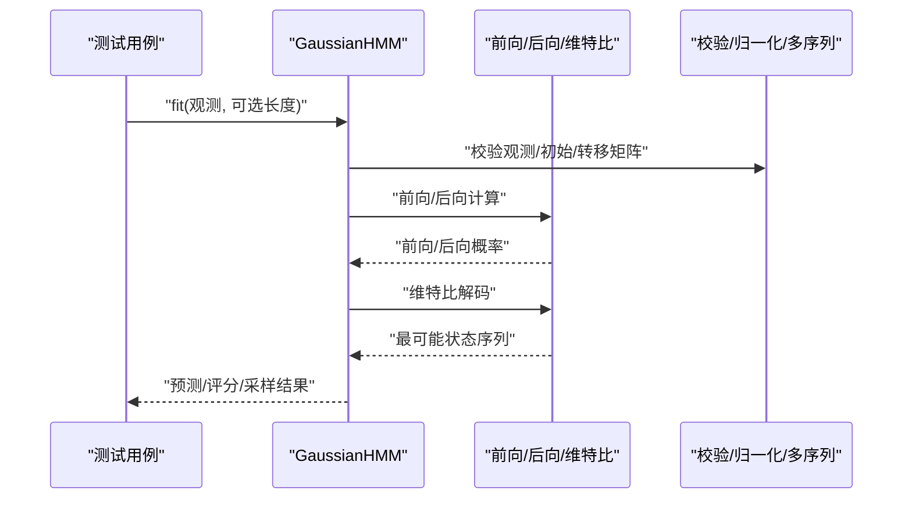
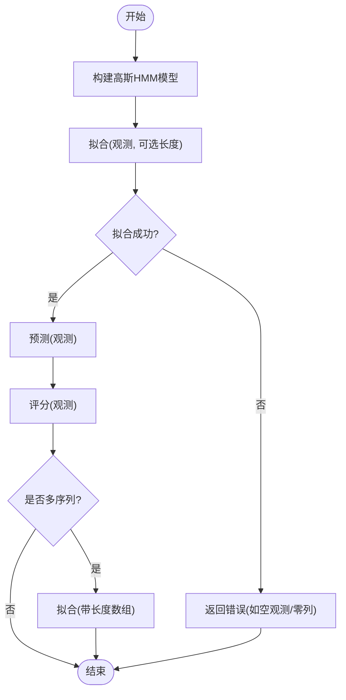
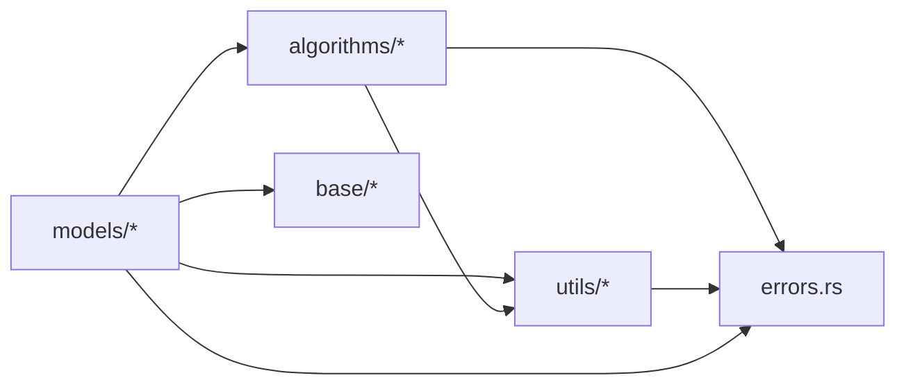

# 测试基准

<cite>
**本文引用的文件**
- [Cargo.toml](file://Cargo.toml)
- [README.md](file://README.md)
- [src/lib.rs](file://src/lib.rs)
- [src/base/mod.rs](file://src/base/mod.rs)
- [src/base/hmm.rs](file://src/base/hmm.rs)
- [src/base/types.rs](file://src/base/types.rs)
- [src/algorithms/mod.rs](file://src/algorithms/mod.rs)
- [src/algorithms/forward.rs](file://src/algorithms/forward.rs)
- [src/algorithms/backward.rs](file://src/algorithms/backward.rs)
- [src/algorithms/viterbi.rs](file://src/algorithms/viterbi.rs)
- [src/models/mod.rs](file://src/models/mod.rs)
- [src/models/gaussian.rs](file://src/models/gaussian.rs)
- [src/utils/mod.rs](file://src/utils/mod.rs)
- [src/utils/validation.rs](file://src/utils/validation.rs)
- [src/utils/normalization.rs](file://src/utils/normalization.rs)
- [src/utils/sequences.rs](file://src/utils/sequences.rs)
- [src/errors.rs](file://src/errors.rs)
- [tests/integration_tests.rs](file://tests/integration_tests.rs)
</cite>

## 目录
1. [引言](#引言)
2. [项目结构](#项目结构)
3. [核心组件](#核心组件)
4. [架构总览](#架构总览)
5. [详细组件分析](#详细组件分析)
6. [依赖关系分析](#依赖关系分析)
7. [性能考虑](#性能考虑)
8. [故障排查指南](#故障排查指南)
9. [结论](#结论)
10. [附录](#附录)

## 引言
本文件面向 rhmm 库的测试与性能基准，系统化梳理单元测试组织、集成测试设计、边界条件覆盖、错误处理与回归策略，并给出性能基准的分析方法与调优建议。文档同时提供测试环境配置、运行方式、持续集成与自动化测试流程建议，以及测试数据生成与验证标准。

## 项目结构
仓库采用按领域分层的模块化组织：核心 trait 定义于 base 层，算法实现于 algorithms，模型实现位于 models，工具函数在 utils，错误类型集中于 errors。测试集中在 tests 目录，当前以集成测试为主，覆盖核心算法一致性、工作流与边界条件。

**图表来源**
- [src/base/hmm.rs](file://src/base/hmm.rs#L7-L61)
- [src/base/types.rs](file://src/base/types.rs#L18-L29)
- [src/algorithms/mod.rs](file://src/algorithms/mod.rs#L1-L12)
- [src/models/mod.rs](file://src/models/mod.rs#L1-L12)
- [src/utils/validation.rs](file://src/utils/validation.rs#L6-L74)
- [src/utils/normalization.rs](file://src/utils/normalization.rs#L5-L35)
- [src/utils/sequences.rs](file://src/utils/sequences.rs#L16-L83)

**章节来源**
- [src/lib.rs](file://src/lib.rs#L19-L28)
- [src/base/mod.rs](file://src/base/mod.rs#L1-L8)
- [src/algorithms/mod.rs](file://src/algorithms/mod.rs#L1-L12)
- [src/models/mod.rs](file://src/models/mod.rs#L1-L12)
- [src/utils/mod.rs](file://src/utils/mod.rs#L1-L12)

## 核心组件
- 接口层：统一的 HiddenMarkovModel trait，定义 fit/predict/score/sample/decode 等能力，支持多序列 lengths 参数。
- 算法层：前向/后向/维特比/Baum-Welch 实现，提供数值稳定与维度检查。
- 模型层：高斯HMM（含多种协方差类型）、贝塔HMM、高斯混合HMM、多项式HMM（预留）。
- 工具层：参数校验、概率归一化、日志空间转换、多序列切分与默认长度。
- 错误层：统一的 HmmError 枚举，涵盖参数、维度、概率、拟合、收敛、数值等错误类型。

**章节来源**
- [src/base/hmm.rs](file://src/base/hmm.rs#L7-L61)
- [src/base/types.rs](file://src/base/types.rs#L18-L29)
- [src/models/gaussian.rs](file://src/models/gaussian.rs#L14-L32)
- [src/utils/validation.rs](file://src/utils/validation.rs#L6-L74)
- [src/utils/normalization.rs](file://src/utils/normalization.rs#L5-L35)
- [src/utils/sequences.rs](file://src/utils/sequences.rs#L16-L83)
- [src/errors.rs](file://src/errors.rs#L9-L34)

## 架构总览
下图展示从模型到算法再到工具的整体交互，以及测试覆盖的关键路径。

**图表来源**
- [tests/integration_tests.rs](file://tests/integration_tests.rs#L10-L27)
- [src/models/gaussian.rs](file://src/models/gaussian.rs#L337-L491)
- [src/algorithms/forward.rs](file://src/algorithms/forward.rs#L20-L47)
- [src/algorithms/backward.rs](file://src/algorithms/backward.rs#L19-L45)
- [src/algorithms/viterbi.rs](file://src/algorithms/viterbi.rs#L20-L74)
- [src/utils/validation.rs](file://src/utils/validation.rs#L58-L74)
- [src/utils/sequences.rs](file://src/utils/sequences.rs#L43-L70)

## 详细组件分析

### 单元测试组织与覆盖范围
- 基础算法测试
  - 前向算法：输入维度、单观测、简单概率初值一致性。
  - 后向算法：末步初始化为1、维度一致性、单观测。
  - 维特比算法：路径长度、确定性路径、对数概率符号。
- 工具函数测试
  - 概率向量校验：求和为1、非负、范围合法。
  - 转移矩阵校验：方阵、行和为1、非负。
  - 观测校验：非空、特征数一致。
  - 归一化与对数归一化：向量/矩阵行归一化、log/exp 互逆。
  - 多序列切分：长度数组校验、切分正确性、默认长度。
- 模型测试
  - 高斯HMM：构造、协方差类型、拟合、预测维度不匹配、未拟合即预测/评分/采样、获取器返回值。
- 集成测试
  - 高斯HMM 工作流：fit 后 is_fitted、predict、score。
  - 前向/后向一致性：维度一致。
  - 维特比确定性路径。
  - 归一化与校验工具使用。
  - 多序列拟合：concat+lengths。
  - 错误处理：空观测、零列、未拟合预测。

**章节来源**
- [src/algorithms/forward.rs](file://src/algorithms/forward.rs#L71-L129)
- [src/algorithms/backward.rs](file://src/algorithms/backward.rs#L47-L90)
- [src/algorithms/viterbi.rs](file://src/algorithms/viterbi.rs#L76-L118)
- [src/utils/validation.rs](file://src/utils/validation.rs#L76-L141)
- [src/utils/normalization.rs](file://src/utils/normalization.rs#L37-L102)
- [src/utils/sequences.rs](file://src/utils/sequences.rs#L85-L153)
- [src/models/gaussian.rs](file://src/models/gaussian.rs#L614-L681)
- [tests/integration_tests.rs](file://tests/integration_tests.rs#L10-L103)

### 集成测试设计理念与场景
- 场景一：高斯HMM完整工作流（拟合→预测→评分），验证端到端可用性。
- 场景二：前向/后向一致性校验，确保算法实现正确。
- 场景三：确定性路径的维特比测试，便于断言。
- 场景四：多序列训练（concat+lengths），覆盖真实业务场景。
- 场景五：错误处理边界（空观测、零列、未拟合即预测）。

**图表来源**
- [tests/integration_tests.rs](file://tests/integration_tests.rs#L10-L27)
- [tests/integration_tests.rs](file://tests/integration_tests.rs#L75-L85)
- [tests/integration_tests.rs](file://tests/integration_tests.rs#L87-L102)

**章节来源**
- [tests/integration_tests.rs](file://tests/integration_tests.rs#L10-L103)

### 性能基准测试（方法与分析）
- 基准目标
  - 不同模型类型（高斯HMM、贝塔HMM、GMM-HMM、多项式HMM）在不同数据规模（样本数、特征数、状态数）下的训练与推理耗时。
  - 多序列长度分布对训练时间的影响。
  - 协方差类型（对角/球面/全/绑）对高斯HMM 训练耗时与稳定性的影响。
- 基准方法
  - 使用基准框架（如 criterion）编写基准测试，固定随机种子以保证可重复性。
  - 生成合成数据集：观测矩阵形状为 (n_samples, n_features)，状态数 n_states，序列长度列表 lengths。
  - 分割维度：样本数（100/1k/10k/100k）、特征数（2/5/10）、状态数（2/4/8）、长度分布（均匀/长尾）。
  - 指标：平均耗时、中位数、分位数、内存分配次数与字节数。
- 结果呈现
  - 表格：各配置组合下的耗时与内存指标。
  - 图表：随样本数增长的渐近行为；不同协方差类型的对比。
- 分析要点
  - 训练阶段主要瓶颈：前向/后向/维特比循环、协方差矩阵运算、EM 迭代收敛判定。
  - 推理阶段瓶颈：发射概率计算（高斯PDF）、维特比回溯。
  - 多序列场景：序列切分与统计累加的开销。

[本节为通用方法论说明，不直接分析具体文件，故无“章节来源”]

### 测试环境配置与运行
- 运行命令
  - 运行全部测试：cargo test
  - 输出详细日志：cargo test -- --nocapture
  - 运行特定测试：cargo test 集成测试名称
- 依赖与工具
  - 开发依赖：approx（相对误差断言）、ndarray、ndarray-linalg、rand、rand_distr、thiserror、serde。
- 并行与隔离
  - 利用 cargo test 的并行执行能力；测试间通过独立的观测数据与随机种子避免相互影响。

**章节来源**
- [Cargo.toml](file://Cargo.toml#L21-L22)
- [README.md](file://README.md#L207-L220)

### 持续集成与自动化测试
- 建议流水线步骤
  - 安装 Rust 工具链（指定版本）。
  - 克隆仓库 → cargo fetch → cargo test（启用并行）。
  - 可选：覆盖率收集（cargo-tarpaulin 或类似工具）。
  - 可选：基准测试（criterion）输出报告。
- 触发策略
  - PR/MR 默认触发；主分支推送可选触发基准回归检测。
- 缓存策略
  - 缓存 Cargo registry 与下载缓存，提升构建速度。

[本节为通用流程建议，不直接分析具体文件，故无“章节来源”]

### 测试数据生成与验证标准
- 生成方法
  - 合成观测：ndarray::Array2，按需设置 (n_samples, n_features)。
  - 多序列：先生成多个短序列，拼接为长序列，并提供长度数组 lengths。
  - 随机种子：在测试中固定或显式传入，确保可复现实验。
- 验证标准
  - 数值稳定性：使用 approx 断言相对误差（如 1e-10）。
  - 维度一致性：nrows/ncols 与期望一致。
  - 概率约束：概率向量和转移矩阵行和为1且非负。
  - 边界条件：空观测、零列、未拟合操作应返回错误。

**章节来源**
- [tests/integration_tests.rs](file://tests/integration_tests.rs#L63-L72)
- [src/utils/validation.rs](file://src/utils/validation.rs#L6-L74)
- [src/utils/normalization.rs](file://src/utils/normalization.rs#L25-L35)

### 回归测试与兼容性测试策略
- 回归测试
  - 对关键工作流（拟合→预测→评分）保留基准断言，防止回归。
  - 对算法一致性（前向/后向维度一致、维特比确定性路径）作为回归基线。
- 兼容性测试
  - 多序列 lengths 与默认长度的兼容性。
  - 不同协方差类型在高斯HMM中的行为一致性。
  - 错误类型与错误消息的稳定性（保持 HmmError 枚举不变）。

**章节来源**
- [tests/integration_tests.rs](file://tests/integration_tests.rs#L29-L60)
- [src/utils/sequences.rs](file://src/utils/sequences.rs#L85-L153)
- [src/base/types.rs](file://src/base/types.rs#L18-L29)
- [src/errors.rs](file://src/errors.rs#L9-L34)

### 性能调优与瓶颈分析指导
- 热路径优化
  - 减少临时对象分配：重用中间数组（alpha/beta/gamma/xi）。
  - 向量化优先：利用 ndarray 的广播与视图，避免不必要的拷贝。
  - 日志空间运算：在发射概率与路径累积中使用 log 操作，避免下溢。
- 算法层面
  - Baum-Welch 收敛阈值与最大迭代次数可调，平衡精度与速度。
  - 多序列训练时，尽量减少跨序列的 xi 累加开销，按序列独立处理。
- 数据层面
  - 特征归一化可改善高斯 PDF 的数值稳定性。
  - 合理选择协方差类型：对角/球面在大特征维度下更高效。
- 基准与监控
  - 使用基准框架定期回归，建立性能基线。
  - 关注内存分配热点，避免在循环内频繁分配。

[本节为通用指导，不直接分析具体文件，故无“章节来源”]

## 依赖关系分析
- 模块耦合
  - models 依赖 algorithms（前向/后向/维特比/Baum-Welch）、utils（校验/归一化/序列处理）、base（类型与 trait）。
  - algorithms 仅依赖 utils 与 errors，保持纯计算模块。
  - utils 为纯工具模块，低耦合。
- 外部依赖
  - ndarray/ndarray-linalg 提供高性能数组与线性代数。
  - rand/rand_distr 提供随机数与分布采样。
  - thiserror/serde 提供错误与序列化支持。

**图表来源**
- [src/models/gaussian.rs](file://src/models/gaussian.rs#L3-L6)
- [src/algorithms/forward.rs](file://src/algorithms/forward.rs#L3-L4)
- [src/utils/validation.rs](file://src/utils/validation.rs#L3-L4)
- [src/errors.rs](file://src/errors.rs#L3)

**章节来源**
- [src/lib.rs](file://src/lib.rs#L19-L28)
- [src/models/gaussian.rs](file://src/models/gaussian.rs#L3-L6)
- [src/algorithms/mod.rs](file://src/algorithms/mod.rs#L1-L12)
- [src/utils/mod.rs](file://src/utils/mod.rs#L1-L12)

## 性能考虑
- 算法复杂度
  - 前向/后向/维特比：O(T·N^2)，T 为序列长度，N 为状态数。
  - Baum-Welch：每轮迭代 O(I·T·N^2)，I 为迭代次数。
- 数值稳定性
  - 使用 log 概率避免下溢；对齐最大值进行指数归一化。
- 内存与分配
  - 尽量复用中间数组，避免在热循环中分配新内存。
- 多序列处理
  - 按序列独立处理，减少跨序列统计带来的额外开销。

[本节为通用讨论，不直接分析具体文件，故无“章节来源”]

## 故障排查指南
- 常见错误与定位
  - InvalidParameter：观测为空、长度数组为空或总和不匹配、协方差类型非法。
  - DimensionMismatch：观测特征数与模型不一致。
  - InvalidProbability：概率向量/转移矩阵不合法。
  - ModelNotFitted：未拟合即进行预测/评分/采样。
  - ConvergenceError：Baum-Welch 收敛失败。
  - NumericalError：数值异常（如正态分布参数非法）。
- 排查步骤
  - 检查输入维度与长度数组之和是否匹配。
  - 校验初始概率与转移矩阵是否满足概率约束。
  - 在多序列场景确认 lengths 与观测行数一致且无零长度。
  - 固定随机种子，复现实验；逐步缩小问题范围。

**章节来源**
- [src/errors.rs](file://src/errors.rs#L9-L34)
- [src/utils/validation.rs](file://src/utils/validation.rs#L6-L74)
- [src/utils/sequences.rs](file://src/utils/sequences.rs#L16-L41)
- [src/models/gaussian.rs](file://src/models/gaussian.rs#L337-L342)

## 结论
本测试文档系统化梳理了 rhmm 的测试与性能基准实践：单元测试覆盖算法、工具与模型的核心逻辑，集成测试验证端到端工作流与边界条件；配合完善的错误处理与验证标准，形成可靠的回归与兼容性保障。建议在现有基础上引入基准框架与 CI 流水线，持续监控性能变化，确保库在不同模型类型与数据规模下的稳定性与效率。

## 附录
- 快速运行测试
  - cargo test
  - cargo test -- --nocapture
  - cargo test 集成测试名称
- 示例参考
  - README 中的使用示例可用于手工验证与回归对照。

**章节来源**
- [README.md](file://README.md#L207-L220)