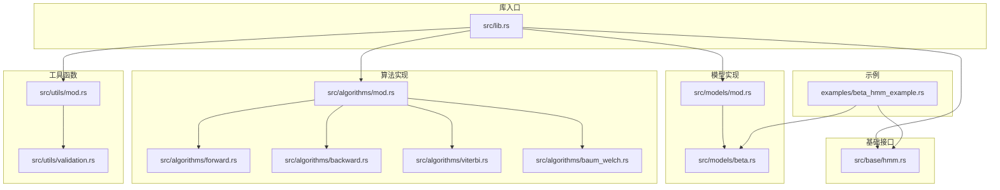
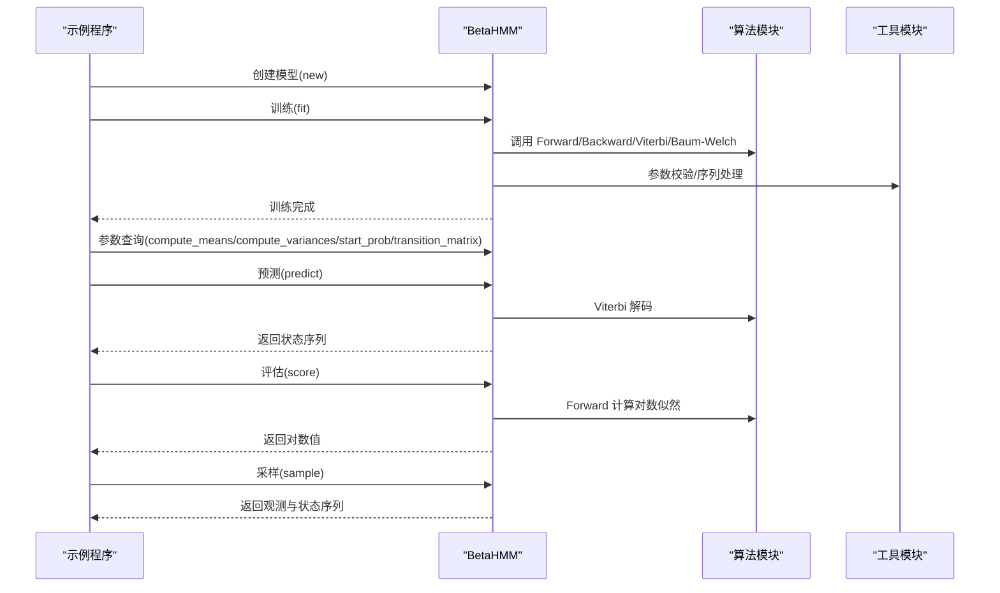
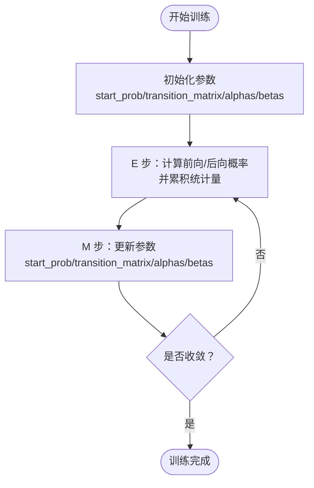
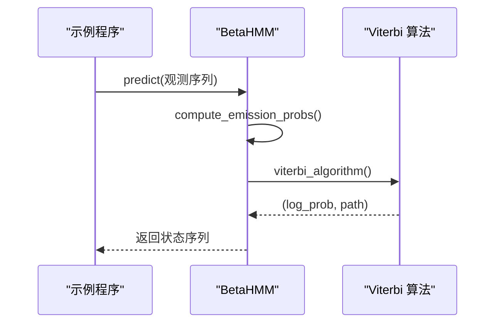
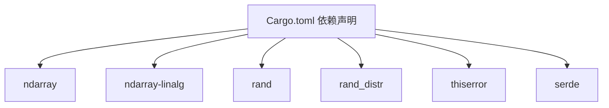

# 基础使用示例

<cite>
**本文引用的文件**
- [examples/beta_hmm_example.rs](file://examples/beta_hmm_example.rs)
- [src/lib.rs](file://src/lib.rs)
- [src/models/beta.rs](file://src/models/beta.rs)
- [src/base/hmm.rs](file://src/base/hmm.rs)
- [src/algorithms/forward.rs](file://src/algorithms/forward.rs)
- [src/algorithms/backward.rs](file://src/algorithms/backward.rs)
- [src/algorithms/viterbi.rs](file://src/algorithms/viterbi.rs)
- [src/algorithms/baum_welch.rs](file://src/algorithms/baum_welch.rs)
- [src/utils/validation.rs](file://src/utils/validation.rs)
- [src/utils/mod.rs](file://src/utils/mod.rs)
- [src/algorithms/mod.rs](file://src/algorithms/mod.rs)
- [src/models/mod.rs](file://src/models/mod.rs)
- [Cargo.toml](file://Cargo.toml)
- [README.md](file://README.md)
</cite>

## 目录
1. [简介](#简介)
2. [项目结构](#项目结构)
3. [核心组件](#核心组件)
4. [架构总览](#架构总览)
5. [详细组件分析](#详细组件分析)
6. [依赖关系分析](#依赖关系分析)
7. [性能考虑](#性能考虑)
8. [故障排查指南](#故障排查指南)
9. [结论](#结论)
10. [附录](#附录)

## 简介
本示例文档面向初学者，基于 rhmm 库中的 Beta HMM 模型，演示如何使用比例数据（范围在 [0,1] 的转换率、点击率等）进行端到端建模与分析。示例涵盖以下完整工作流：
- 数据准备：构造电商每日移动与桌面端转化率序列
- 模型创建：初始化 Beta HMM 并训练
- 参数分析：查看学习到的状态参数（Beta 分布的形状参数）、均值与方差、初始状态概率与转移矩阵
- 预测：使用维特比算法对历史与新数据进行状态预测
- 评估：计算观测序列的对数似然
- 生成：从已训练模型中采样生成新的观测与状态序列

通过清晰的步骤说明与业务场景（电商转化率分析），帮助读者理解每个操作的目的与意义，并能解读模型输出与参数含义。

## 项目结构
rhmm 采用模块化组织，核心模块如下：
- base：定义 HMM 核心 trait（HiddenMarkovModel）
- models：具体模型实现（BetaHMM、GaussianHMM 等）
- algorithms：标准 HMM 算法（Forward、Backward、Viterbi、Baum-Welch）
- utils：验证、归一化、序列处理等工具
- examples：示例程序（本示例文档聚焦于 beta_hmm_example.rs）

图表来源
- [src/lib.rs](file://src/lib.rs#L19-L28)
- [src/base/hmm.rs](file://src/base/hmm.rs#L6-L61)
- [src/models/mod.rs](file://src/models/mod.rs#L1-L12)
- [src/models/beta.rs](file://src/models/beta.rs#L14-L39)
- [src/algorithms/mod.rs](file://src/algorithms/mod.rs#L1-L12)
- [src/algorithms/forward.rs](file://src/algorithms/forward.rs#L6-L47)
- [src/algorithms/backward.rs](file://src/algorithms/backward.rs#L6-L45)
- [src/algorithms/viterbi.rs](file://src/algorithms/viterbi.rs#L6-L74)
- [src/algorithms/baum_welch.rs](file://src/algorithms/baum_welch.rs#L8-L44)
- [src/utils/mod.rs](file://src/utils/mod.rs#L1-L12)
- [src/utils/validation.rs](file://src/utils/validation.rs#L6-L74)
- [examples/beta_hmm_example.rs](file://examples/beta_hmm_example.rs#L1-L266)

章节来源
- [src/lib.rs](file://src/lib.rs#L1-L28)
- [src/models/mod.rs](file://src/models/mod.rs#L1-L12)
- [src/algorithms/mod.rs](file://src/algorithms/mod.rs#L1-L12)
- [src/utils/mod.rs](file://src/utils/mod.rs#L1-L12)

## 核心组件
- HiddenMarkovModel trait：定义 fit、predict、score、sample 等统一接口，所有模型需实现
- BetaHMM：以 Beta 分布作为发射分布的 HMM，适合建模 [0,1] 区间的比例数据
- Forward/Backward/Viterbi/Baum-Welch 算法：实现前向、后向、维特比解码与 EM 训练
- 工具函数：参数校验（概率向量、转移矩阵、观测维度）、序列分割、归一化等

章节来源
- [src/base/hmm.rs](file://src/base/hmm.rs#L6-L61)
- [src/models/beta.rs](file://src/models/beta.rs#L14-L39)
- [src/algorithms/forward.rs](file://src/algorithms/forward.rs#L6-L47)
- [src/algorithms/backward.rs](file://src/algorithms/backward.rs#L6-L45)
- [src/algorithms/viterbi.rs](file://src/algorithms/viterbi.rs#L6-L74)
- [src/algorithms/baum_welch.rs](file://src/algorithms/baum_welch.rs#L8-L44)
- [src/utils/validation.rs](file://src/utils/validation.rs#L6-L74)

## 架构总览
下图展示了 Beta HMM 在示例中的端到端调用流程：从数据准备到模型训练、参数分析、预测、评估与生成。

图表来源
- [examples/beta_hmm_example.rs](file://examples/beta_hmm_example.rs#L57-L217)
- [src/models/beta.rs](file://src/models/beta.rs#L384-L669)
- [src/algorithms/forward.rs](file://src/algorithms/forward.rs#L20-L47)
- [src/algorithms/backward.rs](file://src/algorithms/backward.rs#L19-L45)
- [src/algorithms/viterbi.rs](file://src/algorithms/viterbi.rs#L20-L74)
- [src/utils/validation.rs](file://src/utils/validation.rs#L58-L74)

## 详细组件分析

### BetaHMM 类与参数解析
BetaHMM 使用 Beta 分布作为发射分布，适合比例数据（如转化率）。其核心参数包括：
- 初始状态概率（start_prob）
- 状态转移矩阵（transition_matrix）
- 发射分布参数（alphas、betas），每个状态对每个特征都有对应的形状参数
- 是否已拟合（is_fitted）

参数含义与用途：
- alphas/betas：控制 Beta 分布的形状，决定期望值与方差
- 均值 = α / (α + β)，方差 = (αβ)/((α+β)^2*(α+β+1))
- 初始状态概率与转移矩阵描述隐藏状态之间的动态变化

章节来源
- [src/models/beta.rs](file://src/models/beta.rs#L14-L39)
- [src/models/beta.rs](file://src/models/beta.rs#L91-L114)
- [src/models/beta.rs](file://src/models/beta.rs#L159-L197)

### 端到端工作流程详解（电商转化率分析）

#### 步骤 1：数据准备与加载
- 场景：分析某电商网站 15 天的每日转化率数据，包含移动端与桌面端两个特征
- 数据格式：每行代表一天，两列分别为移动与桌面端转化率（范围 [0,1]）
- 输出：观测矩阵（n_samples × n_features）

章节来源
- [examples/beta_hmm_example.rs](file://examples/beta_hmm_example.rs#L28-L56)

#### 步骤 2：模型创建与训练
- 创建 BetaHMM：指定隐藏状态数量（例如 2 个状态：低转化期、高转化期）
- 训练过程：内部执行 Baum-Welch（EM）算法，迭代更新初始概率、转移矩阵与 Beta 分布参数
- 收敛条件：最大迭代次数与对数似然收敛阈值

图表来源
- [src/models/beta.rs](file://src/models/beta.rs#L393-L547)
- [src/algorithms/forward.rs](file://src/algorithms/forward.rs#L20-L47)
- [src/algorithms/backward.rs](file://src/algorithms/backward.rs#L19-L45)
- [src/algorithms/baum_welch.rs](file://src/algorithms/baum_welch.rs#L25-L44)

章节来源
- [examples/beta_hmm_example.rs](file://examples/beta_hmm_example.rs#L57-L71)
- [src/models/beta.rs](file://src/models/beta.rs#L393-L547)

#### 步骤 3：参数分析与解释
- 学习到的 Beta 分布参数：每个状态对每个特征的 α 与 β
- 均值与方差：用于理解各状态下特征的典型取值与波动程度
- 初始状态概率：模型启动时处于不同状态的概率
- 转移矩阵：状态之间相互转换的概率

章节来源
- [examples/beta_hmm_example.rs](file://examples/beta_hmm_example.rs#L72-L148)
- [src/models/beta.rs](file://src/models/beta.rs#L91-L114)
- [src/models/beta.rs](file://src/models/beta.rs#L126-L157)

#### 步骤 4：状态预测（维特比解码）
- 输入：观测序列（历史或新数据）
- 输出：最可能的状态序列（路径）
- 注意：输入维度必须与训练时一致

图表来源
- [examples/beta_hmm_example.rs](file://examples/beta_hmm_example.rs#L149-L174)
- [src/models/beta.rs](file://src/models/beta.rs#L549-L572)
- [src/algorithms/viterbi.rs](file://src/algorithms/viterbi.rs#L20-L74)

章节来源
- [examples/beta_hmm_example.rs](file://examples/beta_hmm_example.rs#L149-L174)
- [src/models/beta.rs](file://src/models/beta.rs#L549-L572)

#### 步骤 5：模型评估（对数似然）
- 计算给定观测序列的对数似然，用于衡量模型拟合质量
- 数值越高表示模型更“喜欢”该数据

章节来源
- [examples/beta_hmm_example.rs](file://examples/beta_hmm_example.rs#L175-L187)
- [src/models/beta.rs](file://src/models/beta.rs#L574-L599)

#### 步骤 6：数据生成（采样）
- 从已训练模型中生成新的观测与对应状态序列
- 可用于模拟未来趋势、A/B 测试对照组生成等

章节来源
- [examples/beta_hmm_example.rs](file://examples/beta_hmm_example.rs#L188-L217)
- [src/models/beta.rs](file://src/models/beta.rs#L601-L668)

#### 步骤 7：对新数据进行预测
- 将未见过的新观测输入模型，得到其状态预测
- 便于实时监控与异常检测

章节来源
- [examples/beta_hmm_example.rs](file://examples/beta_hmm_example.rs#L219-L251)

## 依赖关系分析
- 编译与运行依赖：ndarray、rand、rand_distr、thiserror、serde
- 示例依赖：ndarray（数组构建）

图表来源
- [Cargo.toml](file://Cargo.toml#L13-L20)

章节来源
- [Cargo.toml](file://Cargo.toml#L1-L23)

## 性能考虑
- 数值稳定性：使用对数空间计算（如 Viterbi、Forward/Backward），避免概率下溢
- 向量化：大量使用 ndarray 的向量化操作，减少循环开销
- 内存分配：在热路径上尽量复用中间结果，避免不必要的拷贝
- 收敛控制：Baum-Welch 设置最大迭代次数与对数似然阈值，平衡精度与速度

章节来源
- [src/algorithms/forward.rs](file://src/algorithms/forward.rs#L60-L69)
- [src/algorithms/viterbi.rs](file://src/algorithms/viterbi.rs#L32-L53)
- [src/models/beta.rs](file://src/models/beta.rs#L440-L547)

## 故障排查指南
常见错误与处理建议：
- 模型未训练即预测/评分/采样：确保先调用 fit 成功后再进行后续操作
- 维度不匹配：观测列数必须与训练时一致
- 观测值越界：Beta HMM 要求观测值严格在 (0,1) 区间内
- 概率向量/转移矩阵非法：概率之和应为 1，且取值在 [0,1] 之间

章节来源
- [src/models/beta.rs](file://src/models/beta.rs#L549-L572)
- [src/models/beta.rs](file://src/models/beta.rs#L574-L599)
- [src/models/beta.rs](file://src/models/beta.rs#L601-L606)
- [src/utils/validation.rs](file://src/utils/validation.rs#L6-L74)

## 结论
通过本示例，读者可以系统掌握使用 Beta HMM 对比例数据进行建模的完整流程：从数据准备、模型训练、参数解读，到状态预测、模型评估与数据生成。该方法特别适用于电商转化率、点击率、市场份额等在 [0,1] 区间内的比例类指标分析，能够自动识别潜在的隐藏状态模式并支持对未来数据进行预测与仿真。

## 附录

### API 一览（与示例相关的）
- HiddenMarkovModel 接口：n_states、n_features、fit、predict、score、sample、decode
- BetaHMM 方法：new、alphas、betas、transition_matrix、start_prob、is_fitted、compute_means、compute_variances、fit、predict、score、sample
- 算法函数：forward_algorithm、backward_algorithm、viterbi_algorithm、compute_gamma
- 工具函数：参数校验与序列处理

章节来源
- [src/base/hmm.rs](file://src/base/hmm.rs#L6-L61)
- [src/models/beta.rs](file://src/models/beta.rs#L41-L89)
- [src/models/beta.rs](file://src/models/beta.rs#L384-L669)
- [src/algorithms/forward.rs](file://src/algorithms/forward.rs#L20-L47)
- [src/algorithms/backward.rs](file://src/algorithms/backward.rs#L19-L45)
- [src/algorithms/viterbi.rs](file://src/algorithms/viterbi.rs#L20-L74)
- [src/algorithms/baum_welch.rs](file://src/algorithms/baum_welch.rs#L46-L74)
- [src/utils/validation.rs](file://src/utils/validation.rs#L58-L74)