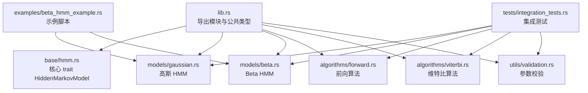
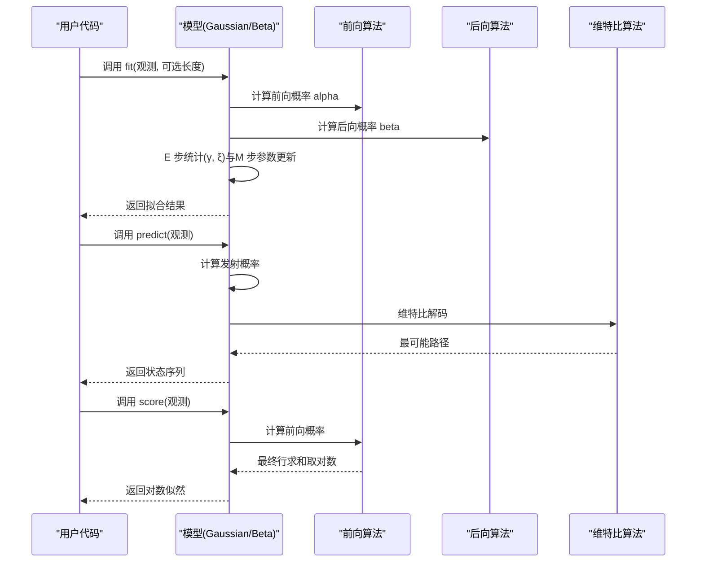
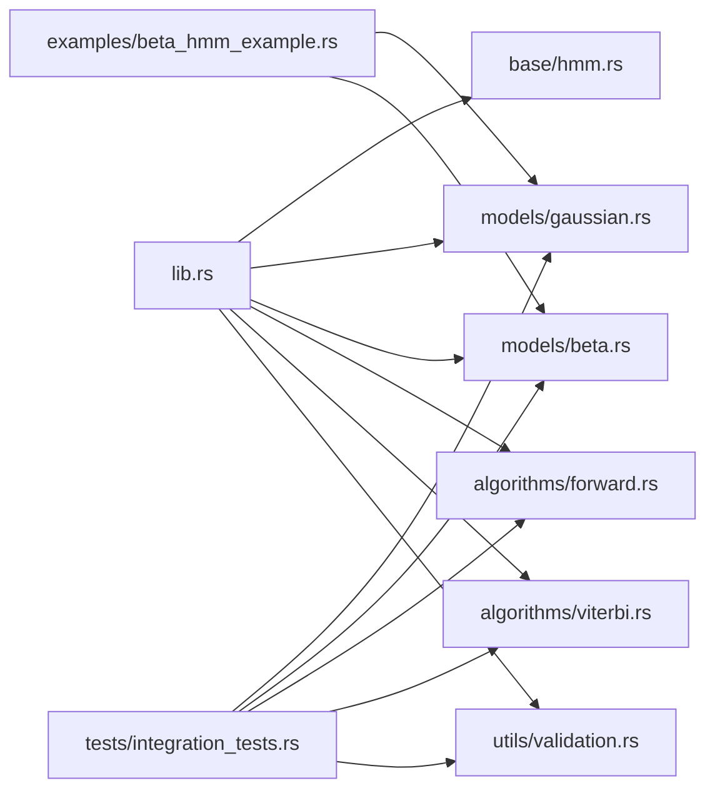

# 实践练习题

<cite>
**本文引用的文件**   
- [Cargo.toml](file://Cargo.toml)
- [README.md](file://README.md)
- [src/lib.rs](file://src/lib.rs)
- [src/base/mod.rs](file://src/base/mod.rs)
- [src/base/hmm.rs](file://src/base/hmm.rs)
- [src/models/mod.rs](file://src/models/mod.rs)
- [src/models/gaussian.rs](file://src/models/gaussian.rs)
- [src/models/beta.rs](file://src/models/beta.rs)
- [src/algorithms/mod.rs](file://src/algorithms/mod.rs)
- [src/algorithms/forward.rs](file://src/algorithms/forward.rs)
- [src/algorithms/viterbi.rs](file://src/algorithms/viterbi.rs)
- [src/utils/mod.rs](file://src/utils/mod.rs)
- [src/utils/validation.rs](file://src/utils/validation.rs)
- [examples/beta_hmm_example.rs](file://examples/beta_hmm_example.rs)
- [tests/integration_tests.rs](file://tests/integration_tests.rs)
</cite>

## 目录
1. [引言](#引言)
2. [项目结构](#项目结构)
3. [核心组件](#核心组件)
4. [架构总览](#架构总览)
5. [详细组件分析与练习](#详细组件分析与练习)
6. [依赖关系分析](#依赖关系分析)
7. [性能与数值稳定性建议](#性能与数值稳定性建议)
8. [故障排查指南](#故障排查指南)
9. [结论](#结论)
10. [附录：练习题与评分标准](#附录练习题与评分标准)

## 引言
本练习题集合面向使用 rhmm 库的开发者，围绕“数据预处理—模型训练—参数调整—评估与对比—扩展应用”的完整流程设计，帮助读者从基础用法逐步深入到算法原理与工程实践。练习覆盖：
- 数据预处理与格式校验
- 模型参数初始化与收敛控制
- 自定义评估指标与性能对比
- 多序列训练与边界条件处理
- 常见错误定位与修复
- 开放性创新任务（结合 Rust 生态工具）

## 项目结构
rhmm 采用模块化组织，核心分为“基础接口”“模型实现”“算法实现”“工具函数”“示例与测试”。下图给出与练习相关的关键模块关系。

图表来源
- [src/lib.rs](file://src/lib.rs#L19-L27)
- [src/base/hmm.rs](file://src/base/hmm.rs#L7-L61)
- [src/models/gaussian.rs](file://src/models/gaussian.rs#L14-L32)
- [src/models/beta.rs](file://src/models/beta.rs#L24-L39)
- [src/algorithms/forward.rs](file://src/algorithms/forward.rs#L20-L47)
- [src/algorithms/viterbi.rs](file://src/algorithms/viterbi.rs#L20-L74)
- [src/utils/validation.rs](file://src/utils/validation.rs#L6-L74)
- [examples/beta_hmm_example.rs](file://examples/beta_hmm_example.rs#L11-L266)
- [tests/integration_tests.rs](file://tests/integration_tests.rs#L10-L103)

章节来源
- [src/lib.rs](file://src/lib.rs#L19-L27)
- [src/base/mod.rs](file://src/base/mod.rs#L3-L7)
- [src/models/mod.rs](file://src/models/mod.rs#L3-L11)
- [src/algorithms/mod.rs](file://src/algorithms/mod.rs#L3-L11)
- [src/utils/mod.rs](file://src/utils/mod.rs#L3-L11)

## 核心组件
- 核心 trait：HiddenMarkovModel 定义了 fit/predict/score/sample/decode 等统一接口，所有模型均需实现。
- 模型实现：
  - GaussianHMM：高斯发射分布，支持多种协方差类型；通过 Baum-Welch 迭代更新初始概率、转移矩阵与发射参数。
  - BetaHMM：Beta 发射分布，适合[0,1]区间比例/转化率等数据；通过方法矩估计初始化参数，EM 更新形状参数。
- 算法实现：
  - forward_algorithm：计算前向概率矩阵，用于概率归一化与对数似然。
  - viterbi_algorithm：计算最可能的状态路径。
- 工具与校验：
  - validate_probability_vector / validate_transition_matrix：确保概率向量与转移矩阵合法。
  - 其他工具模块提供序列切分、归一化、采样等辅助能力。

章节来源
- [src/base/hmm.rs](file://src/base/hmm.rs#L7-L61)
- [src/models/gaussian.rs](file://src/models/gaussian.rs#L14-L32)
- [src/models/gaussian.rs](file://src/models/gaussian.rs#L328-L612)
- [src/models/beta.rs](file://src/models/beta.rs#L24-L39)
- [src/models/beta.rs](file://src/models/beta.rs#L384-L669)
- [src/algorithms/forward.rs](file://src/algorithms/forward.rs#L20-L69)
- [src/algorithms/viterbi.rs](file://src/algorithms/viterbi.rs#L20-L74)
- [src/utils/validation.rs](file://src/utils/validation.rs#L6-L74)

## 架构总览
下图展示一次典型的训练与预测流程：fit 调用 Baum-Welch，内部使用 forward/backward 计算统计量；predict 使用 viterbi 获取状态路径；score 使用 forward 计算对数似然。

图表来源
- [src/models/gaussian.rs](file://src/models/gaussian.rs#L337-L491)
- [src/models/gaussian.rs](file://src/models/gaussian.rs#L493-L544)
- [src/models/gaussian.rs](file://src/models/gaussian.rs#L546-L611)
- [src/models/beta.rs](file://src/models/beta.rs#L393-L547)
- [src/models/beta.rs](file://src/models/beta.rs#L549-L600)
- [src/models/beta.rs](file://src/models/beta.rs#L601-L668)
- [src/algorithms/forward.rs](file://src/algorithms/forward.rs#L20-L69)
- [src/algorithms/viterbi.rs](file://src/algorithms/viterbi.rs#L20-L74)

## 详细组件分析与练习

### 组件一：GaussianHMM（高斯 HMM）
- 关键点
  - 支持多种协方差类型（默认对角），在高斯 PDF 中根据类型选择不同实现。
  - 初始化策略：随机选取观测作为均值初值，按整体方差设置协方差下界。
  - 参数更新：E 步计算 γ 和 ξ，M 步更新初始概率、转移矩阵、均值与协方差。
  - 数值稳定：log 概率域计算，避免下溢。
- 练习建议
  - 数据预处理：检查观测维度一致性、缺失值处理、特征缩放。
  - 参数调整：尝试不同协方差类型、迭代次数、收敛阈值，观察对数似然变化。
  - 多序列训练：构造不同长度序列，验证 lengths 参数与序列切分逻辑。
  - 错误处理：空观测、维度不匹配、未拟合即预测等场景。
- 评分要点
  - 正确性：对数似然单调非降、参数收敛、预测路径合理。
  - 稳健性：异常输入返回明确错误、数值范围保护。
  - 可读性：清晰的日志输出、合理的中间变量命名。

章节来源
- [src/models/gaussian.rs](file://src/models/gaussian.rs#L14-L32)
- [src/models/gaussian.rs](file://src/models/gaussian.rs#L196-L222)
- [src/models/gaussian.rs](file://src/models/gaussian.rs#L224-L271)
- [src/models/gaussian.rs](file://src/models/gaussian.rs#L272-L326)
- [src/models/gaussian.rs](file://src/models/gaussian.rs#L337-L491)
- [src/models/gaussian.rs](file://src/models/gaussian.rs#L493-L544)
- [src/models/gaussian.rs](file://src/models/gaussian.rs#L546-L612)

### 组件二：BetaHMM（Beta HMM）
- 关键点
  - 发射分布为 Beta，适合[0,1]比例数据；通过方法矩估计初始化形状参数。
  - 对数伽马函数近似以稳定 PDF 计算；clamp 观测值到(0,1)避免边界问题。
  - 参数更新：基于加权样本均值与方差，转换为形状参数。
- 练习建议
  - 数据预处理：确保观测严格位于(0,1)，必要时做平滑或边界修正。
  - 参数调整：形状参数的先验约束、正则化项、最小方差下界。
  - 指标扩展：除对数似然外，可引入 AIC/BIC 或外部聚类指标（如 NMI）进行模型选择。
- 评分要点
  - 合理性：形状参数为正、均值与方差计算正确。
  - 稳定性：对极值观测与小参数的鲁棒性。
  - 可解释性：输出状态的期望转化率与方差，便于业务解读。

章节来源
- [src/models/beta.rs](file://src/models/beta.rs#L24-L39)
- [src/models/beta.rs](file://src/models/beta.rs#L91-L114)
- [src/models/beta.rs](file://src/models/beta.rs#L116-L157)
- [src/models/beta.rs](file://src/models/beta.rs#L159-L197)
- [src/models/beta.rs](file://src/models/beta.rs#L226-L286)
- [src/models/beta.rs](file://src/models/beta.rs#L288-L332)
- [src/models/beta.rs](file://src/models/beta.rs#L334-L381)
- [src/models/beta.rs](file://src/models/beta.rs#L393-L547)
- [src/models/beta.rs](file://src/models/beta.rs#L549-L600)
- [src/models/beta.rs](file://src/models/beta.rs#L601-L668)

### 组件三：算法模块（前向/维特比）
- 关键点
  - 前向算法：逐时刻累加，最终行求和得到序列概率，再取对数。
  - 维特比算法：在 log 概率域进行动态规划，回溯得到最优路径。
- 练习建议
  - 手工推导与单元测试：对比手工计算与库函数结果，验证边界条件。
  - 性能优化：向量化实现、内存复用、减少不必要的拷贝。
- 评分要点
  - 正确性：与参考实现一致、对数域运算无溢出。
  - 可读性：清晰的注释与变量命名。

章节来源
- [src/algorithms/forward.rs](file://src/algorithms/forward.rs#L20-L69)
- [src/algorithms/viterbi.rs](file://src/algorithms/viterbi.rs#L20-L74)

### 组件四：参数校验与工具
- 关键点
  - 概率向量校验：和为1且非负。
  - 转移矩阵校验：每行和为1且非负。
  - 观测维度校验：列数必须与模型一致。
- 练习建议
  - 边界测试：空观测、零列、负概率、越界概率等。
  - 集成测试：在完整工作流中插入校验点，定位错误来源。
- 评分要点
  - 完整性：覆盖所有非法输入场景。
  - 明确性：错误信息清晰、可定位到具体参数。

章节来源
- [src/utils/validation.rs](file://src/utils/validation.rs#L6-L74)

### 组件五：示例与测试
- 示例脚本展示了 Beta HMM 的端到端流程：加载数据、训练、参数查看、预测、评分、采样与新数据预测。
- 集成测试覆盖了：
  - GaussianHMM 工作流与基本断言；
  - 前向/后向一致性；
  - 维特比确定性路径；
  - 归一化与校验；
  - 多序列训练；
  - 错误处理。
- 练习建议
  - 基于示例扩展：加入多模型对比、交叉验证、可视化。
  - 补充测试：针对边界与异常输入增加用例。

章节来源
- [examples/beta_hmm_example.rs](file://examples/beta_hmm_example.rs#L15-L266)
- [tests/integration_tests.rs](file://tests/integration_tests.rs#L10-L103)

## 依赖关系分析
- 外部依赖：ndarray、ndarray-linalg、rand、rand_distr、thiserror、serde。
- 内部依赖：lib.rs 导出模块；base 定义接口；models 实现具体模型；algorithms 提供算法；utils 提供工具；examples 与 tests 展示与验证。

图表来源
- [src/lib.rs](file://src/lib.rs#L19-L27)
- [src/base/hmm.rs](file://src/base/hmm.rs#L7-L61)
- [src/models/gaussian.rs](file://src/models/gaussian.rs#L14-L32)
- [src/models/beta.rs](file://src/models/beta.rs#L24-L39)
- [src/algorithms/forward.rs](file://src/algorithms/forward.rs#L20-L47)
- [src/algorithms/viterbi.rs](file://src/algorithms/viterbi.rs#L20-L74)
- [src/utils/validation.rs](file://src/utils/validation.rs#L6-L74)
- [examples/beta_hmm_example.rs](file://examples/beta_hmm_example.rs#L11-L266)
- [tests/integration_tests.rs](file://tests/integration_tests.rs#L3-L8)

章节来源
- [Cargo.toml](file://Cargo.toml#L13-L19)
- [src/lib.rs](file://src/lib.rs#L19-L27)

## 性能与数值稳定性建议
- 数值稳定性
  - 在概率计算中尽量使用 log 概率，避免连乘导致下溢。
  - Beta 分布的 PDF 使用对数形式，并对观测值进行 clamp，避免 log(0)。
  - 协方差设置最小下界，防止数值不稳定。
- 计算效率
  - 尽可能使用向量化操作与就地更新，减少临时数组分配。
  - 在 E 步中优先计算 emission_probs，再复用至 forward/backward。
- 收敛控制
  - Baum-Welch 设置最大迭代次数与对数似然增量阈值，避免过拟合与死循环。

[本节为通用建议，无需列出章节来源]

## 故障排查指南
- 常见错误与解决
  - “模型尚未拟合”：在调用 predict/score/sample 前必须先 fit。
  - “维度不匹配”：观测列数必须与模型 n_features 一致。
  - “观测为空”：确保观测矩阵至少有一行一列。
  - “概率向量/转移矩阵非法”：和为1且非负，行和为1。
  - “Beta 观测超出(0,1)”：对边界值进行 clamp 或数据清洗。
- 定位技巧
  - 在 fit 前后打印关键参数（均值、协方差/形状参数、转移矩阵、初始概率）。
  - 使用集成测试中的断言模式，逐步缩小问题范围。

章节来源
- [src/models/gaussian.rs](file://src/models/gaussian.rs#L493-L544)
- [src/models/gaussian.rs](file://src/models/gaussian.rs#L546-L611)
- [src/models/beta.rs](file://src/models/beta.rs#L549-L600)
- [src/models/beta.rs](file://src/models/beta.rs#L601-L668)
- [src/utils/validation.rs](file://src/utils/validation.rs#L6-L74)
- [tests/integration_tests.rs](file://tests/integration_tests.rs#L88-L102)

## 结论
通过本练习题集合，开发者可以系统掌握 rhmm 的核心用法与实现细节，具备独立完成数据预处理、模型训练与评估、参数调优与错误诊断的能力，并为进一步扩展到多模型对比、业务指标定制与生态集成打下坚实基础。

[本节为总结性内容，无需列出章节来源]

## 附录：练习题与评分标准

### 练习一：数据预处理与基础训练
- 任务
  - 准备两组观测数据：一组连续特征（高斯分布）、一组比例数据（Beta 分布，位于(0,1)）。
  - 分别创建 GaussianHMM 与 BetaHMM，设置合适的隐藏状态数与特征数。
  - 训练模型并输出对数似然、初始概率、转移矩阵与发射参数摘要。
- 评分标准
  - 正确性（40%）：训练成功、参数维度一致、对数似然为有限值。
  - 可解释性（30%）：输出参数含义清晰、业务可解释。
  - 稳健性（20%）：对异常输入（空观测、维度不匹配）有明确报错。
  - 可重复性（10%）：相同种子或固定数据可复现实验结果。

章节来源
- [src/models/gaussian.rs](file://src/models/gaussian.rs#L337-L491)
- [src/models/beta.rs](file://src/models/beta.rs#L393-L547)
- [src/utils/validation.rs](file://src/utils/validation.rs#L58-L74)

### 练习二：模型参数调整与收敛控制
- 任务
  - 固定数据集，改变高斯模型的协方差类型（对角/球面/满/绑定），比较对数似然与收敛速度。
  - 调整 Baum-Welch 的最大迭代次数与收敛阈值，记录对数似然曲线。
- 评分标准
  - 方法严谨（40%）：对比实验设计合理、变量单一、重复多次取平均。
  - 结果呈现（30%）：对数似然曲线与收敛日志清晰。
  - 分析深度（20%）：能解释不同协方差类型的适用场景与代价。
  - 报告规范（10%）：结论简洁、可复现。

章节来源
- [src/models/gaussian.rs](file://src/models/gaussian.rs#L384-L491)

### 练习三：自定义评估指标与模型对比
- 任务
  - 在 BetaHMM 上实现 AIC/BIC 指标，结合对数似然与自由度进行模型选择。
  - 对同一数据集训练多个隐藏状态数的模型，绘制对数似然与 AIC/BIC 随状态数变化的曲线。
- 评分标准
  - 指标正确性（40%）：AIC/BIC 公式与自由度计算无误。
  - 可视化质量（30%）：图表清晰、标注完整。
  - 结论合理性（20%）：能基于指标选择合适的状态数。
  - 文档说明（10%）：公式与实现注释完整。

章节来源
- [src/models/beta.rs](file://src/models/beta.rs#L393-L547)

### 练习四：多序列训练与边界条件
- 任务
  - 构造多个不同长度的时间序列，拼接为一个观测矩阵并提供 lengths 列表。
  - 验证 fit 能正确处理跨序列边界、初始概率与转移矩阵的统计累积。
  - 测试空观测、零列、未拟合预测等边界条件。
- 评分标准
  - 功能完整性（40%）：多序列训练通过、边界条件处理正确。
  - 可靠性（30%）：错误信息明确、异常输入不崩溃。
  - 可测试性（20%）：提供可运行的最小复现用例。
  - 可维护性（10%）：代码结构清晰、注释充分。

章节来源
- [tests/integration_tests.rs](file://tests/integration_tests.rs#L75-L85)
- [tests/integration_tests.rs](file://tests/integration_tests.rs#L88-L102)

### 练习五：开放性创新任务
- 任务方向（任选其一或组合）
  - 与 Polars/Arrow 生态集成：将 ndarray 转换为 Arrow 数组，批量执行多模型推理，输出结构化结果。
  - 与 Plotters/GrAFI 可视化：绘制状态路径热力图、发射密度直方图、对数似然收敛曲线。
  - 与 Criterion 基准测试：对不同协方差类型与序列长度进行性能基准，生成报告。
  - 与 serde 进行序列化：保存/加载模型参数，支持跨版本兼容性检查。
- 评分标准
  - 创新性（30%）：方案新颖、解决实际痛点。
  - 可行性（30%）：技术栈选择合理、依赖可控。
  - 完整性（25%）：包含安装、配置、使用示例与常见问题。
  - 文档质量（15%）：说明背景、动机、步骤与注意事项。

章节来源
- [Cargo.toml](file://Cargo.toml#L13-L19)
- [README.md](file://README.md#L29-L51)
- [README.md](file://README.md#L195-L205)

### 练习六：项目式学习任务
- 项目目标：构建一个“电商转化率状态识别与预测”应用
  - 数据采集：从 CSV/数据库读取每日移动/桌面转化率。
  - 数据预处理：缺失值填充、异常值检测、归一化/标准化。
  - 模型训练：使用 BetaHMM 拟合两个状态（低/高转化）。
  - 在线服务：提供预测接口，返回状态序列与置信度。
  - 监控与回放：记录预测结果与真实标签，定期重训练。
- 评分标准
  - 功能完备（30%）：数据管线、模型训练、在线服务、监控闭环。
  - 工程质量（25%）：模块化设计、错误处理、日志与指标。
  - 可扩展性（20%）：支持多模型对比、参数调优、A/B 实验。
  - 文档与演示（15%）：README、API 文档、演示脚本。
  - 代码规范（10%）：命名规范、注释与测试覆盖率。

章节来源
- [examples/beta_hmm_example.rs](file://examples/beta_hmm_example.rs#L15-L266)
- [src/models/beta.rs](file://src/models/beta.rs#L393-L547)