# 示例教程

<cite>
**本文档中引用的文件**
- [Cargo.toml](file://Cargo.toml)
- [README.md](file://README.md)
- [src/lib.rs](file://src/lib.rs)
- [src/models/gaussian.rs](file://src/models/gaussian.rs)
- [src/models/beta.rs](file://src/models/beta.rs)
- [src/base/types.rs](file://src/base/types.rs)
- [src/algorithms/forward.rs](file://src/algorithms/forward.rs)
- [src/algorithms/viterbi.rs](file://src/algorithms/viterbi.rs)
- [src/algorithms/baum_welch.rs](file://src/algorithms/baum_welch.rs)
- [src/utils/validation.rs](file://src/utils/validation.rs)
- [src/utils/mod.rs](file://src/utils/mod.rs)
- [examples/beta_hmm_example.rs](file://examples/beta_hmm_example.rs)
- [tests/integration_tests.rs](file://tests/integration_tests.rs)
</cite>

## 目录
1. [简介](#简介)
2. [项目结构](#项目结构)
3. [核心组件](#核心组件)
4. [架构概览](#架构概览)
5. [详细组件分析](#详细组件分析)
6. [依赖关系分析](#依赖关系分析)
7. [性能考虑](#性能考虑)
8. [故障排除指南](#故障排除指南)
9. [结论](#结论)
10. [附录](#附录)

## 简介

rhmm 是一个用 Rust 实现的隐马尔可夫模型（Hidden Markov Model）库，灵感来源于 Python 的 hmmlearn。该库提供了高效的 HMM 模型实现，支持多种发射分布类型和标准的 HMM 算法。项目采用 ndarray 进行数值计算，提供了从基础到高级的完整使用示例。

主要特性包括：
- 多种 HMM 模型类型：高斯 HMM、Beta HMM、多项式 HMM（即将推出）、高斯混合 HMM（即将推出）
- 标准 HMM 算法：前向算法、后向算法、维特比算法、Baum-Welch 算法
- 高效实现：基于 ndarray 的快速数值运算
- 支持多种协方差类型：对角、球面、完整、绑定
- 健壮的数值稳定性：使用对数空间计算

## 项目结构

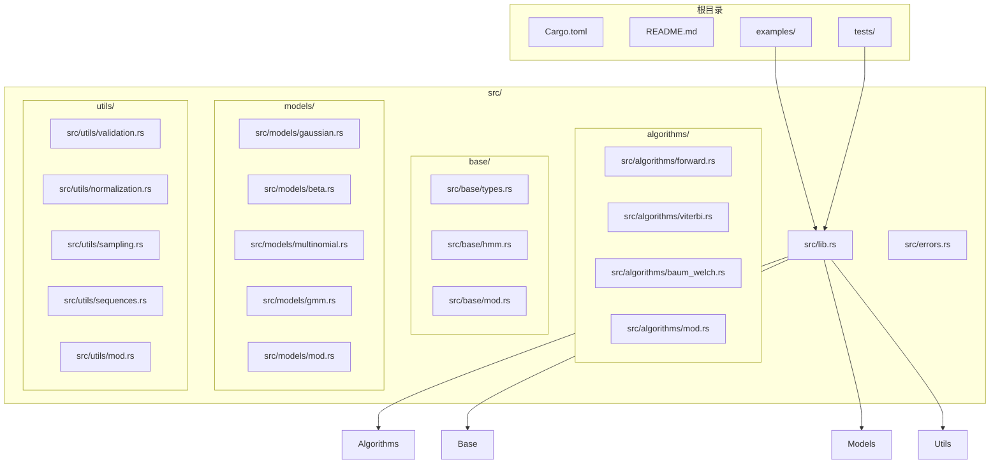

**图表来源**
- [src/lib.rs](file://src/lib.rs#L1-L28)
- [src/models/gaussian.rs](file://src/models/gaussian.rs#L1-L681)
- [src/models/beta.rs](file://src/models/beta.rs#L1-L734)

**章节来源**
- [Cargo.toml](file://Cargo.toml#L1-L23)
- [src/lib.rs](file://src/lib.rs#L1-L28)

## 核心组件

### 隐藏马尔可夫模型核心接口

所有 HMM 模型都实现了统一的 `HiddenMarkovModel` trait，提供一致的 API 接口：

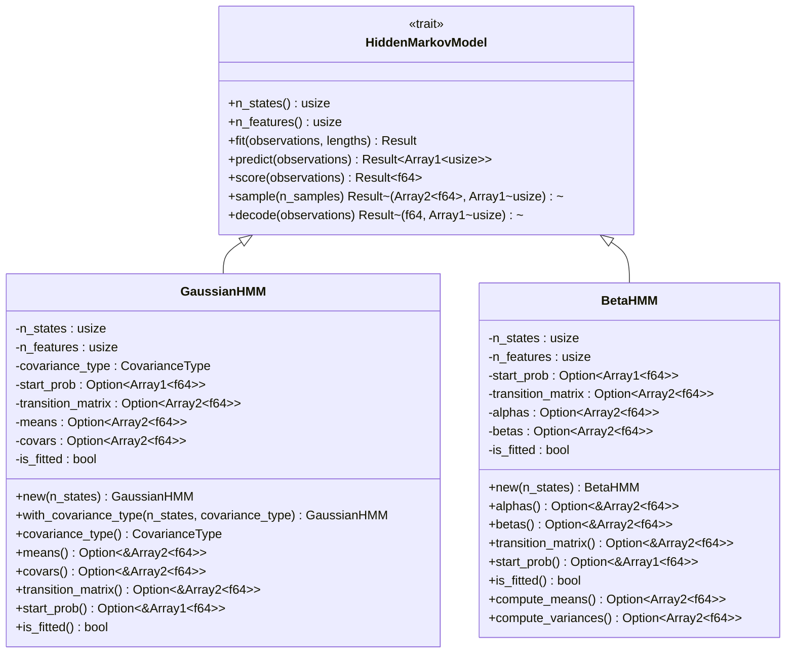

**图表来源**
- [src/base/types.rs](file://src/base/types.rs#L1-L61)
- [src/models/gaussian.rs](file://src/models/gaussian.rs#L11-L32)
- [src/models/beta.rs](file://src/models/beta.rs#L24-L39)

### 协方差类型枚举

高斯 HMM 支持多种协方差类型，每种类型都有不同的数学特性和计算复杂度：

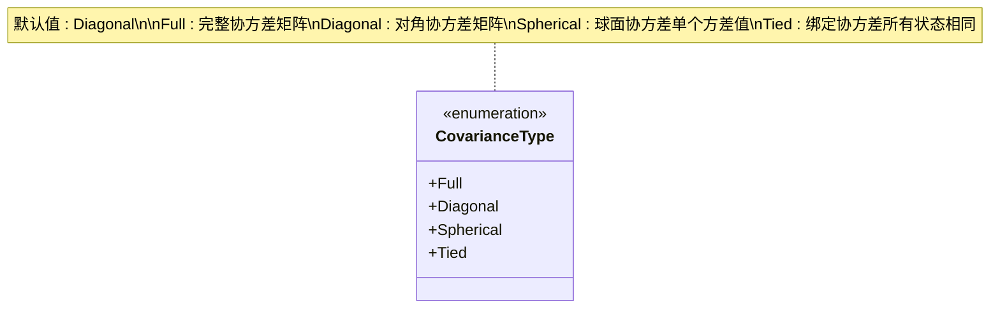

**图表来源**
- [src/base/types.rs](file://src/base/types.rs#L17-L29)

**章节来源**
- [src/base/types.rs](file://src/base/types.rs#L1-L61)
- [src/models/gaussian.rs](file://src/models/gaussian.rs#L14-L32)

## 架构概览

### 算法模块架构

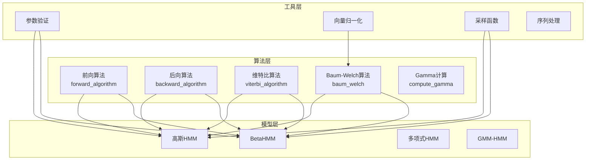

**图表来源**
- [src/algorithms/mod.rs](file://src/algorithms/mod.rs#L1-L12)
- [src/utils/mod.rs](file://src/utils/mod.rs#L1-L12)

### 数据流架构

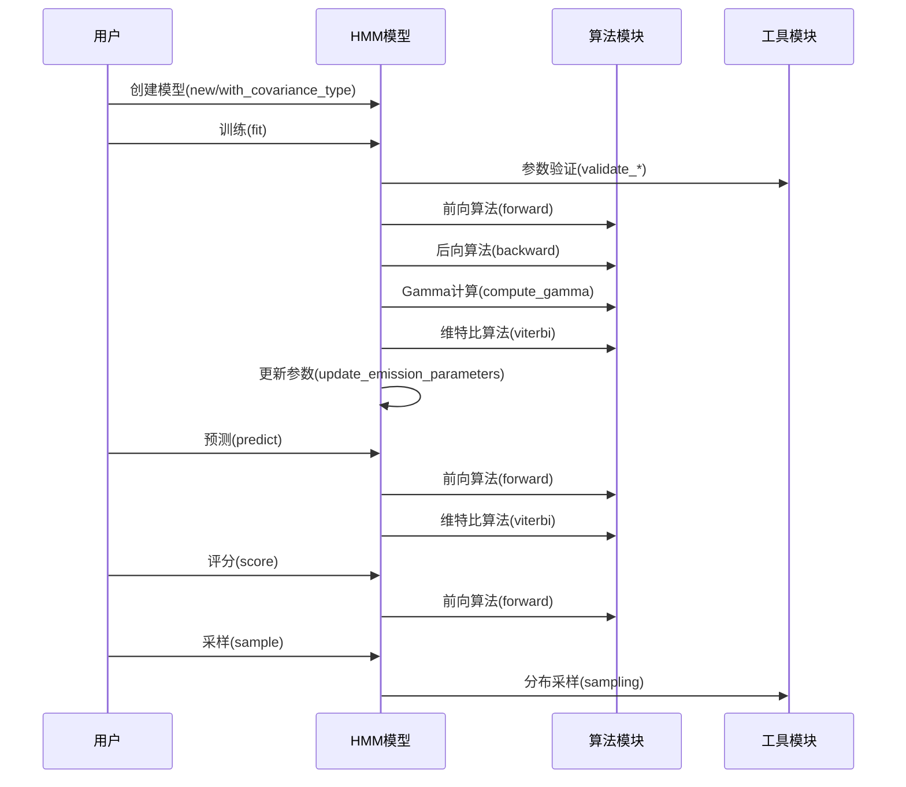

**图表来源**
- [src/models/gaussian.rs](file://src/models/gaussian.rs#L337-L491)
- [src/models/beta.rs](file://src/models/beta.rs#L393-L547)

## 详细组件分析

### 高斯 HMM 模型

#### 模型实现分析

高斯 HMM 使用高斯分布作为发射分布，适用于连续数据建模：

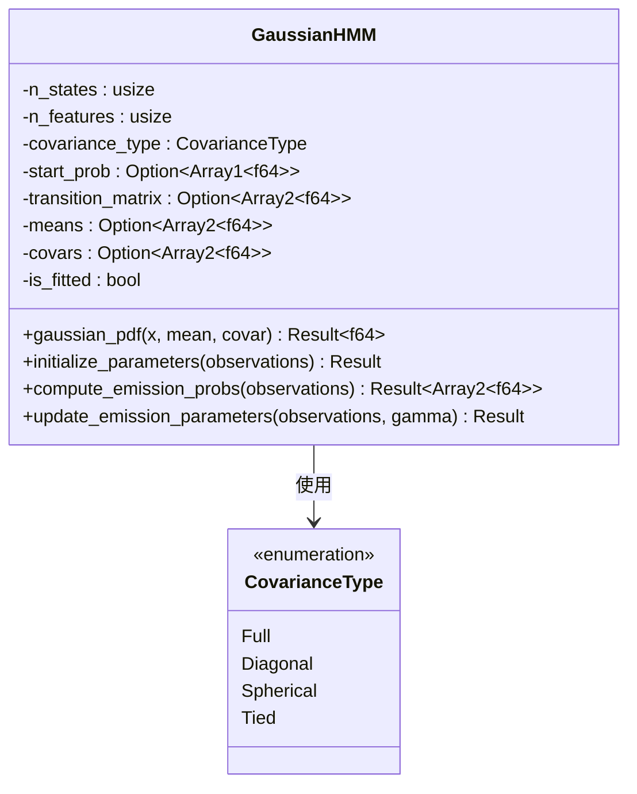

**图表来源**
- [src/models/gaussian.rs](file://src/models/gaussian.rs#L14-L32)
- [src/base/types.rs](file://src/base/types.rs#L17-L29)

#### 高斯概率密度函数实现

高斯 HMM 实现了针对不同协方差类型的优化计算：

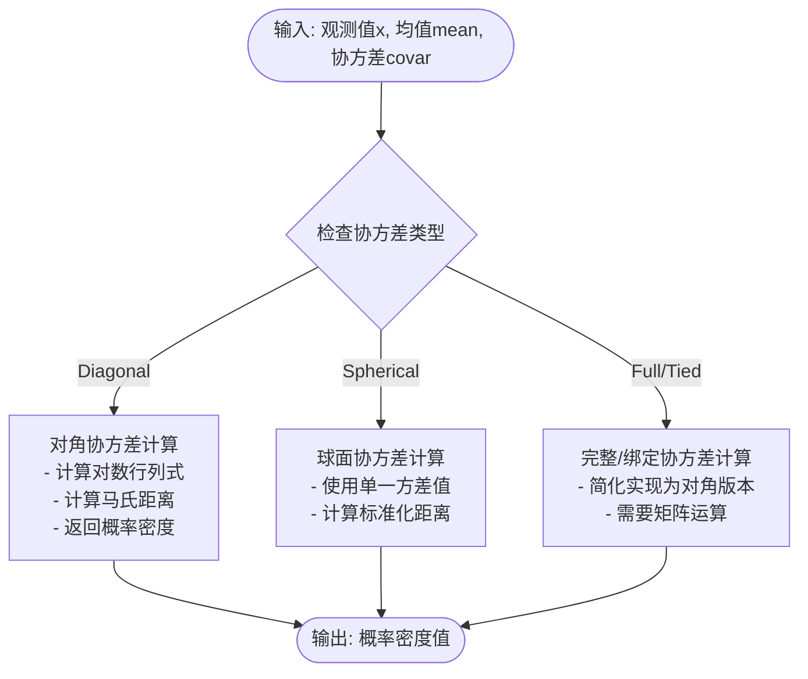

**图表来源**
- [src/models/gaussian.rs](file://src/models/gaussian.rs#L147-L194)

**章节来源**
- [src/models/gaussian.rs](file://src/models/gaussian.rs#L1-L681)

### Beta HMM 模型

#### Beta 分布实现

Beta HMM 使用 Beta 分布作为发射分布，专门用于 [0,1] 区间的数据建模：

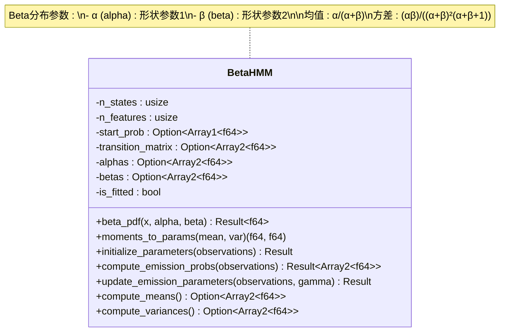

**图表来源**
- [src/models/beta.rs](file://src/models/beta.rs#L24-L39)

#### Beta 分布概率密度函数

Beta HMM 实现了数值稳定的对数概率密度计算：

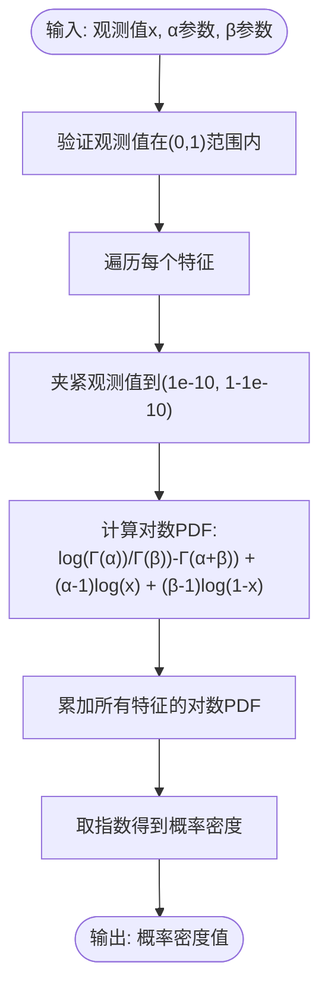

**图表来源**
- [src/models/beta.rs](file://src/models/beta.rs#L173-L197)

**章节来源**
- [src/models/beta.rs](file://src/models/beta.rs#L1-L734)

### 核心算法实现

#### 前向算法

前向算法计算给定观测序列和模型参数下，部分观测序列和处于特定状态的概率：

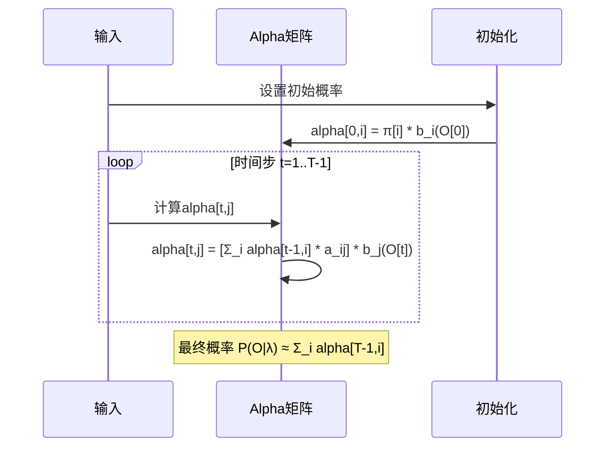

**图表来源**
- [src/algorithms/forward.rs](file://src/algorithms/forward.rs#L20-L47)

#### 维特比算法

维特比算法找到最可能的状态序列：

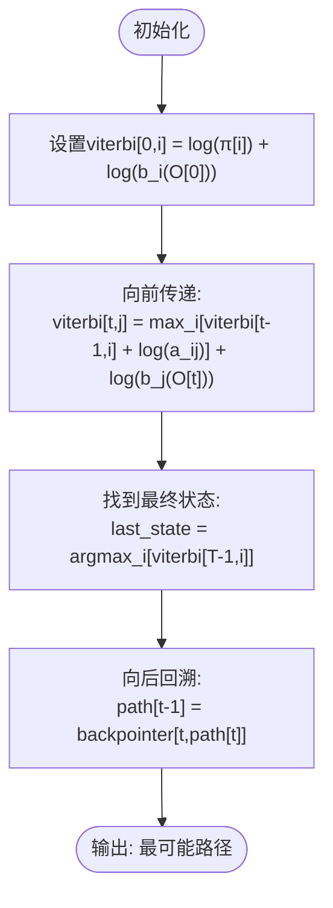

**图表来源**
- [src/algorithms/viterbi.rs](file://src/algorithms/viterbi.rs#L20-L74)

**章节来源**
- [src/algorithms/forward.rs](file://src/algorithms/forward.rs#L1-L129)
- [src/algorithms/viterbi.rs](file://src/algorithms/viterbi.rs#L1-L118)

## 依赖关系分析

### 外部依赖关系

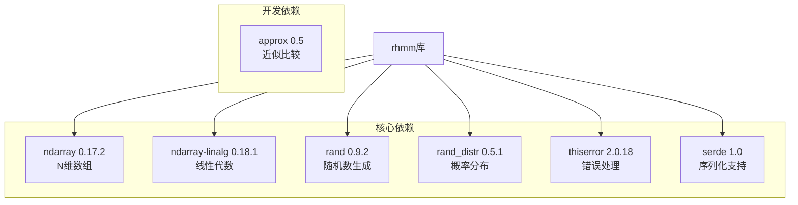

**图表来源**
- [Cargo.toml](file://Cargo.toml#L13-L22)

### 内部模块依赖

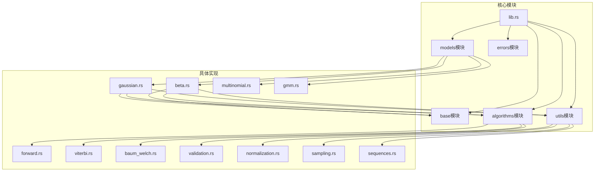

**图表来源**
- [src/lib.rs](file://src/lib.rs#L19-L28)
- [src/models/gaussian.rs](file://src/models/gaussian.rs#L3-L9)
- [src/models/beta.rs](file://src/models/beta.rs#L3-L9)

**章节来源**
- [Cargo.toml](file://Cargo.toml#L1-L23)
- [src/lib.rs](file://src/lib.rs#L1-L28)

## 性能考虑

### 数值稳定性优化

1. **对数空间计算**: 所有概率计算都在对数空间进行，避免数值下溢
2. **稳定归一化**: 使用稳定的向量归一化函数
3. **参数约束**: 强制要求概率参数在有效范围内

### 内存管理

1. **最小分配**: 在热路径上尽量减少内存分配
2. **就地操作**: 尽可能使用就地修改操作
3. **向量化**: 利用 ndarray 的向量化操作

### 并行化机会

虽然当前实现是串行的，但以下部分可以考虑并行化：
- 多序列训练时的序列独立处理
- 特征维度上的并行计算
- 大规模观测矩阵的批处理

## 故障排除指南

### 常见错误类型

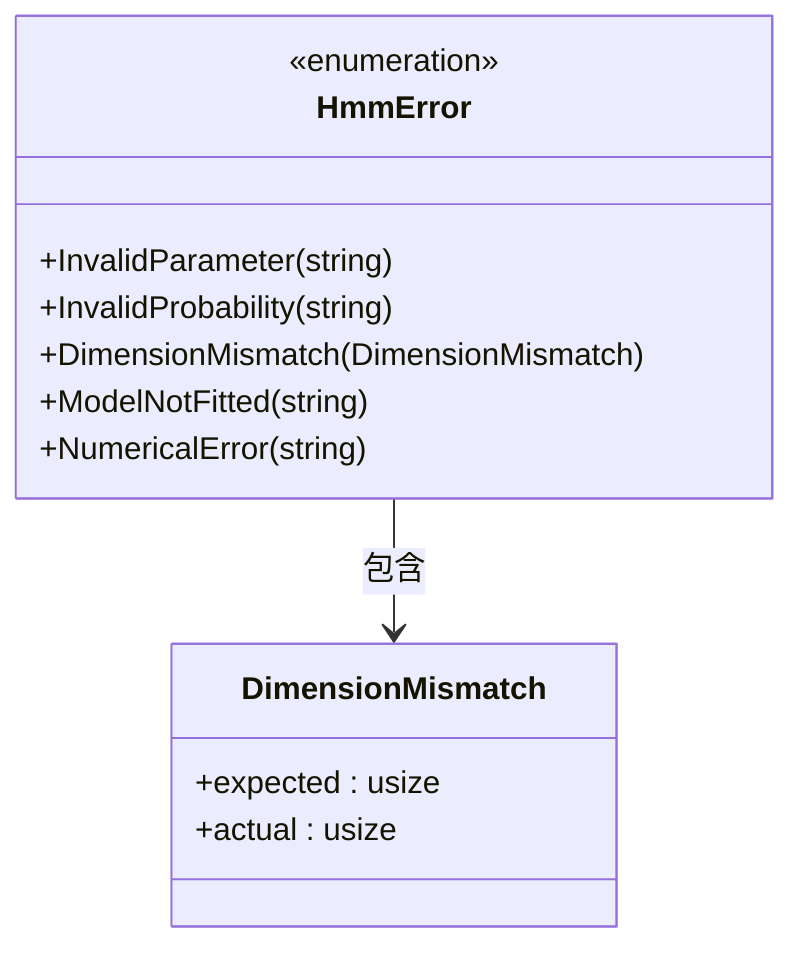

**图表来源**
- [src/errors.rs](file://src/errors.rs#L1-L100)

### 错误处理最佳实践

1. **参数验证**: 在训练前验证所有输入参数
2. **状态检查**: 确保模型已训练后再进行预测或评分
3. **维度匹配**: 验证观测数据的维度与模型配置一致

**章节来源**
- [src/utils/validation.rs](file://src/utils/validation.rs#L1-L141)
- [src/models/gaussian.rs](file://src/models/gaussian.rs#L494-L505)
- [src/models/beta.rs](file://src/models/beta.rs#L550-L561)

## 结论

rhmm 库提供了完整的 HMM 实现，具有以下优势：

1. **一致性**: 统一的 API 设计，便于在不同模型间切换
2. **数值稳定性**: 基于对数空间的计算，确保数值精度
3. **扩展性**: 模块化的架构设计，易于添加新的模型类型
4. **性能**: 基于 ndarray 的高效实现

未来发展方向包括：
- 添加更多发射分布类型
- 实现并行训练
- 改进文档和示例
- 考虑 GPU 加速支持

## 附录

### 快速开始示例

#### 高斯 HMM 基础使用

```rust
use ndarray::array;
use rhmm::models::GaussianHMM;
use rhmm::base::HiddenMarkovModel;

fn main() {
    // 创建训练数据
    let observations = array![
        [0.5, 1.0],
        [0.6, 1.1],
        [5.0, 6.0],
        [5.1, 6.2],
    ];

    // 创建并训练模型
    let mut model = GaussianHMM::new(2);
    model.fit(&observations, None).unwrap();

    // 预测隐藏状态
    let states = model.predict(&observations).unwrap();
    println!("预测状态: {:?}", states);

    // 计算对数似然
    let log_prob = model.score(&observations).unwrap();
    println!("对数概率: {:.4}", log_prob);

    // 生成合成数据
    let (sampled_obs, sampled_states) = model.sample(10).unwrap();
    println!("生成了 {} 个样本", sampled_obs.nrows());
}
```

#### Beta HMM 比例数据分析

```rust
use ndarray::array;
use rhmm::models::BetaHMM;
use rhmm::base::HiddenMarkovModel;

fn main() {
    // 转换率数据（值在0到1之间）
    let observations = array![
        [0.12, 0.15],  // 低转换
        [0.10, 0.13],  // 低转换
        [0.75, 0.82],  // 高转换
        [0.78, 0.85],  // 高转换
    ];

    // 创建并训练模型
    let mut model = BetaHMM::new(2);
    model.fit(&observations, None).unwrap();

    // 预测状态
    let states = model.predict(&observations).unwrap();
    println!("状态: {:?}", states);

    // 获取学习到的参数
    if let (Some(alphas), Some(betas)) = (model.alphas(), model.betas()) {
        println!("Alpha参数: {:?}", alphas);
        println!("Beta参数: {:?}", betas);
    }
}
```

### 高级用法示例

#### 多序列训练

```rust
let observations = array![/* 连接的序列 */];
let lengths = vec![10, 15, 20]; // 每个序列的长度
model.fit(&observations, Some(&lengths)).unwrap();
```

#### 自定义初始化

```rust
let mut model = GaussianHMM::new(3);
// 在拟合前设置自定义初始参数
// model.set_start_prob(...);
// model.set_transition_matrix(...);
model.fit(&observations, None).unwrap();
```

#### 协方差类型选择

```rust
use rhmm::base::CovarianceType;

// 对角协方差（默认）
let model = GaussianHMM::with_covariance_type(3, CovarianceType::Diagonal);

// 球面协方差（单个方差）
let model = GaussianHMM::with_covariance_type(3, CovarianceType::Spherical);

// 完整协方差矩阵
let model = GaussianHMM::with_covariance_type(3, CovarianceType::Full);
```

### 测试和验证

```rust
// 运行测试套件
cargo test

// 运行特定测试
cargo test integration_tests

// 查看测试输出
cargo test -- --nocapture
```

**章节来源**
- [README.md](file://README.md#L53-L119)
- [README.md](file://README.md#L230-L266)
- [tests/integration_tests.rs](file://tests/integration_tests.rs#L1-L103)