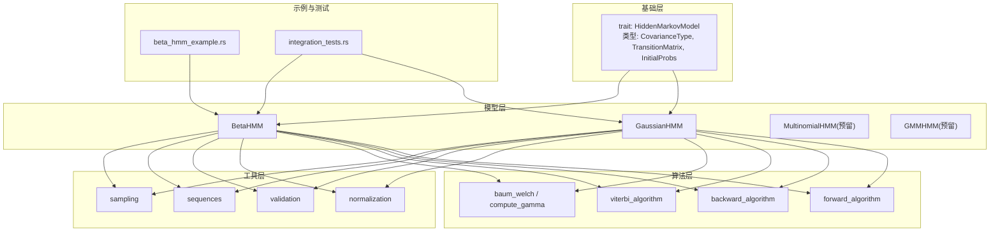
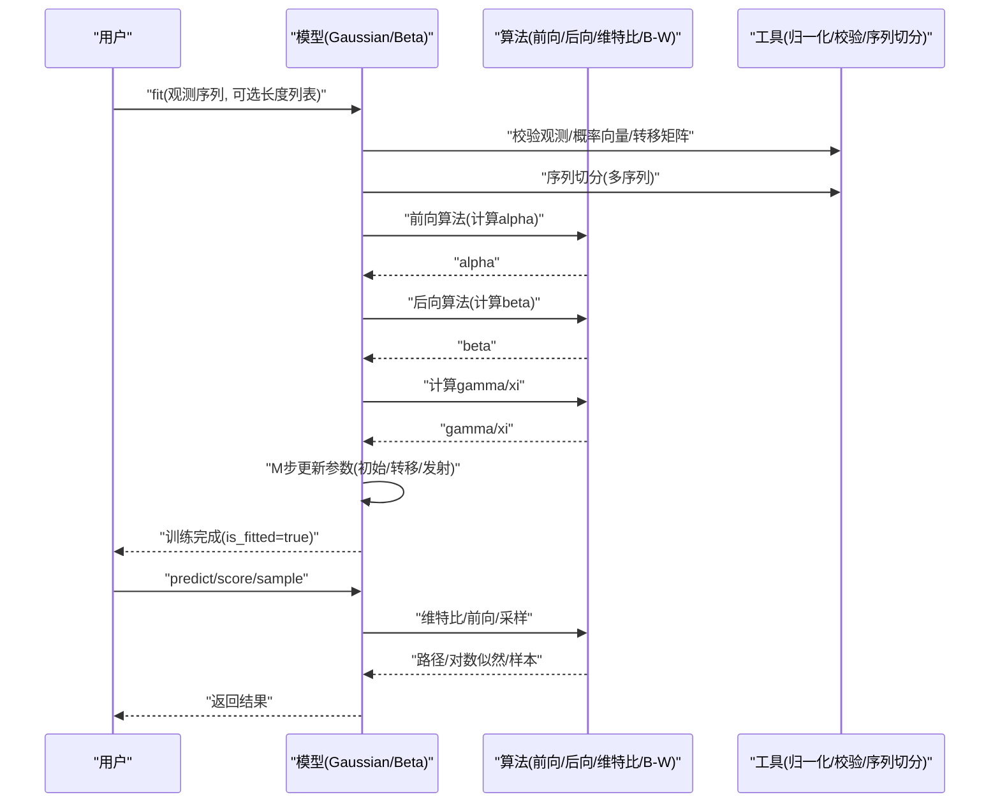
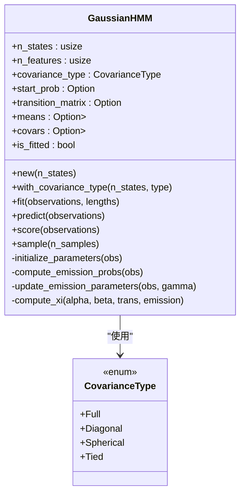
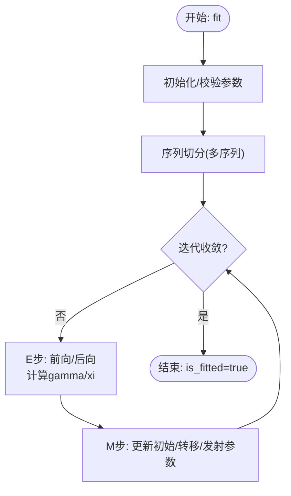
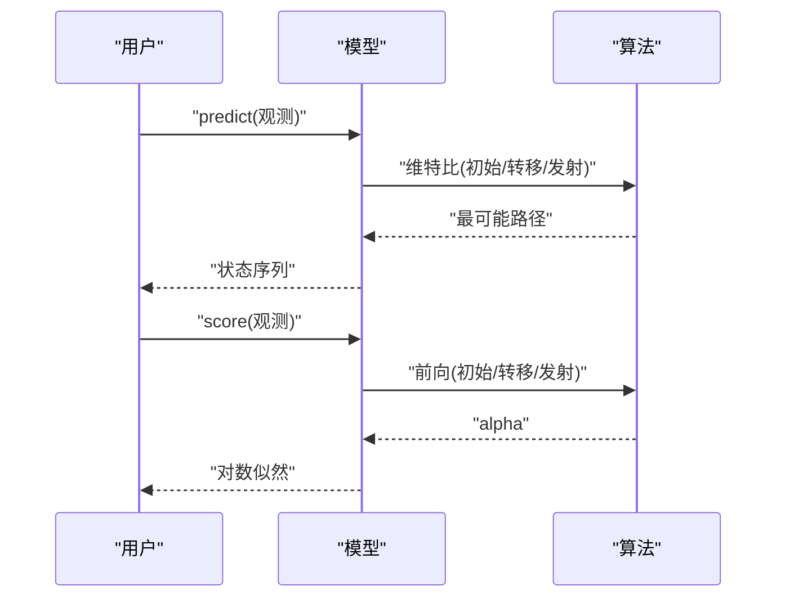
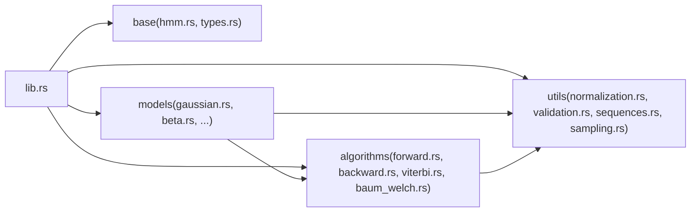

# 高级应用案例

<cite>
**本文引用的文件**
- [README.md](file://README.md)
- [lib.rs](file://src/lib.rs)
- [hmm.rs](file://src/base/hmm.rs)
- [types.rs](file://src/base/types.rs)
- [gaussian.rs](file://src/models/gaussian.rs)
- [beta.rs](file://src/models/beta.rs)
- [forward.rs](file://src/algorithms/forward.rs)
- [backward.rs](file://src/algorithms/backward.rs)
- [viterbi.rs](file://src/algorithms/viterbi.rs)
- [baum_welch.rs](file://src/algorithms/baum_welch.rs)
- [normalization.rs](file://src/utils/normalization.rs)
- [validation.rs](file://src/utils/validation.rs)
- [sequences.rs](file://src/utils/sequences.rs)
- [sampling.rs](file://src/utils/sampling.rs)
- [beta_hmm_example.rs](file://examples/beta_hmm_example.rs)
- [integration_tests.rs](file://tests/integration_tests.rs)
- [Cargo.toml](file://Cargo.toml)
</cite>

## 目录
1. [简介](#简介)
2. [项目结构](#项目结构)
3. [核心组件](#核心组件)
4. [架构总览](#架构总览)
5. [详细组件分析](#详细组件分析)
6. [依赖关系分析](#依赖关系分析)
7. [性能考量](#性能考量)
8. [故障排除指南](#故障排除指南)
9. [结论](#结论)
10. [附录](#附录)

## 简介
本文件面向高级用户与工程实践者，系统化梳理 rhmm 库在复杂业务场景中的应用方法，覆盖多序列训练、参数自定义、协方差类型选择、模型集成与性能优化；并提供金融时间序列、生物信息学序列建模、语音识别特征建模等跨领域案例研究思路与实施建议。同时给出模型比较与选择指南、参数调优策略、与其他机器学习生态的集成路径，以及常见问题的排查与调试技巧。

## 项目结构
rhmm 采用模块化分层设计：基础接口与通用类型位于 base 模块，具体模型（高斯、贝塔等）位于 models，算法实现（前向、后向、维特比、Baum-Welch）位于 algorithms，工具函数（归一化、序列切分、校验、采样）位于 utils。顶层 lib.rs 聚合并导出常用类型与错误处理。

图表来源
- [lib.rs](file://src/lib.rs#L19-L28)
- [hmm.rs](file://src/base/hmm.rs#L7-L61)
- [types.rs](file://src/base/types.rs#L17-L29)
- [gaussian.rs](file://src/models/gaussian.rs#L14-L32)
- [beta.rs](file://src/models/beta.rs#L24-L39)
- [forward.rs](file://src/algorithms/forward.rs#L20-L47)
- [backward.rs](file://src/algorithms/backward.rs)
- [viterbi.rs](file://src/algorithms/viterbi.rs)
- [baum_welch.rs](file://src/algorithms/baum_welch.rs#L25-L44)
- [normalization.rs](file://src/utils/normalization.rs#L5-L35)
- [validation.rs](file://src/utils/validation.rs)
- [sequences.rs](file://src/utils/sequences.rs)
- [sampling.rs](file://src/utils/sampling.rs)
- [beta_hmm_example.rs](file://examples/beta_hmm_example.rs#L15-L266)
- [integration_tests.rs](file://tests/integration_tests.rs)

章节来源
- [lib.rs](file://src/lib.rs#L19-L28)
- [README.md](file://README.md#L1-L303)

## 核心组件
- 基础接口与类型
  - 核心 trait HiddenMarkovModel 定义了 fit/predict/score/sample/decode 等统一能力，确保各模型具备一致的训练与推理接口。
  - 类型别名与协方差类型 CovarianceType 提供统一的数据结构与协方差枚举，便于在高斯模型中灵活切换协方差结构。
- 算法实现
  - 前向/后向/维特比/Baum-Welch 算法以独立模块提供，便于复用与单元测试。
- 工具函数
  - 归一化、对数空间转换、序列切分、参数校验与采样等工具支撑数值稳定性与工程可用性。
- 示例与测试
  - beta_hmm_example 展示贝塔 HMM 的完整流程；integration_tests 提供端到端验证。

章节来源
- [hmm.rs](file://src/base/hmm.rs#L7-L61)
- [types.rs](file://src/base/types.rs#L17-L29)
- [forward.rs](file://src/algorithms/forward.rs#L20-L47)
- [normalization.rs](file://src/utils/normalization.rs#L5-L35)
- [sequences.rs](file://src/utils/sequences.rs)
- [validation.rs](file://src/utils/validation.rs)
- [sampling.rs](file://src/utils/sampling.rs)
- [beta_hmm_example.rs](file://examples/beta_hmm_example.rs#L15-L266)
- [integration_tests.rs](file://tests/integration_tests.rs)

## 架构总览
下图展示了从数据输入到模型输出的关键交互路径，涵盖多序列训练、参数估计与状态解码的主干流程。

图表来源
- [gaussian.rs](file://src/models/gaussian.rs#L337-L491)
- [beta.rs](file://src/models/beta.rs#L393-L547)
- [forward.rs](file://src/algorithms/forward.rs#L20-L47)
- [backward.rs](file://src/algorithms/backward.rs)
- [viterbi.rs](file://src/algorithms/viterbi.rs)
- [baum_welch.rs](file://src/algorithms/baum_welch.rs#L56-L74)
- [normalization.rs](file://src/utils/normalization.rs#L5-L35)
- [validation.rs](file://src/utils/validation.rs)
- [sequences.rs](file://src/utils/sequences.rs)

## 详细组件分析

### 高斯 HMM（连续观测）
- 模型特性
  - 支持多种协方差类型：Full、Diagonal、Spherical、Tied，默认 Diagonal。
  - 发射分布为高斯密度，参数由均值与协方差决定。
- 训练流程
  - 初始化：初始概率、转移矩阵、均值与协方差。
  - E 步：前向/后向计算，得到 gamma 与 xi。
  - M 步：更新初始概率、转移矩阵、均值与协方差。
  - 收敛：基于对数似然增量判断。
- 关键实现要点
  - 协方差类型在高斯密度计算中影响协方差表示与数值稳定性。
  - 多序列训练通过序列切分与累积统计实现，避免跨序列边界。
  - 数值稳定：对数空间与最小正数约束防止溢出与除零。

图表来源
- [gaussian.rs](file://src/models/gaussian.rs#L14-L32)
- [gaussian.rs](file://src/models/gaussian.rs#L147-L194)
- [gaussian.rs](file://src/models/gaussian.rs#L328-L491)
- [types.rs](file://src/base/types.rs#L17-L29)

章节来源
- [gaussian.rs](file://src/models/gaussian.rs#L14-L32)
- [gaussian.rs](file://src/models/gaussian.rs#L147-L194)
- [gaussian.rs](file://src/models/gaussian.rs#L328-L491)
- [types.rs](file://src/base/types.rs#L17-L29)

### 贝塔 HMM（比例/速率数据）
- 模型特性
  - 观测必须在开区间 (0,1)，适合转化率、点击率、市场份额等比例数据。
  - 发射分布为贝塔分布，参数由 α、β 决定，支持按特征维度学习。
- 训练流程
  - 初始化：随机或基于矩估计初始化 α、β。
  - E 步：前向/后向，计算 gamma 与 xi。
  - M 步：基于加权矩估计更新 α、β。
  - 收敛：对数似然增量阈值控制。
- 关键实现要点
  - 对数伽马函数近似用于数值稳定。
  - 观测值在 (0,1) 区间内进行 clamp，避免边界导致的无穷大。
  - 向量化计算 xi，提升多序列下的吞吐。

图表来源
- [beta.rs](file://src/models/beta.rs#L393-L547)
- [forward.rs](file://src/algorithms/forward.rs#L20-L47)
- [normalization.rs](file://src/utils/normalization.rs#L5-L35)
- [sequences.rs](file://src/utils/sequences.rs)

章节来源
- [beta.rs](file://src/models/beta.rs#L24-L39)
- [beta.rs](file://src/models/beta.rs#L116-L157)
- [beta.rs](file://src/models/beta.rs#L199-L224)
- [beta.rs](file://src/models/beta.rs#L393-L547)

### 维特比解码与评分
- 维特比：在已训练模型上进行状态路径推断，结合初始概率、转移矩阵与发射概率。
- 评分：使用前向算法计算观测序列的对数似然，作为模型拟合度指标。

图表来源
- [hmm.rs](file://src/base/hmm.rs#L22-L60)
- [viterbi.rs](file://src/algorithms/viterbi.rs)
- [forward.rs](file://src/algorithms/forward.rs#L20-L47)

章节来源
- [hmm.rs](file://src/base/hmm.rs#L22-L60)
- [forward.rs](file://src/algorithms/forward.rs#L20-L47)

### 多序列训练与参数自定义
- 多序列训练
  - 通过长度列表将拼接后的观测序列切分为多个子序列，分别进行前向/后向与统计累积，保证跨序列边界不被跨越。
- 参数自定义
  - 在 fit 前可设置初始参数（如初始概率、转移矩阵），随后由 EM 迭代更新。
  - 高斯模型支持协方差类型选择，以平衡拟合能力与计算成本。

章节来源
- [gaussian.rs](file://src/models/gaussian.rs#L351-L355)
- [gaussian.rs](file://src/models/gaussian.rs#L357-L381)
- [beta.rs](file://src/models/beta.rs#L407-L411)
- [beta.rs](file://src/models/beta.rs#L413-L437)
- [types.rs](file://src/base/types.rs#L17-L29)

### 协方差类型选择指南
- Diagonal：默认选项，每个特征维度独立方差，兼顾效率与灵活性。
- Spherical：单一方差，进一步简化参数规模，适合特征间相关性较弱或数据稀疏。
- Full/Tied：理论上更灵活，当前实现以对角化近似处理，完整矩阵运算可作为扩展方向。

章节来源
- [types.rs](file://src/base/types.rs#L17-L29)
- [gaussian.rs](file://src/models/gaussian.rs#L155-L194)

### 模型集成与性能优化
- 模型集成
  - 使用多个 HMM 模型（如高斯与贝塔）对同一观测的不同特征维度建模，或对不同子任务分别建模后融合决策。
- 性能优化
  - 向量化与日志空间计算减少数值误差与内存分配。
  - 多序列独立处理时，注意累积统计的内存布局与缓存友好性。
  - 适当降低最大迭代次数与提高收敛阈值以平衡精度与速度。

章节来源
- [gaussian.rs](file://src/models/gaussian.rs#L402-L453)
- [beta.rs](file://src/models/beta.rs#L458-L509)
- [normalization.rs](file://src/utils/normalization.rs#L5-L35)

### 业务领域应用案例研究

#### 金融时间序列分析
- 场景：检测市场状态（牛市/熊市）或波动 regime，使用高斯 HMM 对价格变化、成交量等连续特征建模。
- 实施要点：
  - 特征工程：构建收益率、动量、波动率等指标，作为多维观测。
  - 协方差选择：优先 Diagonal，若特征相关性强可评估 Full。
  - 多序列：按交易日或周序列训练，关注状态转移的持续性。
- 指标：对数似然、状态停留时间、状态间转移频率。

章节来源
- [README.md](file://README.md#L123-L127)
- [gaussian.rs](file://src/models/gaussian.rs#L14-L32)
- [gaussian.rs](file://src/models/gaussian.rs#L351-L355)

#### 生物信息学序列建模
- 场景：基因片段分类、启动子区域识别等离散/连续混合特征建模。
- 实施要点：
  - 若观测为比例（如 CpG 富集度），可考虑贝塔 HMM。
  - 若为连续表达谱，使用高斯 HMM 并结合差异表达特征。
- 指标：状态解释性（如生物学功能富集）、跨样本一致性。

章节来源
- [README.md](file://README.md#L127-L139)
- [beta.rs](file://src/models/beta.rs#L14-L18)
- [gaussian.rs](file://src/models/gaussian.rs#L14-L32)

#### 语音识别中的特征建模
- 场景：声学特征（MFCC、能量）的状态建模，识别音素或说话人状态。
- 实施要点：
  - 高斯 HMM 是经典选择，建议使用 Diagonal 协方差以提升实时性。
  - 多序列：按帧序列训练，结合端点检测与说话人分割。
- 指标：词错误率（WER）与状态路径稳定性。

章节来源
- [README.md](file://README.md#L124-L125)
- [gaussian.rs](file://src/models/gaussian.rs#L14-L32)

### 模型比较与选择指南
- 数据范围
  - (0,1) 比例类数据：优先贝塔 HMM。
  - 连续实数：高斯 HMM。
  - 离散类别：Multinomial HMM（预留）。
- 计算与存储
  - Diagonal 协方差在大多数情况下提供良好折中；Spherical 更轻量；Full/Tied 更灵活但成本更高。
- 收敛与稳定性
  - 增加观测维度时，优先检查协方差最小值与数值稳定性函数（如 clamp/log-gamma）。

章节来源
- [README.md](file://README.md#L10-L15)
- [types.rs](file://src/base/types.rs#L17-L29)
- [beta.rs](file://src/models/beta.rs#L199-L224)

### 参数调优策略
- 初始参数
  - 利用先验知识设定初始概率与转移矩阵；若无先验，使用均匀初始化。
- 协方差类型
  - 从 Diagonal 开始，逐步尝试 Spherical/Full，观察对数似然与泛化误差。
- 迭代与收敛
  - 调整最大迭代次数与容忍阈值；对多序列数据，确保序列切分正确。
- 数值稳定
  - 使用日志空间与最小正值约束；对边界值进行 clamp。

章节来源
- [gaussian.rs](file://src/models/gaussian.rs#L357-L381)
- [gaussian.rs](file://src/models/gaussian.rs#L444-L459)
- [beta.rs](file://src/models/beta.rs#L435-L442)
- [normalization.rs](file://src/utils/normalization.rs#L25-L35)

### 与其他机器学习库的集成
- 数据准备
  - 使用 ndarray 作为核心数组类型，便于与 Polars、Arrow 等生态协作（参考示例运行说明）。
- 模型部署
  - 通过 serde 序列化模型参数，结合配置中心进行版本管理。
- 特征工程
  - 将外部特征（如市场因子、生物标记物）标准化后作为多维观测输入。

章节来源
- [README.md](file://README.md#L195-L205)
- [Cargo.toml](file://Cargo.toml#L13-L19)

## 依赖关系分析
- 内部依赖
  - models 依赖 algorithms 与 utils；algorithms 仅依赖 utils 与错误类型；base 提供公共接口与类型。
- 外部依赖
  - ndarray/ndarray-linalg：高性能数组与线性代数。
  - rand/rand_distr：随机数与概率分布。
  - serde：序列化支持。
  - thiserror：错误处理。

图表来源
- [lib.rs](file://src/lib.rs#L19-L28)
- [gaussian.rs](file://src/models/gaussian.rs#L3-L9)
- [beta.rs](file://src/models/beta.rs#L3-L9)
- [forward.rs](file://src/algorithms/forward.rs#L3-L4)
- [normalization.rs](file://src/utils/normalization.rs#L3-L3)

章节来源
- [lib.rs](file://src/lib.rs#L19-L28)
- [Cargo.toml](file://Cargo.toml#L13-L19)

## 性能考量
- 数值稳定性
  - 使用日志空间与最小正值约束，避免下溢与除零。
- 向量化与内存
  - 尽可能使用 ndarray 的广播与视图操作，减少拷贝。
- 多序列处理
  - 独立处理每个序列并累积统计，注意缓存局部性与内存重用。
- 算法复杂度
  - 前向/后向/维特比为 O(T·N^2) 或 O(T·N)（N 为状态数，T 为序列长度），Baum-Welch 的每轮迭代包含上述步骤。

章节来源
- [normalization.rs](file://src/utils/normalization.rs#L25-L35)
- [gaussian.rs](file://src/models/gaussian.rs#L402-L453)
- [beta.rs](file://src/models/beta.rs#L458-L509)

## 故障排除指南
- 常见错误与定位
  - 模型未训练：在 predict/score/sample 前检查 is_fitted。
  - 维度不匹配：观测特征数需与训练一致。
  - 观测越界：贝塔 HMM 要求观测在 (0,1)。
  - 收敛失败：检查初始参数、协方差类型与迭代阈值。
- 调试建议
  - 打印中间变量（alpha/beta/gamma/xi）与对数似然轨迹。
  - 使用小规模数据集快速验证流程。
  - 对比不同协方差类型与初始化策略的效果。

章节来源
- [gaussian.rs](file://src/models/gaussian.rs#L494-L505)
- [gaussian.rs](file://src/models/gaussian.rs#L519-L531)
- [beta.rs](file://src/models/beta.rs#L550-L561)
- [beta.rs](file://src/models/beta.rs#L574-L586)
- [beta.rs](file://src/models/beta.rs#L137-L145)

## 结论
rhmm 提供了清晰的接口与稳健的实现，适用于多种观测类型的隐马尔可夫建模。通过合理选择协方差类型、规范多序列训练流程、重视数值稳定性与收敛控制，可在金融、生物信息学与语音识别等领域取得良好效果。建议在生产环境中结合序列切分、参数校验与日志空间计算，形成可重复、可监控的流水线。

## 附录

### 快速上手与示例
- 高斯 HMM 示例与贝塔 HMM 示例均可直接运行，帮助快速理解训练、预测、评分与采样的完整流程。

章节来源
- [README.md](file://README.md#L53-L119)
- [beta_hmm_example.rs](file://examples/beta_hmm_example.rs#L15-L266)