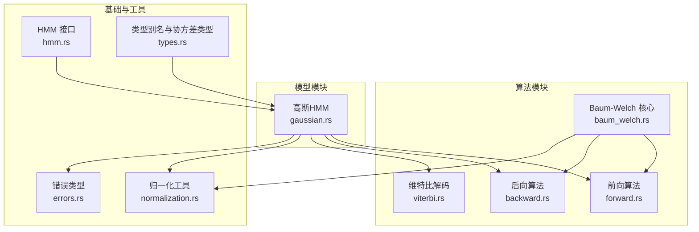
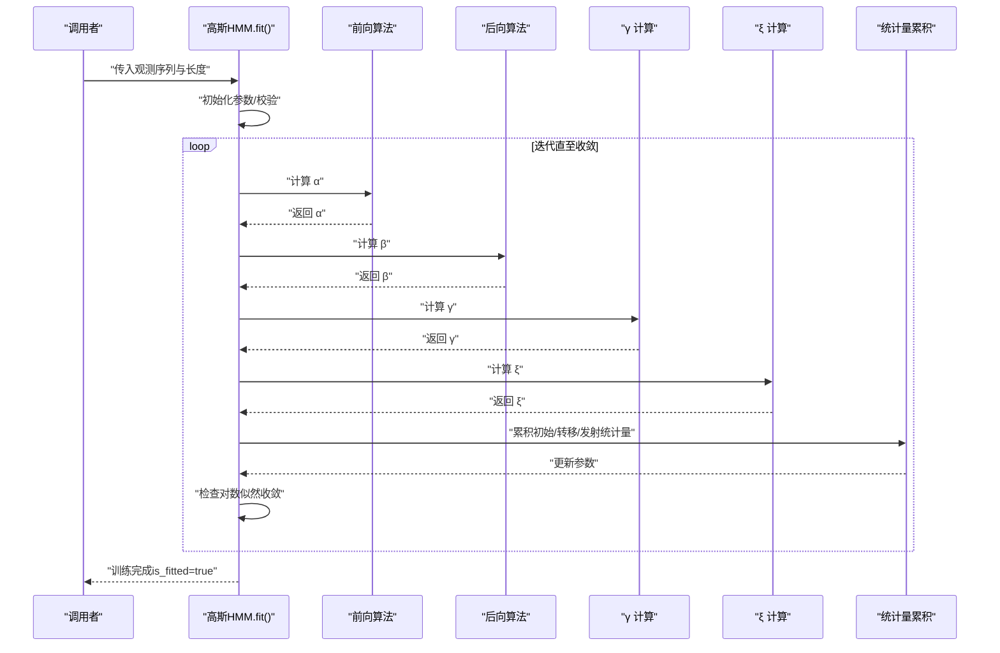
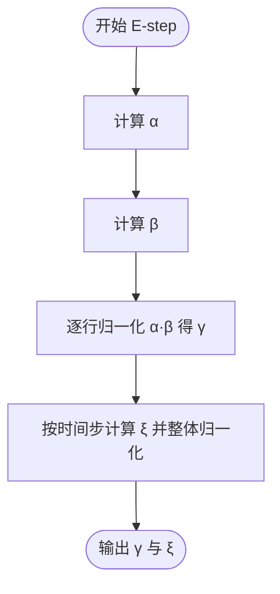
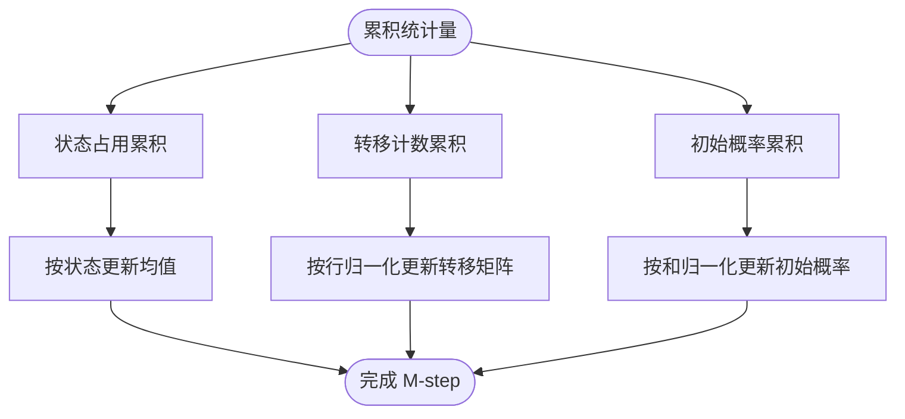
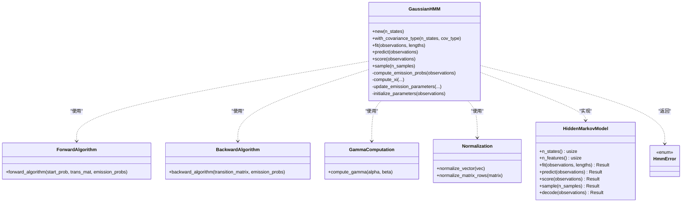

# Baum-Welch 算法

<cite>
**本文引用的文件**
- [src/algorithms/baum_welch.rs](file://src/algorithms/baum_welch.rs)
- [src/algorithms/forward.rs](file://src/algorithms/forward.rs)
- [src/algorithms/backward.rs](file://src/algorithms/backward.rs)
- [src/algorithms/viterbi.rs](file://src/algorithms/viterbi.rs)
- [src/models/gaussian.rs](file://src/models/gaussian.rs)
- [src/base/hmm.rs](file://src/base/hmm.rs)
- [src/base/types.rs](file://src/base/types.rs)
- [src/utils/normalization.rs](file://src/utils/normalization.rs)
- [src/errors.rs](file://src/errors.rs)
- [examples/beta_hmm_example.rs](file://examples/beta_hmm_example.rs)
- [Cargo.toml](file://Cargo.toml)
- [src/lib.rs](file://src/lib.rs)
</cite>

## 目录
1. [引言](#引言)
2. [项目结构](#项目结构)
3. [核心组件](#核心组件)
4. [架构总览](#架构总览)
5. [详细组件分析](#详细组件分析)
6. [依赖关系分析](#依赖关系分析)
7. [性能考量](#性能考量)
8. [故障排查指南](#故障排查指南)
9. [结论](#结论)
10. [附录](#附录)

## 引言
本文件围绕 Baum-Welch 算法（期望最大化 EM 在隐马尔可夫模型中的实现）进行系统化技术说明。内容涵盖：
- E-step 与 M-step 的数学推导与计算流程
- γ（状态占用概率）与 ξ（状态转移概率）的定义与计算
- 从无标注数据中学习 HMM 参数（初始概率、转移概率、发射概率）的更新规则
- 函数接口说明（训练参数、收敛判断、迭代控制）
- 收敛性分析与停止条件
- 初始化策略与局部最优问题
- 调试技巧、性能优化与参数调优
- 与监督学习的区别与优势

## 项目结构
该仓库采用模块化组织：算法实现位于 algorithms 子模块，模型实现位于 models 子模块，基础类型与接口定义位于 base 子模块，工具函数位于 utils 子模块，错误类型位于 errors 模块；examples 提供使用示例。

图表来源
- [src/algorithms/forward.rs](file://src/algorithms/forward.rs#L1-L129)
- [src/algorithms/backward.rs](file://src/algorithms/backward.rs#L1-L90)
- [src/algorithms/baum_welch.rs](file://src/algorithms/baum_welch.rs#L1-L75)
- [src/algorithms/viterbi.rs](file://src/algorithms/viterbi.rs#L1-L118)
- [src/models/gaussian.rs](file://src/models/gaussian.rs#L1-L681)
- [src/base/hmm.rs](file://src/base/hmm.rs#L1-L62)
- [src/base/types.rs](file://src/base/types.rs#L1-L61)
- [src/utils/normalization.rs](file://src/utils/normalization.rs#L1-L102)
- [src/errors.rs](file://src/errors.rs#L1-L105)

章节来源
- [src/lib.rs](file://src/lib.rs#L1-L28)
- [Cargo.toml](file://Cargo.toml#L1-L23)

## 核心组件
- 前向算法（Forward）：计算“到时间 t 为止观察到部分序列且处于状态 i”的前向概率 α。
- 后向算法（Backward）：计算“在状态 i 的条件下，从时间 t+1 到 T 的剩余观测序列”的后向概率 β。
- γ（状态占用概率）：由 α 与 β 归一化得到，表示时间 t 处于状态 i 的概率。
- ξ（状态转移概率）：由 α、β、转移矩阵与发射概率归一化得到，表示时间 t 从状态 i 转移到状态 j 的概率。
- Baum-Welch（EM）：在 E-step 使用前向/后向计算 γ 与 ξ，在 M-step 更新初始概率、转移概率与发射参数（以高斯模型为例为均值与协方差）。
- 高斯 HMM：实现了 fit 方法，内部调用前向/后向与 γ/ξ 计算，并通过累积统计量执行 M-step 更新。

章节来源
- [src/algorithms/forward.rs](file://src/algorithms/forward.rs#L1-L129)
- [src/algorithms/backward.rs](file://src/algorithms/backward.rs#L1-L90)
- [src/algorithms/baum_welch.rs](file://src/algorithms/baum_welch.rs#L1-L75)
- [src/algorithms/viterbi.rs](file://src/algorithms/viterbi.rs#L1-L118)
- [src/models/gaussian.rs](file://src/models/gaussian.rs#L224-L326)

## 架构总览
下图展示了高斯 HMM 的训练流程，其中 Baum-Welch 作为核心迭代器，E-step 与 M-step 分别负责统计量计算与参数更新。

图表来源
- [src/models/gaussian.rs](file://src/models/gaussian.rs#L337-L491)
- [src/algorithms/forward.rs](file://src/algorithms/forward.rs#L20-L47)
- [src/algorithms/backward.rs](file://src/algorithms/backward.rs#L19-L45)
- [src/algorithms/baum_welch.rs](file://src/algorithms/baum_welch.rs#L56-L74)

## 详细组件分析

### 数学推导与 E-step/M-step
- E-step
  - 计算前向概率 α 与后向概率 β
  - 定义 γ(t,i) ∝ α(t,i)·β(t,i)，并对每个时间步进行归一化
  - 定义 ξ(t,i,j) ∝ α(t,i)·a(i,j)·b_j(O_{t+1})·β(t+1,j)，并对每条边进行归一化
- M-step
  - 初始概率 π_i ← Σ_t δ(i=1) γ(t,i) / Σ_t γ(t,i)
  - 转移概率 a(i,j) ← Σ_t γ(t,i)·δ(i→j) / Σ_t γ(t,i)
  - 发射参数（高斯模型）：均值 μ_i 与协方差 Σ_i 通过 γ 与 ξ 的加权平均更新

章节来源
- [src/algorithms/forward.rs](file://src/algorithms/forward.rs#L20-L47)
- [src/algorithms/backward.rs](file://src/algorithms/backward.rs#L19-L45)
- [src/algorithms/baum_welch.rs](file://src/algorithms/baum_welch.rs#L56-L74)
- [src/models/gaussian.rs](file://src/models/gaussian.rs#L224-L326)

### γ 与 ξ 的实现细节
- γ 计算：逐行对 α·β 进行归一化，确保每行和为 1
- ξ 计算：对每个时间步 t，计算所有 i,j 的乘积项之和，再整体归一化

图表来源
- [src/algorithms/baum_welch.rs](file://src/algorithms/baum_welch.rs#L56-L74)
- [src/utils/normalization.rs](file://src/utils/normalization.rs#L14-L23)

章节来源
- [src/algorithms/baum_welch.rs](file://src/algorithms/baum_welch.rs#L56-L74)
- [src/utils/normalization.rs](file://src/utils/normalization.rs#L1-L102)

### 参数更新规则（M-step）
- 初始概率更新：使用首时刻 γ 的行和进行归一化
- 转移概率更新：使用 ξ 的行和进行归一化
- 发射参数（高斯）：均值与协方差分别按状态 i 的 γ 加权平均更新

图表来源
- [src/models/gaussian.rs](file://src/models/gaussian.rs#L392-L487)

章节来源
- [src/models/gaussian.rs](file://src/models/gaussian.rs#L392-L487)

### 函数接口说明
- baum_welch（占位实现）
  - 输入：观测序列、初始概率、转移矩阵、发射概率、最大迭代次数、容差
  - 输出：实际迭代次数
  - 当前为占位，未实现完整 EM 循环
- compute_gamma
  - 输入：α、β
  - 输出：γ（每行和为 1）
- forward_algorithm / backward_algorithm
  - 输入：初始概率、转移矩阵、发射概率
  - 输出：α 或 β
- GaussianHMM::fit
  - 输入：观测序列、可选序列长度列表
  - 输出：训练结果（is_fitted=true）

章节来源
- [src/algorithms/baum_welch.rs](file://src/algorithms/baum_welch.rs#L25-L44)
- [src/algorithms/baum_welch.rs](file://src/algorithms/baum_welch.rs#L56-L74)
- [src/algorithms/forward.rs](file://src/algorithms/forward.rs#L20-L47)
- [src/algorithms/backward.rs](file://src/algorithms/backward.rs#L19-L45)
- [src/models/gaussian.rs](file://src/models/gaussian.rs#L337-L491)

### 收敛性分析与停止条件
- 停止条件：连续两次迭代的对数似然增量小于容差 tol
- 默认容差与最大迭代次数在高斯 HMM 的 fit 中设定
- 对数似然通过前向算法最后一行求和取对数得到

章节来源
- [src/models/gaussian.rs](file://src/models/gaussian.rs#L384-L386)
- [src/models/gaussian.rs](file://src/models/gaussian.rs#L455-L459)
- [src/algorithms/forward.rs](file://src/algorithms/forward.rs#L60-L69)

### 初始化策略与局部最优
- 初始化策略（高斯 HMM）：
  - 初始概率：均匀分布
  - 转移矩阵：均匀分布
  - 均值：随机选择观测样本
  - 协方差：基于数据列方差并设最小阈值
- 局部最优问题：
  - EM 易受初始值影响，建议多次随机初始化并选择对数似然最高的模型
  - 可结合验证集评估稳定性

章节来源
- [src/models/gaussian.rs](file://src/models/gaussian.rs#L357-L382)
- [src/models/gaussian.rs](file://src/models/gaussian.rs#L196-L222)

### 与监督学习的区别与优势
- 区别：Baum-Welch 是无监督学习，仅使用观测序列；监督学习需要标注状态序列
- 优势：适用于真实场景中难以获得标注数据的情况；能自动发现潜在的状态结构

## 依赖关系分析
- 高斯 HMM 依赖前向/后向算法、γ/ξ 计算、归一化工具与错误类型
- 接口层（HiddenMarkovModel）统一了模型行为（fit/predict/score/sample/decode）

图表来源
- [src/base/hmm.rs](file://src/base/hmm.rs#L6-L61)
- [src/models/gaussian.rs](file://src/models/gaussian.rs#L1-L681)
- [src/algorithms/forward.rs](file://src/algorithms/forward.rs#L1-L129)
- [src/algorithms/backward.rs](file://src/algorithms/backward.rs#L1-L90)
- [src/algorithms/baum_welch.rs](file://src/algorithms/baum_welch.rs#L56-L74)
- [src/utils/normalization.rs](file://src/utils/normalization.rs#L1-L102)
- [src/errors.rs](file://src/errors.rs#L9-L34)

章节来源
- [src/base/hmm.rs](file://src/base/hmm.rs#L6-L61)
- [src/models/gaussian.rs](file://src/models/gaussian.rs#L1-L681)
- [src/algorithms/forward.rs](file://src/algorithms/forward.rs#L1-L129)
- [src/algorithms/backward.rs](file://src/algorithms/backward.rs#L1-L90)
- [src/algorithms/baum_welch.rs](file://src/algorithms/baum_welch.rs#L56-L74)
- [src/utils/normalization.rs](file://src/utils/normalization.rs#L1-L102)
- [src/errors.rs](file://src/errors.rs#L9-L34)

## 性能考量
- 时间复杂度：单序列 O(T·N^2)，其中 T 为序列长度，N 为状态数；对多序列线性扩展
- 空间复杂度：O(T·N)
- 优化建议：
  - 使用 log 概率避免数值下溢（如前向/维特比中已采用 ln）
  - 对大矩阵运算尽量复用中间结果（α、β、γ、ξ）
  - 将归一化操作批量化（行归一化）
  - 在多序列场景中并行处理不同序列（注意共享统计量的线程安全）

## 故障排查指南
- 常见错误类型
  - 参数无效、维度不匹配、模型未拟合、收敛失败、数值异常等
- 排查要点
  - 检查观测维度与模型特征数是否一致
  - 确认初始概率与转移矩阵合法（非负、行和为 1）
  - 关注对数似然单调递增但可能接近饱和导致收敛过慢
  - 若出现 NaN/Inf，检查发射概率计算与协方差正则化

章节来源
- [src/errors.rs](file://src/errors.rs#L9-L34)
- [src/models/gaussian.rs](file://src/models/gaussian.rs#L337-L350)
- [src/models/gaussian.rs](file://src/models/gaussian.rs#L362-L377)
- [src/utils/normalization.rs](file://src/utils/normalization.rs#L14-L23)

## 结论
本仓库提供了 Baum-Welch 算法的核心构件：前向/后向算法、γ/ξ 计算与高斯 HMM 的 M-step 实现。尽管 baum_welch 函数当前为占位实现，但高斯 HMM 的 fit 已完整体现了 EM 流程：E-step 统计量累积，M-step 参数更新，并以对数似然增量作为收敛判据。结合合理的初始化策略与性能优化手段，可在无标注数据场景下高效学习 HMM 参数。

## 附录

### 实际使用示例（Beta HMM）
示例展示了如何创建与训练 Beta HMM，并进行预测、评分与采样，体现模型训练与推理的完整流程。

章节来源
- [examples/beta_hmm_example.rs](file://examples/beta_hmm_example.rs#L1-L266)

### 类型与接口概览
- HiddenMarkovModel：统一的 HMM 接口，定义了 fit/predict/score/sample/decode 等方法
- 类型别名：转移矩阵、初始概率、观测序列、状态序列
- 协方差类型：支持 Full、Diagonal、Spherical、Tied

章节来源
- [src/base/hmm.rs](file://src/base/hmm.rs#L6-L61)
- [src/base/types.rs](file://src/base/types.rs#L5-L29)