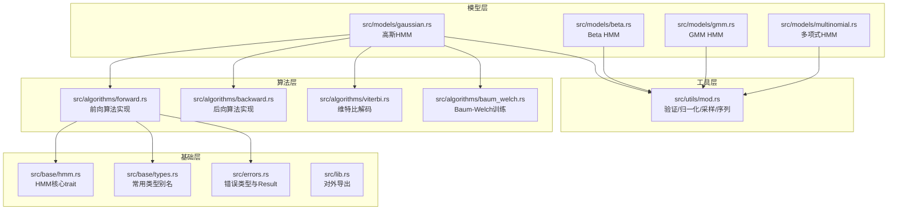
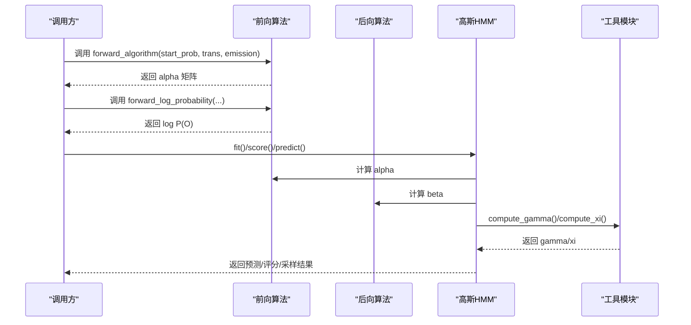
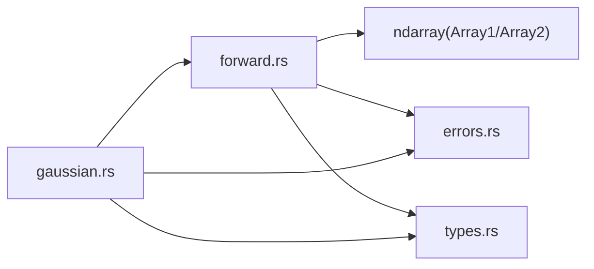

# 前向算法

<cite>
**本文引用的文件**
- [src/algorithms/forward.rs](file://src/algorithms/forward.rs)
- [src/base/hmm.rs](file://src/base/hmm.rs)
- [src/base/types.rs](file://src/base/types.rs)
- [src/errors.rs](file://src/errors.rs)
- [src/lib.rs](file://src/lib.rs)
- [src/models/gaussian.rs](file://src/models/gaussian.rs)
- [src/utils/mod.rs](file://src/utils/mod.rs)
- [tests/integration_tests.rs](file://tests/integration_tests.rs)
- [README.md](file://README.md)
</cite>

## 目录
1. [引言](#引言)
2. [项目结构](#项目结构)
3. [核心组件](#核心组件)
4. [架构总览](#架构总览)
5. [详细组件分析](#详细组件分析)
6. [依赖分析](#依赖分析)
7. [性能考量](#性能考量)
8. [故障排查指南](#故障排查指南)
9. [结论](#结论)
10. [附录](#附录)

## 引言
本文件围绕前向算法（Forward Algorithm）进行系统化技术文档编写，目标包括：
- 数学原理与递推关系：alpha 概率的定义、初始化、递推与最终概率计算
- 在 HMM 中的作用：计算观测序列概率与各时间步的状态概率
- 函数接口说明：参数类型、返回值、错误处理
- 复杂度分析：时间复杂度 O(T×N^2)、空间复杂度
- 数值稳定性与对数域计算
- 性能优化建议与常见问题解决方案
- 实际代码示例与测试用例解析

## 项目结构
该仓库采用模块化组织，前向算法位于 algorithms 子模块中，配合基础类型、错误处理、模型实现与工具模块共同构成完整的 HMM 能力集。

图表来源
- [src/algorithms/forward.rs](file://src/algorithms/forward.rs#L1-L129)
- [src/base/hmm.rs](file://src/base/hmm.rs#L1-L62)
- [src/base/types.rs](file://src/base/types.rs#L1-L61)
- [src/errors.rs](file://src/errors.rs#L1-L105)
- [src/lib.rs](file://src/lib.rs#L1-L28)
- [src/models/gaussian.rs](file://src/models/gaussian.rs#L1-L200)
- [src/utils/mod.rs](file://src/utils/mod.rs#L1-L12)

章节来源
- [src/lib.rs](file://src/lib.rs#L1-L28)
- [README.md](file://README.md#L1-L303)

## 核心组件
- 前向算法函数：计算 alpha 概率矩阵与观测序列的对数概率
- HMM 核心 trait：定义模型统一接口（fit/predict/score/sample/decode）
- 类型别名：过渡矩阵、初始概率、观测序列、状态序列等
- 错误类型：统一的 Result 类型与错误枚举

章节来源
- [src/algorithms/forward.rs](file://src/algorithms/forward.rs#L1-L129)
- [src/base/hmm.rs](file://src/base/hmm.rs#L1-L62)
- [src/base/types.rs](file://src/base/types.rs#L1-L61)
- [src/errors.rs](file://src/errors.rs#L1-L105)

## 架构总览
前向算法作为 HMM 的基础能力之一，被多个模型共享使用。例如高斯 HMM 在其训练与评估流程中会调用前向/后向算法以计算状态占用概率 gamma 与转移概率 xi。

图表来源
- [src/algorithms/forward.rs](file://src/algorithms/forward.rs#L20-L69)
- [src/models/gaussian.rs](file://src/models/gaussian.rs#L3-L10)
- [src/utils/mod.rs](file://src/utils/mod.rs#L1-L12)

## 详细组件分析

### 数学原理与递推关系
- alpha 概率定义：在时间 t 且处于状态 i 的条件下，观测到前 t 步完整观测序列的概率，记为 α(t,i)。
- 初始化：对 t=0，α(0,i) ∝ π(i) × b_i(o_1)，其中 π 为初始概率，b_i 为状态 i 下的观测密度/概率。
- 递推：对 t≥1，α(t,j) ∝ Σ_i α(t−1,i) × a_ij × b_j(o_t)，其中 a_ij 为状态转移概率。
- 最终概率：P(O) = Σ_i α(T,i)；通常取对数得到 log P(O) 以提升数值稳定性。

章节来源
- [src/algorithms/forward.rs](file://src/algorithms/forward.rs#L6-L47)

### 函数接口说明
- 函数：forward_algorithm
  - 参数：start_prob: Array1<f64>（初始状态概率），transition_matrix: Array2<f64>（状态转移矩阵），emission_probs: Array2<f64>（每个观测对应各状态的发射概率/密度）
  - 返回：Result<Array2<f64>>（形状为 (n_samples, n_states) 的 alpha 矩阵）
  - 错误：依赖 Result 类型，具体错误由调用链上游抛出（如维度不匹配、未拟合等）

- 函数：forward_log_probability
  - 参数：同上
  - 返回：Result<f64>（观测序列的对数概率）
  - 实现要点：先调用前向算法得到 alpha，再对最后一行求和并取对数

章节来源
- [src/algorithms/forward.rs](file://src/algorithms/forward.rs#L20-L69)
- [src/base/types.rs](file://src/base/types.rs#L5-L15)
- [src/errors.rs](file://src/errors.rs#L5-L6)

### 数据结构与复杂度
- 输入规模：T 为观测序列长度，N 为隐藏状态数
- 时间复杂度：O(T×N^2)。外层循环遍历 T，内层对每个 j 需要对所有 i 求和，涉及矩阵乘法或双重循环，典型为 O(N^2)。
- 空间复杂度：O(T×N)，用于存储 alpha 矩阵。

章节来源
- [src/algorithms/forward.rs](file://src/algorithms/forward.rs#L20-L47)

### 数值稳定性与对数域计算
- 对数域优势：直接相乘会快速下溢，取对数后转为加法，避免数值不稳定。
- 当前实现：forward_log_probability 返回 log P(O)，属于对数域计算。
- 建议实践：在实际模型（如高斯/贝塔 HMM）中，发射概率通常以对数形式计算，前向/后向亦应保持在对数域以避免累积误差。

章节来源
- [src/algorithms/forward.rs](file://src/algorithms/forward.rs#L60-L69)
- [README.md](file://README.md#L222-L229)

### 与 HMM 模型的集成
- 高斯 HMM：在 fit/score/predict 等流程中会调用前向/后向算法，并通过工具函数 compute_gamma/compute_xi 计算状态占用与转移概率。
- 其他模型（Beta/GMM/Multinomial）同样可复用前向算法框架，仅在发射概率计算上不同。

章节来源
- [src/models/gaussian.rs](file://src/models/gaussian.rs#L3-L10)
- [src/utils/mod.rs](file://src/utils/mod.rs#L1-L12)

### 测试用例解析
- 单观测序列测试：验证 alpha 形状与首步计算正确性
- 维度一致性测试：确保输出矩阵维度与输入一致
- 对数概率测试：验证返回值为负数（符合概率小于等于1的对数性质）
- 与后向算法一致性：检查前向/后向矩阵形状一致

章节来源
- [tests/integration_tests.rs](file://tests/integration_tests.rs#L30-L45)
- [src/algorithms/forward.rs](file://src/algorithms/forward.rs#L71-L129)

## 依赖分析
- 前向算法依赖 ndarray 进行数组操作
- 错误处理通过统一 Result 类型与 HmmError 枚举
- 类型别名简化了参数签名
- 高斯 HMM 在训练/评分中复用前向/后向算法

图表来源
- [src/algorithms/forward.rs](file://src/algorithms/forward.rs#L3-L4)
- [src/errors.rs](file://src/errors.rs#L5-L6)
- [src/base/types.rs](file://src/base/types.rs#L5-L15)
- [src/models/gaussian.rs](file://src/models/gaussian.rs#L3-L6)

章节来源
- [src/algorithms/forward.rs](file://src/algorithms/forward.rs#L3-L4)
- [src/errors.rs](file://src/errors.rs#L5-L6)
- [src/base/types.rs](file://src/base/types.rs#L5-L15)
- [src/models/gaussian.rs](file://src/models/gaussian.rs#L3-L6)

## 性能考量
- 时间复杂度 O(T×N^2)：主要瓶颈在于对每个时间步的内部求和，需注意 N 较大时的性能开销。
- 空间复杂度 O(T×N)：alpha 矩阵占用内存，长序列会显著增加内存压力。
- 向量化与对数域：优先使用对数域计算，减少下溢风险；在可能的情况下利用广播与向量化操作（如在 compute_gamma/compute_xi 中已体现）。
- 并行化：当前实现为顺序迭代，若需要可考虑按时间步并行（需保证无数据竞争）。

[本节为通用性能讨论，无需特定文件来源]

## 故障排查指南
- 维度不匹配：当 start_prob/n_states 与 emission_probs 的列数不一致时，会导致运行时错误。请确保输入矩阵维度一致。
- 未拟合模型：在某些模型中，需要先 fit 才能执行 predict/score。若提前调用会触发“模型未拟合”错误。
- 观测范围非法：例如 Beta HMM 要求观测值在 (0,1) 区间，超出范围会报错。
- 数值异常：概率为 0 或 NaN 导致对数域计算失败。建议在发射概率计算阶段加入极小值约束或对数域规范化。

章节来源
- [src/errors.rs](file://src/errors.rs#L14-L15)
- [src/errors.rs](file://src/errors.rs#L20-L21)
- [src/models/gaussian.rs](file://src/models/gaussian.rs#L111-L134)

## 结论
前向算法是 HMM 的基石，负责高效地计算观测序列的概率以及各时间步的状态概率。通过清晰的接口设计、统一的错误处理与对数域计算策略，该实现既保证了数值稳定性，又具备良好的扩展性，可无缝集成到多种 HMM 模型中。

[本节为总结性内容，无需特定文件来源]

## 附录

### 函数签名与行为摘要
- forward_algorithm(start_prob, transition_matrix, emission_probs) -> Result<Array2<f64>>
  - 功能：计算 alpha 矩阵
  - 输入维度：start_prob=(N,), transition_matrix=(N,N), emission_probs=(T,N)
  - 输出维度：alpha=(T,N)
- forward_log_probability(start_prob, transition_matrix, emission_probs) -> Result<f64>
  - 功能：返回 log P(O)
  - 行为：调用前向算法后对最后一行求和并取对数

章节来源
- [src/algorithms/forward.rs](file://src/algorithms/forward.rs#L20-L69)

### 使用场景与最佳实践
- 场景：HMM 模型评分（log-likelihood）、训练中的 E 步统计（gamma/xi 计算）
- 最佳实践：
  - 在发射概率计算阶段即使用对数形式，避免后续乘积导致的下溢
  - 对 alpha/beta 进行数值稳定化（如减去最大值或使用 log-sum-exp）
  - 对于长序列，考虑分段处理或降低 N

[本节为概念性内容，无需特定文件来源]