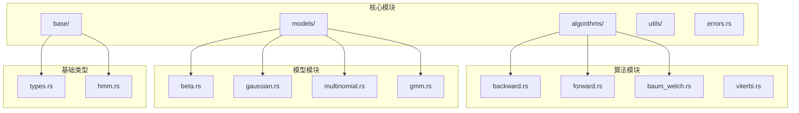
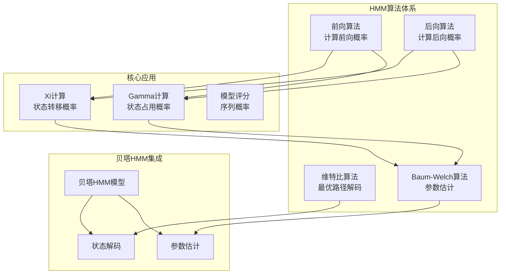
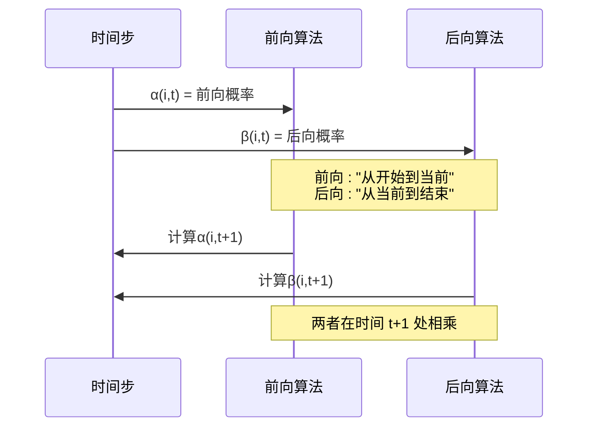
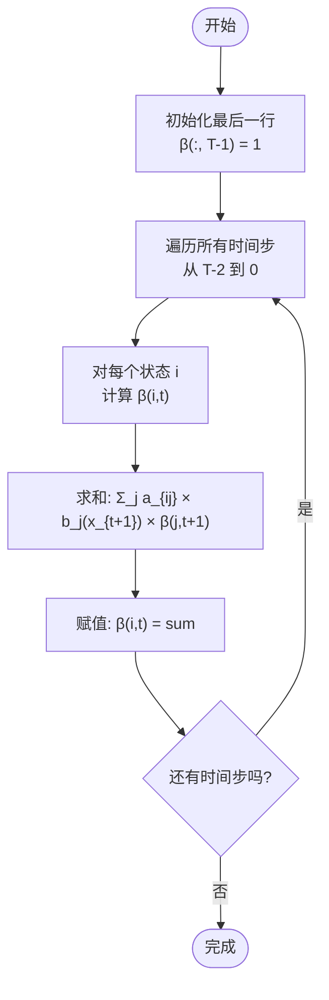
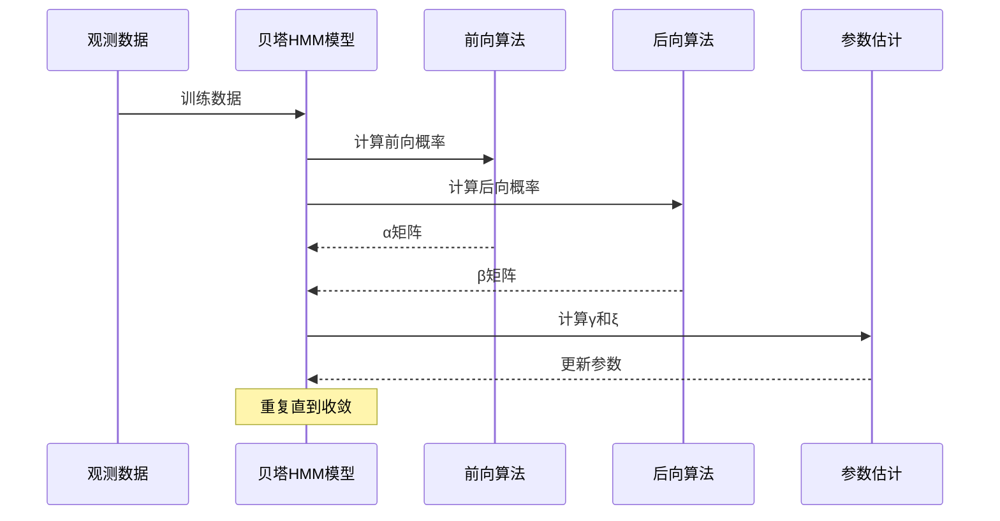
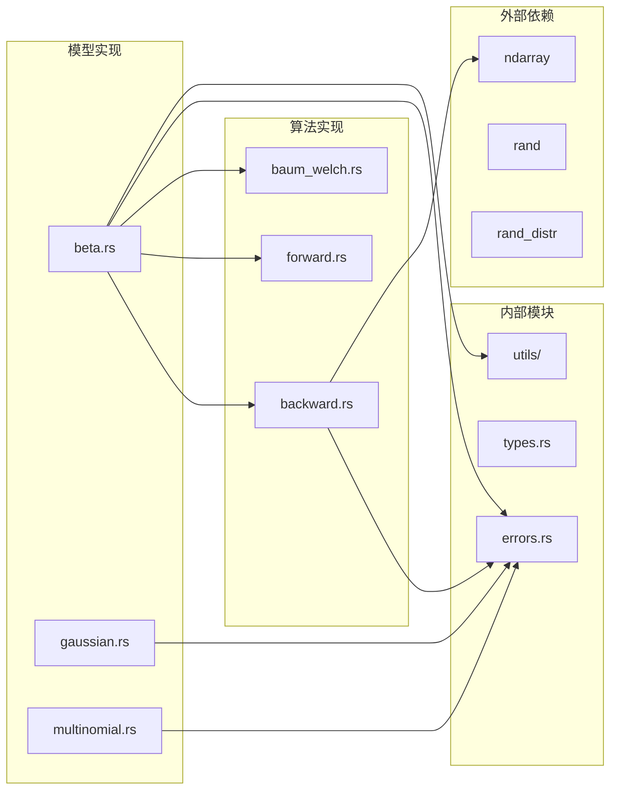
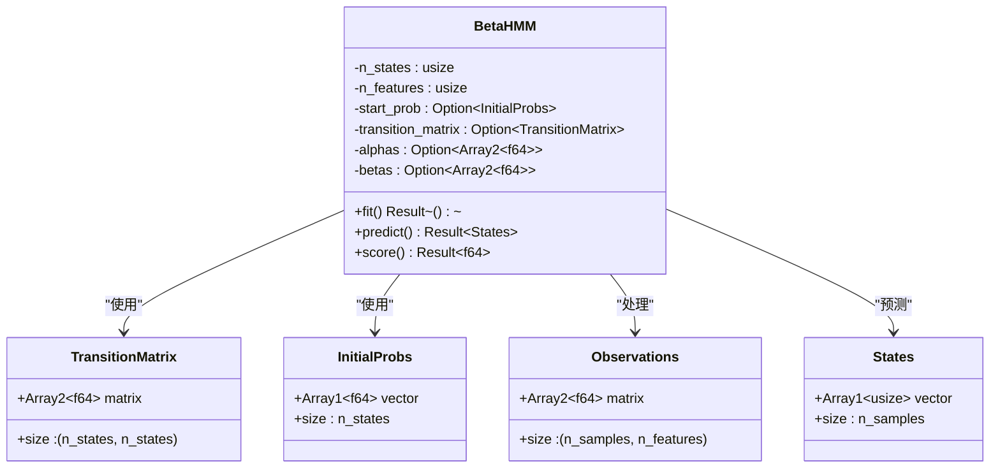

# 后向算法

<cite>
**本文档引用的文件**
- [backward.rs](file://src/algorithms/backward.rs)
- [forward.rs](file://src/algorithms/forward.rs)
- [baum_welch.rs](file://src/algorithms/baum_welch.rs)
- [beta.rs](file://src/models/beta.rs)
- [types.rs](file://src/base/types.rs)
- [hmm.rs](file://src/base/hmm.rs)
- [errors.rs](file://src/errors.rs)
- [mod.rs](file://src/algorithms/mod.rs)
- [lib.rs](file://src/lib.rs)
- [beta_hmm_example.rs](file://examples/beta_hmm_example.rs)
- [Cargo.toml](file://Cargo.toml)
</cite>

## 目录
1. [简介](#简介)
2. [项目结构](#项目结构)
3. [核心组件](#核心组件)
4. [架构概览](#架构概览)
5. [详细组件分析](#详细组件分析)
6. [依赖关系分析](#依赖关系分析)
7. [性能考虑](#性能考虑)
8. [故障排除指南](#故障排除指南)
9. [结论](#结论)

## 简介

后向算法是隐马尔可夫模型（HMM）中一个重要的递推算法，用于计算在给定时间步状态下观察到剩余序列的概率。该算法与前向算法形成互补，两者结合可以实现参数估计、状态概率计算和模型评估等核心功能。

在本项目中，后向算法通过 `backward_algorithm` 函数实现，采用标准的数学定义和数值稳定的实现方式。该算法在贝塔HMM模型中得到广泛应用，支持参数估计和状态解码等高级功能。

## 项目结构

该项目采用模块化设计，将不同类型的算法和模型分离到独立的模块中：



**图表来源**
- [lib.rs](file://src/lib.rs#L1-L28)
- [mod.rs](file://src/algorithms/mod.rs#L1-L12)

**章节来源**
- [lib.rs](file://src/lib.rs#L1-L28)
- [mod.rs](file://src/algorithms/mod.rs#L1-L12)

## 核心组件

### 后向算法函数接口

后向算法的核心实现位于 `backward.rs` 文件中，提供以下主要接口：

#### 主要函数
- `backward_algorithm`: 计算后向概率矩阵
- 参数类型: `transition_matrix` (状态转移矩阵), `emission_probs` (发射概率)
- 返回值: `Result<Array2<f64>>` (形状为 `(n_samples, n_states)` 的后向概率矩阵)
- 错误处理: 使用 `Result` 类型包装可能的错误

#### 关键数据结构
- **后向概率矩阵 (Beta Matrix)**: 存储每个时间步和状态的后向概率
- **状态转移矩阵**: 描述状态间的转换概率
- **发射概率矩阵**: 描述在特定状态下观察到各观测值的概率

**章节来源**
- [backward.rs](file://src/algorithms/backward.rs#L1-L90)

## 架构概览

后向算法在整个HMM系统中扮演着关键角色，与前向算法、维特比算法和Baum-Welch算法形成完整的算法体系：



**图表来源**
- [backward.rs](file://src/algorithms/backward.rs#L1-L90)
- [forward.rs](file://src/algorithms/forward.rs#L1-L129)
- [baum_welch.rs](file://src/algorithms/baum_welch.rs#L1-L75)
- [beta.rs](file://src/models/beta.rs#L393-L547)

## 详细组件分析

### 数学原理和递推关系

#### 后向概率的数学定义

后向概率 β(i,t) 定义为在时间 t 处于状态 i 的条件下，从时间 t+1 到 T 观察到剩余序列的概率：

```
β(i,t) = P(x_{t+1}, x_{t+2}, ..., x_T | q_t = i)
```

#### 边界条件设置

后向算法的边界条件为：
```
β(i, T-1) = 1  对所有状态 i
```

这表示在最后一个时间步，从当前状态到序列结束的条件概率为1。

#### 递推公式

后向算法的标准递推关系为：
```
β(i,t) = Σ_j [a_{ij} × b_j(x_{t+1}) × β(j,t+1)]
```

其中：
- a_{ij}: 从状态 i 转移到状态 j 的概率
- b_j(x_{t+1}): 在状态 j 下观察到 x_{t+1} 的发射概率
- Σ_j: 对所有可能的下一个状态 j 求和

#### 与前向算法的关系

前向算法和后向算法在概念上互为镜像：



**图表来源**
- [forward.rs](file://src/algorithms/forward.rs#L20-L47)
- [backward.rs](file://src/algorithms/backward.rs#L19-L45)

**章节来源**
- [forward.rs](file://src/algorithms/forward.rs#L1-L129)
- [backward.rs](file://src/algorithms/backward.rs#L1-L90)

### 实现细节分析

#### 初始化阶段

后向算法的初始化过程相对简单，仅需设置最后一个时间步的所有状态概率为1：



**图表来源**
- [backward.rs](file://src/algorithms/backward.rs#L28-L42)

#### 状态转移计算

后向算法的状态转移计算涉及三重循环：

1. **时间步循环**: 从 n_samples-2 递减到 0
2. **源状态循环**: 对每个状态 i
3. **目标状态循环**: 对所有可能的下一个状态 j

这种设计确保了算法能够正确处理所有状态间的转换关系。

**章节来源**
- [backward.rs](file://src/algorithms/backward.rs#L33-L42)

### 在贝塔HMM中的应用

贝塔HMM模型将后向算法集成到完整的参数估计流程中：



**图表来源**
- [beta.rs](file://src/models/beta.rs#L468-L542)

**章节来源**
- [beta.rs](file://src/models/beta.rs#L468-L542)

## 依赖关系分析

### 模块间依赖关系

后向算法与其他模块的依赖关系如下：



**图表来源**
- [backward.rs](file://src/algorithms/backward.rs#L1-L90)
- [beta.rs](file://src/models/beta.rs#L1-L734)
- [Cargo.toml](file://Cargo.toml#L13-L20)

### 类型系统设计

项目使用强类型系统确保参数的正确性：



**图表来源**
- [types.rs](file://src/base/types.rs#L5-L15)
- [beta.rs](file://src/models/beta.rs#L24-L39)

**章节来源**
- [types.rs](file://src/base/types.rs#L1-L61)
- [beta.rs](file://src/models/beta.rs#L24-L39)

## 性能考虑

### 时间复杂度分析

后向算法的时间复杂度为 O(T × N²)，其中：
- T: 序列长度
- N: 隐藏状态数量

具体分析：
1. **外层循环**: 时间步遍历，执行 T-1 次
2. **中层循环**: 源状态遍历，执行 N 次
3. **内层循环**: 目标状态求和，执行 N 次
4. **总复杂度**: (T-1) × N × N = O(T × N²)

### 空间复杂度分析

后向算法的空间复杂度为 O(T × N)，主要用于存储后向概率矩阵：
- **后向概率矩阵**: T × N 元素
- **临时变量**: 常数级额外空间
- **总空间**: O(T × N)

### 性能优化建议

1. **内存访问模式优化**
   - 利用ndarray的连续内存布局
   - 减少数组索引操作的开销

2. **数值稳定性改进**
   - 在高维情况下考虑对数域计算
   - 避免数值下溢和上溢

3. **并行化机会**
   - 不同时间步之间可以并行处理
   - 不同状态之间的计算可以并行化

**章节来源**
- [backward.rs](file://src/algorithms/backward.rs#L19-L45)

## 故障排除指南

### 常见错误类型

项目使用统一的错误处理机制，后向算法可能遇到的错误包括：

#### 参数验证错误
- **维度不匹配**: 观测序列与模型参数维度不符
- **概率无效**: 转移矩阵或初始概率不符合概率分布要求
- **空输入**: 传入空的观测数据或参数

#### 数值计算错误
- **数值下溢**: 概率值过小导致精度丢失
- **收敛失败**: 算法无法达到预期的收敛标准
- **矩阵无效**: 转移矩阵不是有效的概率矩阵

### 调试技巧

1. **单元测试验证**
   ```rust
   // 测试后向算法的基本功能
   #[test]
   fn test_backward_algorithm_simple() {
       let transition_matrix = array![[0.7, 0.3], [0.4, 0.6]];
       let emission_probs = array![[0.9, 0.1], [0.8, 0.2]];
       
       let beta = backward_algorithm(&transition_matrix, &emission_probs).unwrap();
       
       // 验证最后时间步为1.0
       assert_relative_eq!(beta[[1, 0]], 1.0, epsilon = 1e-10);
       assert_relative_eq!(beta[[1, 1]], 1.0, epsilon = 1e-10);
   }
   ```

2. **边界条件检查**
   - 单观测序列测试
   - 单状态模型测试
   - 极端概率值测试

3. **数值稳定性检查**
   - 检查概率和是否接近1.0
   - 验证无负值出现
   - 监控数值范围

**章节来源**
- [errors.rs](file://src/errors.rs#L8-L34)
- [backward.rs](file://src/algorithms/backward.rs#L47-L89)

## 结论

后向算法作为HMM理论的重要组成部分，在本项目中得到了完整而高效的实现。通过与前向算法的完美配合，后向算法为参数估计、状态解码和模型评估提供了坚实的数学基础。

### 主要优势

1. **数学严谨性**: 严格遵循HMM理论定义
2. **实现效率**: 采用O(T×N²)的时间复杂度
3. **数值稳定性**: 提供了完善的错误处理机制
4. **模块化设计**: 与整个HMM生态系统无缝集成

### 应用价值

后向算法在以下场景中发挥重要作用：
- **参数估计**: 与前向算法结合实现Baum-Welch算法
- **状态概率计算**: 通过γ和ξ计算实现精确的状态解码
- **模型评估**: 为模型选择和比较提供量化指标
- **贝塔HMM**: 支持比例数据的建模和分析

该实现为后续的算法扩展和优化奠定了良好的基础，是构建更复杂HMM应用的理想起点。