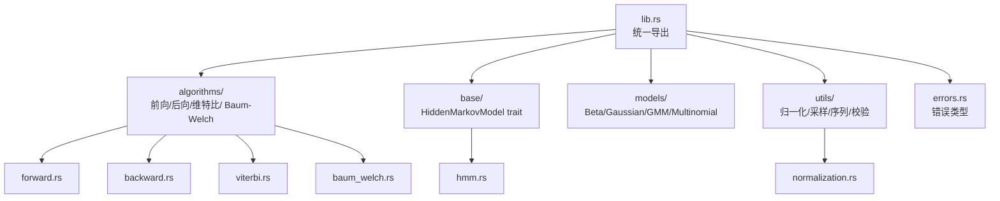
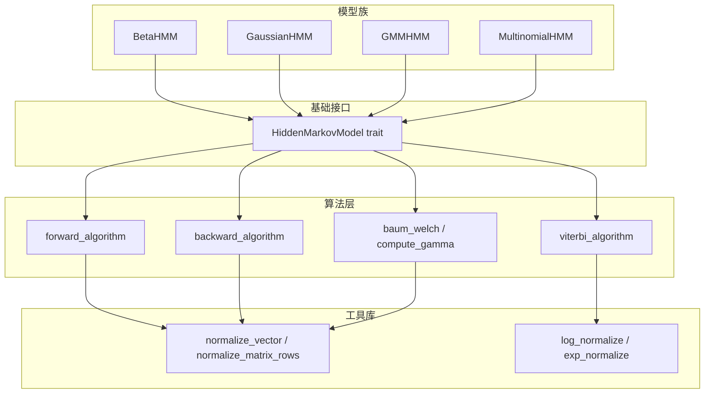
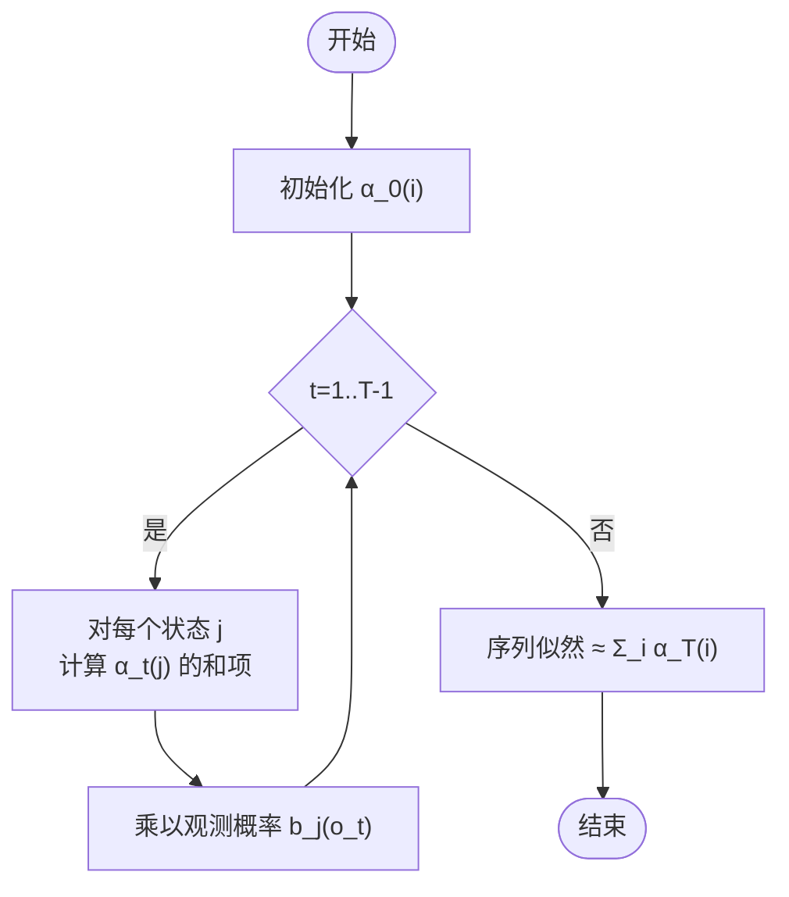
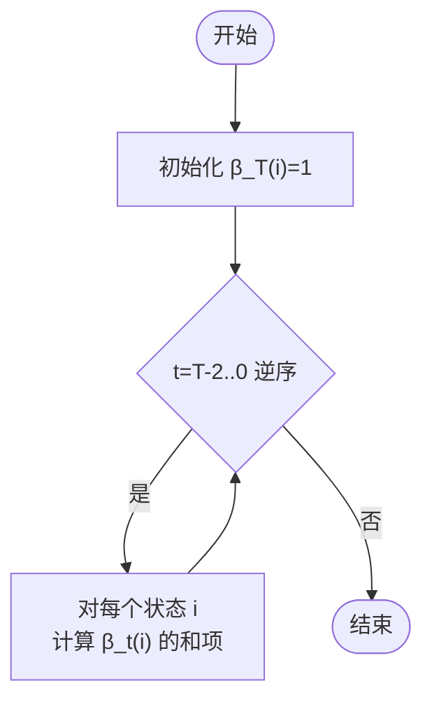
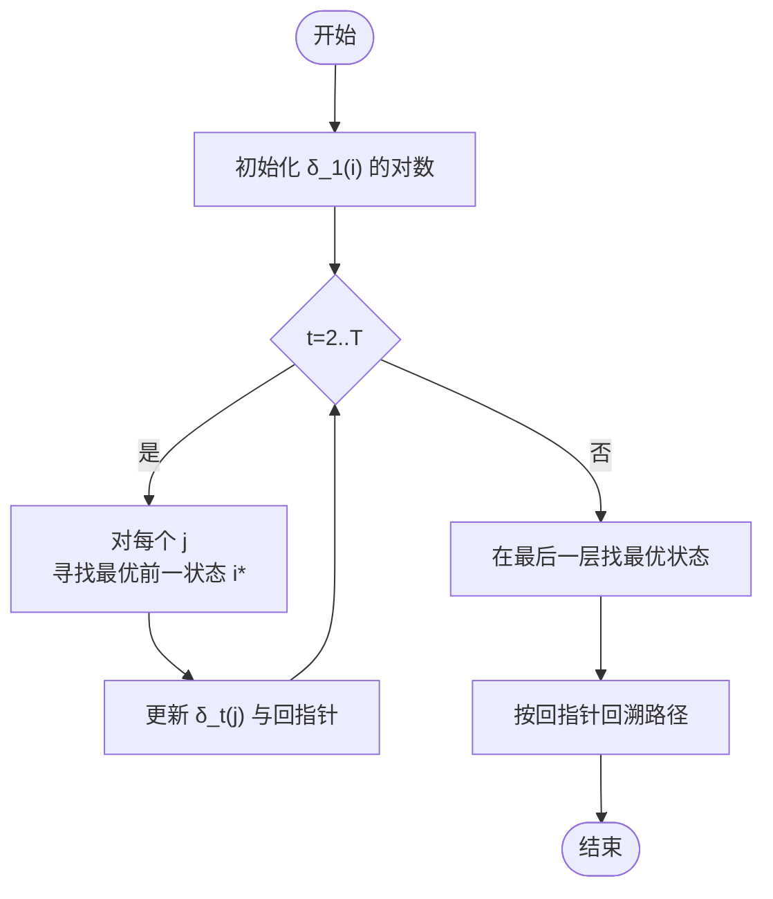
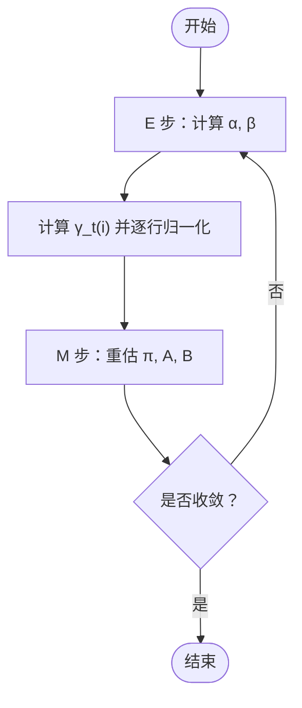
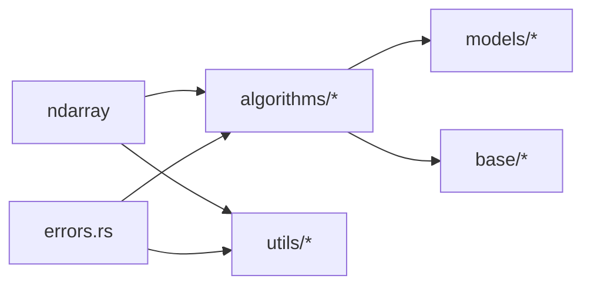

# 算法实现

<cite>
**本文引用的文件**
- [src/lib.rs](file://src/lib.rs)
- [src/algorithms/mod.rs](file://src/algorithms/mod.rs)
- [src/algorithms/forward.rs](file://src/algorithms/forward.rs)
- [src/algorithms/backward.rs](file://src/algorithms/backward.rs)
- [src/algorithms/viterbi.rs](file://src/algorithms/viterbi.rs)
- [src/algorithms/baum_welch.rs](file://src/algorithms/baum_welch.rs)
- [src/base/mod.rs](file://src/base/mod.rs)
- [src/base/hmm.rs](file://src/base/hmm.rs)
- [src/utils/mod.rs](file://src/utils/mod.rs)
- [src/utils/normalization.rs](file://src/utils/normalization.rs)
- [src/errors.rs](file://src/errors.rs)
- [examples/beta_hmm_example.rs](file://examples/beta_hmm_example.rs)
- [tests/integration_tests.rs](file://tests/integration_tests.rs)
- [Cargo.toml](file://Cargo.toml)
</cite>

## 目录
1. 引言
2. 项目结构
3. 核心组件
4. 架构总览
5. 详细组件分析
6. 依赖分析
7. 性能考量
8. 故障排查指南
9. 结论
10. 附录

## 引言
本文件面向 rhmm 库中的 HMM 算法实现，系统梳理前向（Forward）、后向（Backward）、维特比（Viterbi）与 Baum-Welch（EM）等核心算法的数学背景、实现细节、数值稳定性策略、复杂度与性能特征，并给出算法间的关系与组合使用场景。文档同时提供伪代码级流程图与可视化说明，帮助读者在工程实践中高效应用与优化这些算法。

## 项目结构
rhmm 采用模块化组织：算法层（algorithms）、基础接口（base）、模型族（models）、工具库（utils）与错误类型（errors）。对外通过 lib.rs 统一导出常用类型与 trait，便于上层模型调用。

图表来源
- [src/lib.rs](file://src/lib.rs#L19-L28)
- [src/algorithms/mod.rs](file://src/algorithms/mod.rs#L1-L12)
- [src/base/mod.rs](file://src/base/mod.rs#L1-L8)
- [src/utils/mod.rs](file://src/utils/mod.rs#L1-L12)

章节来源
- [src/lib.rs](file://src/lib.rs#L1-L28)
- [src/algorithms/mod.rs](file://src/algorithms/mod.rs#L1-L12)
- [src/base/mod.rs](file://src/base/mod.rs#L1-L8)
- [src/utils/mod.rs](file://src/utils/mod.rs#L1-L12)

## 核心组件
- 前向算法：计算“到时间 t 且处于状态 i 的部分观测序列”的概率（前向概率），用于评估序列似然与为后向/EM 提供中间量。
- 后向算法：计算“在时间 t 处于状态 i 的条件下，从 t+1 到 T 的剩余观测序列”的概率（后向概率），常与前向概率配合得到状态占用概率。
- 维特比算法：动态规划求解最可能的状态序列（最优路径），输出对数概率与路径。
- Baum-Welch（EM）：参数估计的 EM 迭代框架，当前仓库提供占位实现与 gamma 计算函数，完整实现待补充。

章节来源
- [src/algorithms/forward.rs](file://src/algorithms/forward.rs#L1-L129)
- [src/algorithms/backward.rs](file://src/algorithms/backward.rs#L1-L90)
- [src/algorithms/viterbi.rs](file://src/algorithms/viterbi.rs#L1-L118)
- [src/algorithms/baum_welch.rs](file://src/algorithms/baum_welch.rs#L1-L75)

## 架构总览
下图展示算法模块与基础 trait 的交互关系，以及工具库在归一化与数值稳定方面的支撑作用。

图表来源
- [src/algorithms/forward.rs](file://src/algorithms/forward.rs#L3-L4)
- [src/algorithms/backward.rs](file://src/algorithms/backward.rs#L3-L4)
- [src/algorithms/viterbi.rs](file://src/algorithms/viterbi.rs#L3-L4)
- [src/algorithms/baum_welch.rs](file://src/algorithms/baum_welch.rs#L4-L5)
- [src/base/hmm.rs](file://src/base/hmm.rs#L6-L61)
- [src/utils/normalization.rs](file://src/utils/normalization.rs#L6-L35)
- [src/models/mod.rs](file://src/models/mod.rs#L1-L12)

## 详细组件分析

### 前向算法（Forward）
- 数学定义与目的
  - 前向概率 α_t(i) 表示到时间 t 且处于状态 i 的部分观测序列的概率。
  - 可用于计算观测序列的似然（所有状态的 α_T 和），并为后向与 EM 提供中间量。
- 实现要点
  - 初始化：α_0(i) ∝ π(i) · b_i(o_0)。
  - 递推：α_t(j) ∝ Σ_i α_{t-1}(i) · a_{ij} · b_j(o_t)。
  - 归一化：可选地在每步进行行归一化以提升数值稳定性（见“数值稳定性”）。
- 复杂度
  - 时间复杂度：O(T · N^2)，T 为观测长度，N 为状态数。
  - 空间复杂度：O(T · N)。
- 数值稳定性
  - 使用 log 概率或行归一化避免下溢；log 空间转换由工具库提供。
- 关键实现位置
  - 前向概率矩阵计算：[forward_algorithm](file://src/algorithms/forward.rs#L20-L46)
  - 对数似然计算：[forward_log_probability](file://src/algorithms/forward.rs#L60-L69)

图表来源
- [src/algorithms/forward.rs](file://src/algorithms/forward.rs#L30-L44)

章节来源
- [src/algorithms/forward.rs](file://src/algorithms/forward.rs#L1-L129)
- [src/utils/normalization.rs](file://src/utils/normalization.rs#L14-L23)

### 后向算法（Backward）
- 数学定义与目的
  - 后向概率 β_t(i) 表示在时间 t 处于状态 i 的条件下，从 t+1 到 T 的剩余观测序列的概率。
  - 与前向概率配合可得 γ_t(i) = α_t(i)β_t(i) / P(O)。
- 实现要点
  - 初始化：β_T(i) = 1。
  - 递推：β_t(i) ∝ Σ_j a_{ij} · b_j(o_{t+1}) · β_{t+1}(j)。
- 复杂度
  - 时间复杂度：O(T · N^2)。
  - 空间复杂度：O(T · N)。
- 数值稳定性
  - 与前向类似，可结合行归一化或对数空间计算。
- 关键实现位置
  - 后向概率矩阵计算：[backward_algorithm](file://src/algorithms/backward.rs#L19-L44)

图表来源
- [src/algorithms/backward.rs](file://src/algorithms/backward.rs#L28-L42)

章节来源
- [src/algorithms/backward.rs](file://src/algorithms/backward.rs#L1-L90)

### 维特比算法（Viterbi）
- 数学定义与目的
  - 动态规划求解最可能的状态序列（路径），输出对数概率与路径数组。
- 实现要点
  - 初始化：δ_1(i) = π(i) · b_i(o_1) 的对数形式。
  - 递推：δ_t(j) = max_i [δ_{t-1}(i) + log a_{ij}] + log b_j(o_t)，并记录回指针。
  - 回溯：从末尾状态向前按回指针取最优路径。
- 复杂度
  - 时间复杂度：O(T · N^2)。
  - 空间复杂度：O(T · N)（含回指针）。
- 数值稳定性
  - 使用 log 空间避免小数连乘导致下溢。
- 关键实现位置
  - 最优路径与对数概率：[viterbi_algorithm](file://src/algorithms/viterbi.rs#L20-L74)

图表来源
- [src/algorithms/viterbi.rs](file://src/algorithms/viterbi.rs#L31-L71)

章节来源
- [src/algorithms/viterbi.rs](file://src/algorithms/viterbi.rs#L1-L118)

### Baum-Welch（EM）算法
- 数学背景
  - EM 的 E 步：计算前向/后向概率，进而得到 γ_t(i) 与 ξ_t(i,j)。
  - M 步：基于 γ 与 ξ 重估初始概率、转移矩阵与发射参数。
  - 收敛：通常以对数似然增量小于阈值或达到最大迭代次数停止。
- 当前实现状态
  - 占位函数返回最大迭代次数，未实现完整 EM 迭代与收敛判断。
  - 提供 gamma 计算函数，内部对每行进行概率归一化。
- 关键实现位置
  - 占位 EM 主函数：[baum_welch](file://src/algorithms/baum_welch.rs#L25-L44)
  - γ 计算与行归一化：[compute_gamma](file://src/algorithms/baum_welch.rs#L56-L74)
  - 归一化工具：[normalize_vector](file://src/utils/normalization.rs#L6-L12)、[normalize_matrix_rows](file://src/utils/normalization.rs#L14-L23)

图表来源
- [src/algorithms/baum_welch.rs](file://src/algorithms/baum_welch.rs#L36-L43)
- [src/algorithms/forward.rs](file://src/algorithms/forward.rs#L60-L69)
- [src/algorithms/backward.rs](file://src/algorithms/backward.rs#L19-L44)
- [src/algorithms/baum_welch.rs](file://src/algorithms/baum_welch.rs#L56-L74)
- [src/utils/normalization.rs](file://src/utils/normalization.rs#L14-L23)

章节来源
- [src/algorithms/baum_welch.rs](file://src/algorithms/baum_welch.rs#L1-L75)
- [src/utils/normalization.rs](file://src/utils/normalization.rs#L1-L102)

### 算法间关系与组合使用
- 前向/后向一致性验证：二者应产生相同维度的矩阵，且在无归一化时满足全局概率一致性。
- γ 的计算：γ_t(i) = α_t(i)β_t(i) / P(O)，用于状态占用概率估计。
- 维特比与前向/后向：维特比用于点估计（最优路径），前向/后向用于分布估计（全路径权重）。
- EM 参数估计：E 步用前向/后向，M 步用 γ/ξ 更新参数；可与维特比联合用于预测阶段。

章节来源
- [tests/integration_tests.rs](file://tests/integration_tests.rs#L30-L45)
- [src/algorithms/baum_welch.rs](file://src/algorithms/baum_welch.rs#L56-L74)

## 依赖分析
- 数据结构与线性代数：使用 ndarray 矩阵/向量，提供高效的多维数组操作。
- 数值稳定性：通过行归一化与 log 空间转换降低下溢风险。
- 错误处理：统一的 Result 类型与 HmmError 枚举，覆盖参数、维度、概率、拟合状态、收敛与数值错误等。

图表来源
- [Cargo.toml](file://Cargo.toml#L13-L20)
- [src/algorithms/forward.rs](file://src/algorithms/forward.rs#L3-L4)
- [src/algorithms/backward.rs](file://src/algorithms/backward.rs#L3-L4)
- [src/algorithms/viterbi.rs](file://src/algorithms/viterbi.rs#L3-L4)
- [src/utils/normalization.rs](file://src/utils/normalization.rs#L3-L4)
- [src/errors.rs](file://src/errors.rs#L5-L6)

章节来源
- [Cargo.toml](file://Cargo.toml#L1-L23)
- [src/errors.rs](file://src/errors.rs#L1-L105)

## 性能考量
- 时间复杂度
  - 前向/后向/维特比均为 O(T · N^2)；当状态数 N 较大时，需优先考虑矩阵乘法优化与缓存友好布局。
- 空间复杂度
  - O(T · N)，可通过分块计算或仅保存必要列降低内存占用。
- 数值稳定性
  - 使用行归一化（每步将 α 或 β 按行和归一）或 log 概率（维特比已采用）。
  - 工具库提供 log_normalize 与 exp_normalize，避免直接对极小概率做乘幂导致下溢。
- 实践建议
  - 在长序列上优先采用 log 空间与分块处理。
  - 对转移/发射矩阵进行稀疏化（若适用）以减少乘法次数。
  - 预分配矩阵并复用中间结果，避免频繁分配。

章节来源
- [src/utils/normalization.rs](file://src/utils/normalization.rs#L25-L35)
- [src/algorithms/viterbi.rs](file://src/algorithms/viterbi.rs#L32-L51)

## 故障排查指南
- 常见错误类型
  - 参数非法、维度不匹配、概率无效、模型未拟合、收敛失败、状态非法、数值错误、IO 错误。
- 定位方法
  - 在 fit/predict/score 调用前后检查输入维度与概率非负性。
  - 使用工具库的 validate_probability_vector 与 normalize_vector 进行预处理。
  - 在 EM 中检查对数似然单调性与收敛阈值设置。
- 单元与集成测试参考
  - 前向/后向维度一致性、维特比确定性路径、归一化正确性、多序列拟合、错误分支覆盖。

章节来源
- [src/errors.rs](file://src/errors.rs#L9-L34)
- [tests/integration_tests.rs](file://tests/integration_tests.rs#L88-L102)
- [src/utils/normalization.rs](file://src/utils/normalization.rs#L54-L58)

## 结论
rhmm 的算法模块提供了前向、后向、维特比与 EM 的基础实现与工具支撑。当前 EM 仍为占位实现，建议在后续版本中补全 E/M 步与收敛判断。整体设计遵循模块化与数值稳定优先原则，适合在工程中作为 HMM 的核心计算引擎使用。建议结合具体模型（如高斯/多项式/贝塔）与数据规模选择合适的归一化策略与优化手段。

## 附录

### 使用示例与工作流
- Beta HMM 示例展示了从训练到预测、评分、采样与新数据预测的完整流程，可作为各算法组合使用的参考模板。

章节来源
- [examples/beta_hmm_example.rs](file://examples/beta_hmm_example.rs#L1-L266)

### 接口契约与模型族
- HiddenMarkovModel trait 规定了 fit/predict/score/sample/decode 等核心方法，具体模型（Beta/Gaussian/GMM/Multinomial）均实现该 trait，从而统一上层调用。

章节来源
- [src/base/hmm.rs](file://src/base/hmm.rs#L6-L61)
- [src/models/mod.rs](file://src/models/mod.rs#L1-L12)