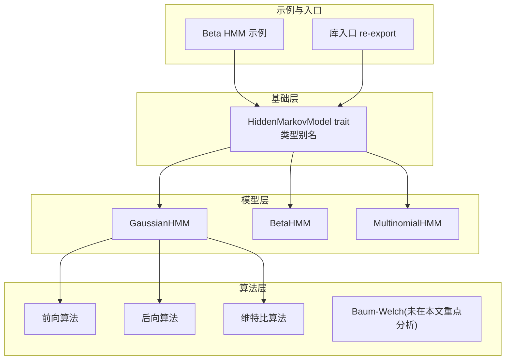
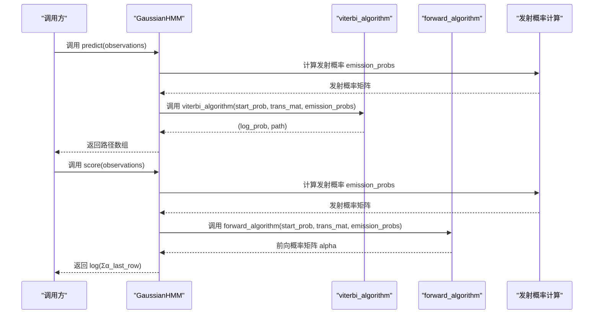
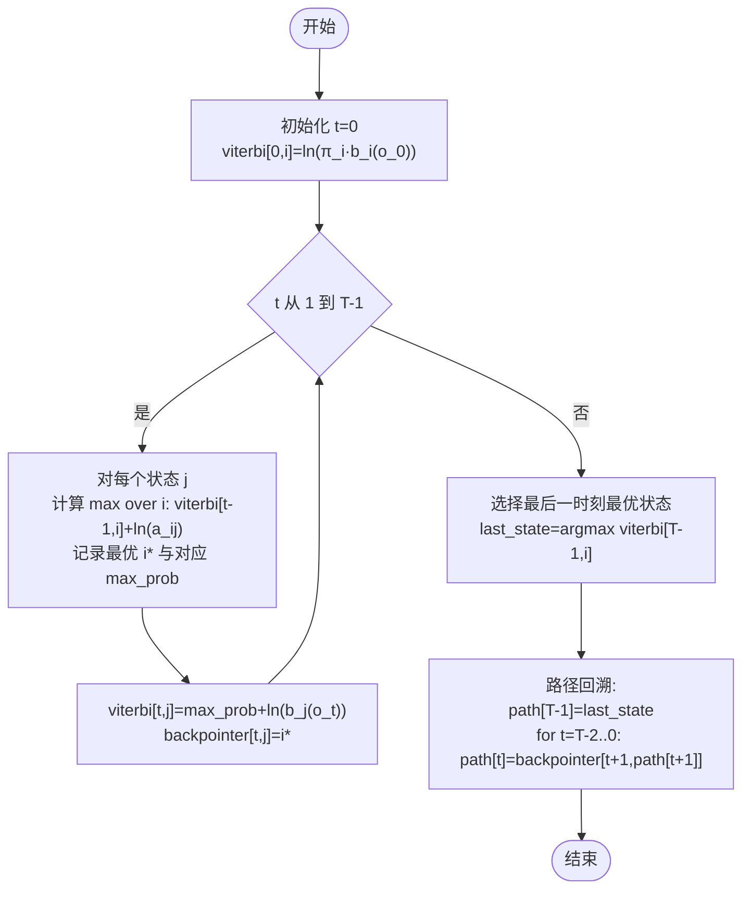
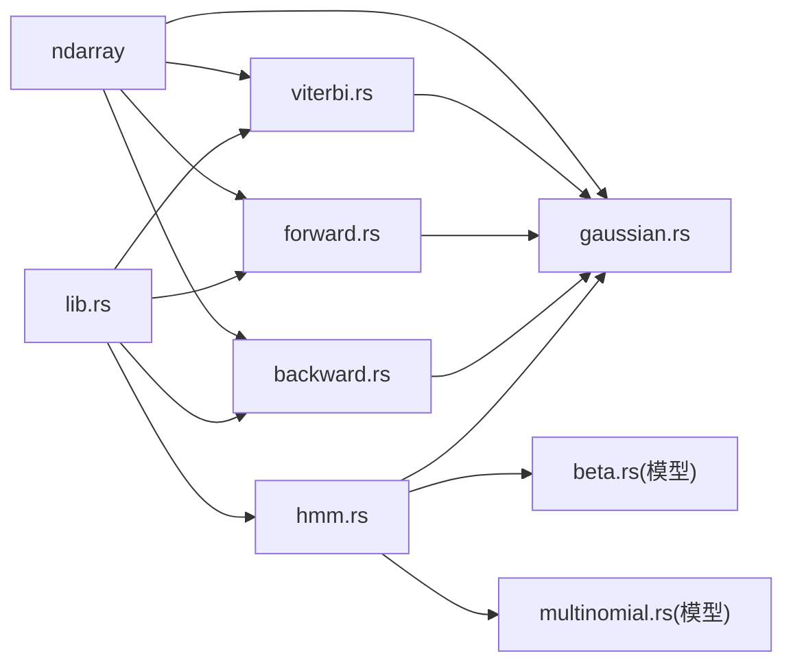

# 维特比算法

<cite>
**本文引用的文件**
- [viterbi.rs](file://src/algorithms/viterbi.rs)
- [hmm.rs](file://src/base/hmm.rs)
- [types.rs](file://src/base/types.rs)
- [gaussian.rs](file://src/models/gaussian.rs)
- [multinomial.rs](file://src/models/multinomial.rs)
- [forward.rs](file://src/algorithms/forward.rs)
- [backward.rs](file://src/algorithms/backward.rs)
- [lib.rs](file://src/lib.rs)
- [beta_hmm_example.rs](file://examples/beta_hmm_example.rs)
- [README.md](file://README.md)
- [Cargo.toml](file://Cargo.toml)
</cite>

## 目录
1. [简介](#简介)
2. [项目结构](#项目结构)
3. [核心组件](#核心组件)
4. [架构总览](#架构总览)
5. [详细组件分析](#详细组件分析)
6. [依赖关系分析](#依赖关系分析)
7. [性能考量](#性能考量)
8. [故障排查指南](#故障排查指南)
9. [结论](#结论)
10. [附录](#附录)

## 简介
本文件围绕维特比算法（Viterbi Algorithm）在隐马尔可夫模型（HMM）中的实现与应用展开，系统阐述其动态规划原理、最优路径搜索过程、delta 值计算与回溯机制，并结合代码库中现有实现，给出函数接口说明、时间/空间复杂度分析、适用场景与局限性、调试技巧与性能优化建议，以及与前向算法的区别与应用场景对比。

## 项目结构
该仓库采用模块化组织，核心围绕“基础接口”“算法实现”“模型实现”“工具与类型”等层次构建：
- 基础层：定义 HMM 核心 trait 与通用类型别名
- 算法层：实现前向、后向、维特比、Baum-Welch 等标准算法
- 模型层：实现高斯、Beta、多项式等不同发射分布的 HMM
- 示例与文档：提供使用示例与 README

图表来源
- [hmm.rs](file://src/base/hmm.rs#L6-L61)
- [gaussian.rs](file://src/models/gaussian.rs#L328-L612)
- [viterbi.rs](file://src/algorithms/viterbi.rs#L1-L118)
- [forward.rs](file://src/algorithms/forward.rs#L1-L129)
- [backward.rs](file://src/algorithms/backward.rs#L1-L90)
- [beta_hmm_example.rs](file://examples/beta_hmm_example.rs#L1-L266)
- [lib.rs](file://src/lib.rs#L19-L28)

章节来源
- [lib.rs](file://src/lib.rs#L1-L28)
- [README.md](file://README.md#L1-L303)

## 核心组件
- 维特比算法实现：提供函数接口以求解最可能的状态序列，并返回对数概率与路径数组
- HMM 核心 trait：统一模型能力，包括训练、预测（Viterbi）、评分（前向）、采样等
- 类型别名：为转移矩阵、初始概率、观测序列、状态序列等提供清晰的类型标识
- 高斯 HMM：在模型内部调用维特比算法进行解码；同时提供前向算法用于评分
- 多项式 HMM：当前未实现维特比与前向算法（占位）

章节来源
- [viterbi.rs](file://src/algorithms/viterbi.rs#L11-L74)
- [hmm.rs](file://src/base/hmm.rs#L6-L61)
- [types.rs](file://src/base/types.rs#L5-L15)
- [gaussian.rs](file://src/models/gaussian.rs#L493-L544)
- [multinomial.rs](file://src/models/multinomial.rs#L35-L94)

## 架构总览
维特比算法在模型中的位置如下：模型在预测阶段调用维特比算法，先根据观测序列计算发射概率，再由维特比算法求出最可能的状态序列；同时，模型在评分阶段调用前向算法计算对数似然。

图表来源
- [gaussian.rs](file://src/models/gaussian.rs#L493-L544)
- [viterbi.rs](file://src/algorithms/viterbi.rs#L20-L74)
- [forward.rs](file://src/algorithms/forward.rs#L20-L69)

## 详细组件分析

### 维特比算法实现（核心）
- 函数签名与返回值
  - 输入：初始状态概率向量、状态转移矩阵、每个时刻每个状态的发射概率矩阵
  - 输出：(对数概率, 最可能状态序列)
- 动态规划核心
  - 初始化：t=0 时，对每个状态计算 ln(π_i · b_i(o_0))
  - 递推：t>0 时，对每个状态 j，取前一时刻 i 的最优累积概率 ln(v[t-1,i] + a_ij) 的最大者，再乘以 ln(b_j(o_t))
  - 回溯：从最后一时刻选择最优状态，沿 backpointer 逐时刻回溯得到完整路径
- 数据结构
  - viterbi 矩阵：形状 (T, N)，存储每个时刻每个状态的最优累积对数值
  - backpointer 矩阵：形状 (T, N)，记录每个时刻每个状态的最优前驱状态
- 复杂度
  - 时间复杂度：O(T·N^2)，每步需遍历所有状态 i 计算最优前驱，共 T 步
  - 空间复杂度：O(T·N)，存储 viterbi 与 backpointer 矩阵

图表来源
- [viterbi.rs](file://src/algorithms/viterbi.rs#L31-L74)

章节来源
- [viterbi.rs](file://src/algorithms/viterbi.rs#L11-L74)

### HMM 核心 trait 与接口
- predict：返回最可能的状态序列（内部调用维特比）
- score：返回观测序列的对数概率（内部调用前向算法）
- decode：返回 (对数概率, 路径) 的组合
- n_states/n_features：查询模型维度

章节来源
- [hmm.rs](file://src/base/hmm.rs#L6-L61)

### 类型别名与数据约定
- TransitionMatrix：状态转移矩阵
- InitialProbs：初始状态概率向量
- Observations：观测序列（二维数组）
- States：状态序列（一维数组）

章节来源
- [types.rs](file://src/base/types.rs#L5-L15)

### 高斯 HMM 中的维特比与前向
- predict：先计算发射概率，再调用 viterbi_algorithm 得到路径
- score：先计算发射概率，再调用 forward_algorithm 并取对数
- 这两个流程与维特比算法紧密配合，形成“解码（Viterbi）+ 评分（Forward）”的标准工作流

章节来源
- [gaussian.rs](file://src/models/gaussian.rs#L493-L544)
- [forward.rs](file://src/algorithms/forward.rs#L20-L69)

### 多项式 HMM 的现状
- 当前未实现维特比与前向算法，predict/score/sample 返回占位结果或错误
- 未来可基于现有框架扩展

章节来源
- [multinomial.rs](file://src/models/multinomial.rs#L35-L94)

### 示例：Beta HMM 中的维特比使用
- 示例展示了通过 HiddenMarkovModel::predict 获取状态序列的过程
- 展示了模型训练、参数查看、预测、评分、采样等完整流程

章节来源
- [beta_hmm_example.rs](file://examples/beta_hmm_example.rs#L149-L186)

## 依赖关系分析
- 维特比算法依赖 ndarray 数组类型进行高效数值计算
- 高斯 HMM 在 predict/score 中直接复用前向/维特比算法
- 库入口 re-export 关键类型，便于外部使用

图表来源
- [viterbi.rs](file://src/algorithms/viterbi.rs#L3-L4)
- [forward.rs](file://src/algorithms/forward.rs#L3-L4)
- [backward.rs](file://src/algorithms/backward.rs#L3-L4)
- [gaussian.rs](file://src/models/gaussian.rs#L3-L6)
- [lib.rs](file://src/lib.rs#L19-L28)

章节来源
- [Cargo.toml](file://Cargo.toml#L13-L20)
- [lib.rs](file://src/lib.rs#L19-L28)

## 性能考量
- 时间复杂度
  - 维特比：O(T·N^2)，主要来自每步对所有状态 i 的最优前驱搜索
  - 前向/后向：O(T·N^2)，每步对所有状态 i 的求和/累加
- 空间复杂度
  - 维特比/前向/后向：O(T·N)，需要存储每步每状态的中间值
- 内存优化建议
  - 使用对数空间避免数值下溢，减少中间值的绝对值大小
  - 将 backpointer 存储为整数索引，避免额外浮点开销
  - 若仅需路径而不需要完整矩阵，可在迭代中只保留必要的两行（当前实现为完整矩阵，便于回溯）
  - 对于长序列，考虑分段处理或增量更新策略（需谨慎维护边界条件）
- 并行化
  - 维特比递推的内层循环对 i 的计算相互独立，理论上可并行化；但受回溯链路影响，实际收益有限
  - 前向/后向的内层循环同样可并行化，注意数据依赖与同步

[本节为通用性能讨论，不直接分析具体文件]

## 故障排查指南
- 维特比返回 log 概率为负值：符合对数概率的性质，属于正常现象
- 路径长度与观测长度不一致：检查输入观测序列维度与发射概率矩阵形状是否匹配
- 模型未训练即预测：高斯 HMM 在 predict 中会抛出“模型未训练”的错误，需先 fit
- 维特比路径全为同一状态：可能由于初始概率或转移矩阵过于偏向某一状态，或发射概率差异较小
- 前向/后向矩阵异常：确认发射概率非负且归一化良好，避免出现 NaN 或 Inf

章节来源
- [viterbi.rs](file://src/algorithms/viterbi.rs#L76-L117)
- [gaussian.rs](file://src/models/gaussian.rs#L493-L544)

## 结论
维特比算法作为 HMM 解码的核心，通过动态规划在 O(T·N^2) 时间内找到最可能的状态序列，并借助回溯机制恢复完整路径。在该代码库中，高斯 HMM 将维特比与前向算法无缝集成，形成“解码（Viterbi）+ 评分（Forward）”的标准工作流；Beta HMM 提供了实际业务场景（如转化率建模）的使用范例。对于多项式 HMM，当前尚未实现相应算法，未来可在此基础上扩展。整体而言，该实现注重数值稳定性（对数空间）与模块化设计，便于进一步优化与扩展。

[本节为总结性内容，不直接分析具体文件]

## 附录

### 函数接口说明（摘要）
- 维特比算法
  - 参数：初始概率向量、转移矩阵、发射概率矩阵
  - 返回：(对数概率, 状态序列)
- HMM trait
  - predict：返回状态序列
  - score：返回对数概率
  - decode：返回 (对数概率, 状态序列)

章节来源
- [viterbi.rs](file://src/algorithms/viterbi.rs#L11-L74)
- [hmm.rs](file://src/base/hmm.rs#L22-L60)

### 与前向算法的区别与应用
- 前向算法：计算观测序列的总概率（或对数），用于模型评分与 EM 训练
- 维特比算法：寻找一条“最可能”的状态序列，用于解码与预测
- 共同点：两者均依赖初始概率、转移矩阵与发射概率；前者使用求和，后者使用取最大值

章节来源
- [forward.rs](file://src/algorithms/forward.rs#L6-L69)
- [viterbi.rs](file://src/algorithms/viterbi.rs#L31-L74)