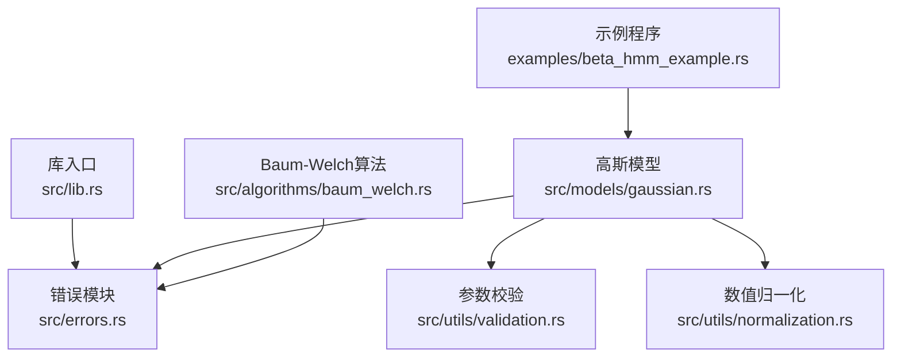
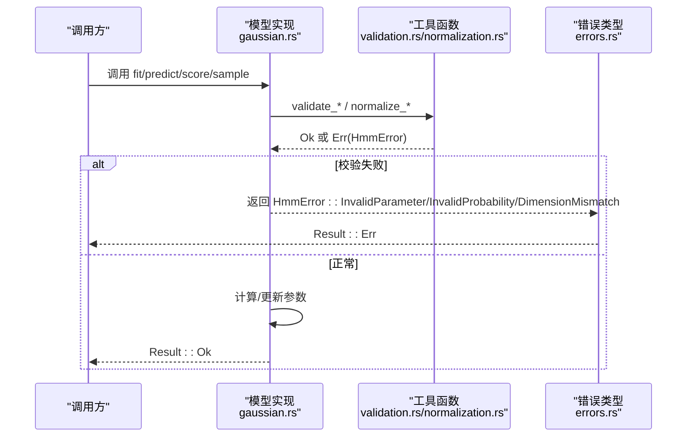
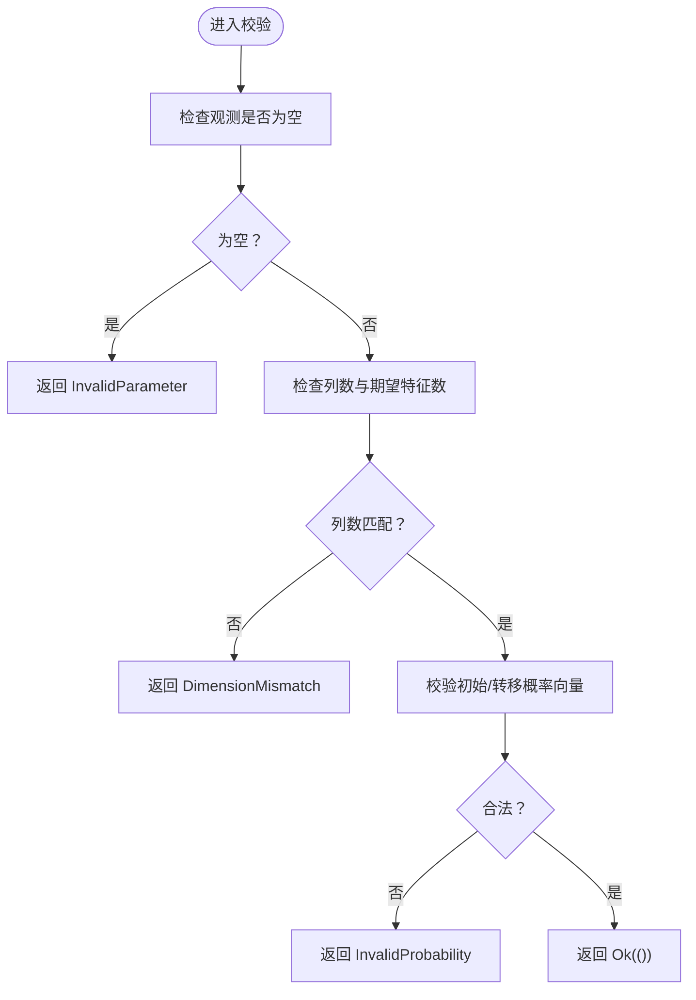
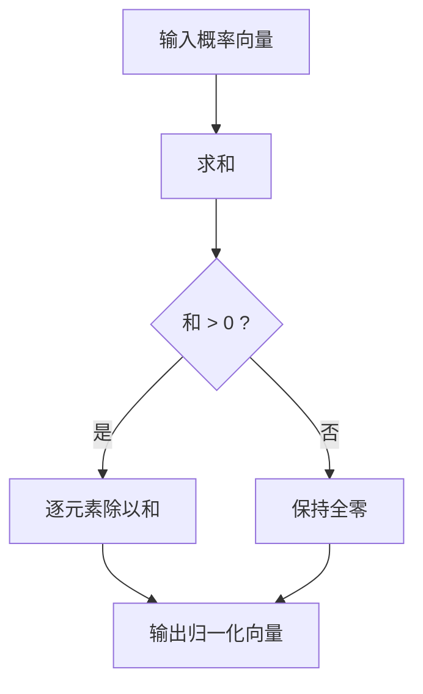
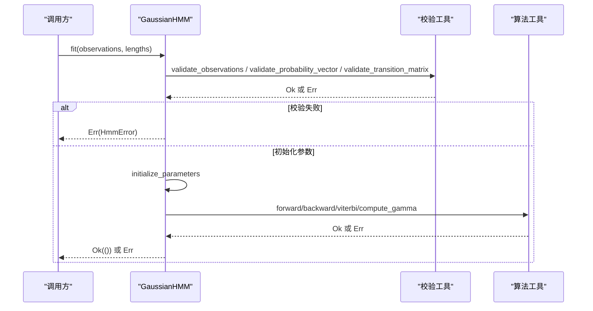
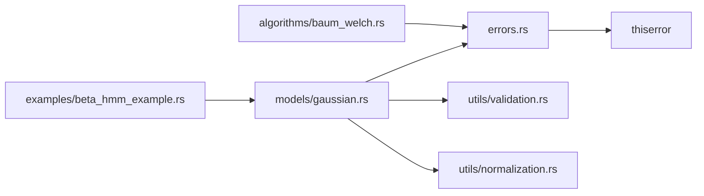

# 错误处理

<cite>
**本文引用的文件**
- [src/errors.rs](file://src/errors.rs)
- [src/lib.rs](file://src/lib.rs)
- [src/utils/validation.rs](file://src/utils/validation.rs)
- [src/utils/normalization.rs](file://src/utils/normalization.rs)
- [src/models/gaussian.rs](file://src/models/gaussian.rs)
- [src/algorithms/baum_welch.rs](file://src/algorithms/baum_welch.rs)
- [Cargo.toml](file://Cargo.toml)
- [examples/beta_hmm_example.rs](file://examples/beta_hmm_example.rs)
</cite>

## 目录
1. [简介](#简介)
2. [项目结构](#项目结构)
3. [核心组件](#核心组件)
4. [架构总览](#架构总览)
5. [详细组件分析](#详细组件分析)
6. [依赖关系分析](#依赖关系分析)
7. [性能考量](#性能考量)
8. [故障排查指南](#故障排查指南)
9. [结论](#结论)
10. [附录](#附录)

## 简介
本文件系统性梳理 rhmm 库的错误处理体系，覆盖错误类型定义、传播策略、恢复机制、与 Rust 类型系统的集成、常见问题与修复方案、调试技巧以及性能优化建议。目标是帮助开发者在训练、推理与采样等流程中高效定位与解决错误，同时保持代码健壮性与可维护性。

## 项目结构
错误处理相关的核心位置如下：
- 错误类型与结果别名：src/errors.rs
- 公共导出入口：src/lib.rs（重新导出 Result 与 HmmError）
- 参数校验工具：src/utils/validation.rs
- 数值归一化与安全转换：src/utils/normalization.rs
- 模型实现中的错误使用点：src/models/gaussian.rs
- 算法模块中的返回类型：src/algorithms/baum_welch.rs
- 示例中错误处理演示：examples/beta_hmm_example.rs
- 依赖声明：Cargo.toml

**图表来源**
- [src/errors.rs](file://src/errors.rs#L1-L105)
- [src/lib.rs](file://src/lib.rs#L19-L28)
- [src/utils/validation.rs](file://src/utils/validation.rs#L1-L141)
- [src/utils/normalization.rs](file://src/utils/normalization.rs#L1-L102)
- [src/models/gaussian.rs](file://src/models/gaussian.rs#L1-L681)
- [src/algorithms/baum_welch.rs](file://src/algorithms/baum_welch.rs#L1-L75)
- [examples/beta_hmm_example.rs](file://examples/beta_hmm_example.rs#L1-L266)

**章节来源**
- [src/errors.rs](file://src/errors.rs#L1-L105)
- [src/lib.rs](file://src/lib.rs#L19-L28)

## 核心组件
- 自定义错误类型：通过 derive(Error) 定义，涵盖参数非法、维度不匹配、概率非法、模型未拟合、收敛失败、状态非法、数值错误以及 IO 错误。
- 结果别名：Result<T> 统一为 std::result::Result<T, HmmError>，便于在各模块直接使用。
- 参数校验：提供概率向量、转移矩阵、观测维度的验证函数，返回 Result<()>。
- 数值稳定性：提供向量/矩阵行归一化、对数概率空间转换等工具，避免数值溢出或下溢。
- 模型层错误传播：在 fit/predict/score/sample 等关键路径上进行前置校验与错误返回。
- 示例展示：示例程序中对 Err 分支进行打印与早退，体现错误处理最佳实践。

**章节来源**
- [src/errors.rs](file://src/errors.rs#L5-L34)
- [src/utils/validation.rs](file://src/utils/validation.rs#L6-L74)
- [src/utils/normalization.rs](file://src/utils/normalization.rs#L5-L35)
- [src/models/gaussian.rs](file://src/models/gaussian.rs#L337-L517)
- [examples/beta_hmm_example.rs](file://examples/beta_hmm_example.rs#L64-L70)

## 架构总览
错误处理贯穿“模型层 → 工具层 → 算法层”的调用链路，形成统一的错误语义与传播路径。

**图表来源**
- [src/models/gaussian.rs](file://src/models/gaussian.rs#L337-L517)
- [src/utils/validation.rs](file://src/utils/validation.rs#L6-L74)
- [src/utils/normalization.rs](file://src/utils/normalization.rs#L5-L35)
- [src/errors.rs](file://src/errors.rs#L9-L34)

## 详细组件分析

### 错误类型与分类
- 数据格式错误
  - 非法参数：InvalidParameter
  - 维度不匹配：DimensionMismatch（携带 expected/actual）
  - 非法概率：InvalidProbability（概率和不为1或越界）
- 数值计算错误
  - 数值错误：NumericalError（如分布初始化失败）
  - 收敛失败：ConvergenceError（迭代收敛检查）
- 模型配置错误
  - 模型未拟合：ModelNotFitted（访问未初始化参数或执行预测/评分/采样）
  - 非法状态：InvalidState（状态索引越界）

这些错误类型均实现 Debug 与 Display，便于日志与测试断言。

**章节来源**
- [src/errors.rs](file://src/errors.rs#L9-L34)

### 参数校验与维度检查
- 概率向量校验：要求和为1且每个元素在[0,1]区间内。
- 转移矩阵校验：必须为方阵，且每行和为1且非负。
- 观测维度校验：禁止空观测；列数需与模型特征数一致。

**图表来源**
- [src/utils/validation.rs](file://src/utils/validation.rs#L58-L74)
- [src/utils/validation.rs](file://src/utils/validation.rs#L6-L26)
- [src/utils/validation.rs](file://src/utils/validation.rs#L28-L56)

**章节来源**
- [src/utils/validation.rs](file://src/utils/validation.rs#L6-L74)

### 数值稳定性与归一化
- 向量/矩阵行归一化：避免概率和不为1导致的后续计算异常。
- 对数概率空间：log_normalize/exp_normalize 提供数值稳定的对数域运算，防止下溢。

**图表来源**
- [src/utils/normalization.rs](file://src/utils/normalization.rs#L5-L23)

**章节来源**
- [src/utils/normalization.rs](file://src/utils/normalization.rs#L5-L35)

### 模型层错误传播策略
- 拟合阶段（fit）：先进行观测合法性检查与参数初始化，再进行 E/M 步迭代；收敛失败时返回 ConvergenceError（当前占位实现返回迭代次数，实际收敛逻辑可扩展）。
- 预测/评分/采样阶段：若模型未拟合，直接返回 ModelNotFitted；若观测维度不匹配，返回 DimensionMismatch。
- 发射概率计算：当模型参数缺失时返回 ModelNotFitted；采样时从外部库创建分布失败时返回 NumericalError。

**图表来源**
- [src/models/gaussian.rs](file://src/models/gaussian.rs#L337-L491)
- [src/utils/validation.rs](file://src/utils/validation.rs#L58-L74)
- [src/algorithms/baum_welch.rs](file://src/algorithms/baum_welch.rs#L25-L44)

**章节来源**
- [src/models/gaussian.rs](file://src/models/gaussian.rs#L337-L517)

### 错误处理与 Rust 类型系统集成
- 使用 Result<T> 作为统一返回类型，结合 ? 操作符进行短路传播，减少嵌套与样板代码。
- 通过 thiserror::Error 实现错误派生与上下文消息格式化，便于调试与日志记录。
- 在公共 API 中 re-export Result 与 HmmError，使调用方无需直接导入错误模块即可使用。

**章节来源**
- [src/errors.rs](file://src/errors.rs#L5-L6)
- [src/lib.rs](file://src/lib.rs#L25-L28)
- [Cargo.toml](file://Cargo.toml#L18)

### 常见错误场景与解决方案
- 观测为空或维度不匹配
  - 现象：fit/predict/score 抛出 InvalidParameter 或 DimensionMismatch。
  - 解决：确保观测矩阵非空且列数等于模型特征数；必要时在调用前进行显式校验。
- 初始/转移概率非法
  - 现象：InvalidProbability（和不为1或含负值/超界）。
  - 解决：使用工具函数 normalize_vector/normalize_matrix_rows 进行归一化；或手动保证概率合法。
- 模型未拟合即使用
  - 现象：ModelNotFitted。
  - 解决：先调用 fit 完成参数估计，再执行 predict/score/sample。
- 数值异常（如分布初始化失败）
  - 现象：NumericalError。
  - 解决：检查输入参数范围与正定性；必要时增加正则项或边界约束。
- 收敛失败
  - 现象：ConvergenceError。
  - 解决：调整容差、最大迭代次数，或检查初始化质量。

**章节来源**
- [src/utils/validation.rs](file://src/utils/validation.rs#L58-L74)
- [src/models/gaussian.rs](file://src/models/gaussian.rs#L337-L517)

### 调试与诊断技巧
- 使用 Debug 输出：在测试或日志中打印错误的 Debug 形式，快速识别错误分支。
- 匹配错误类型：在关键路径上区分不同错误类型，针对性地给出用户提示或自动修复建议。
- 示例程序风格：在示例中对 Err 分支进行 eprintln 并早退，避免继续执行导致二次错误。
- 单元测试覆盖：针对典型错误路径编写测试，确保错误消息与行为稳定。

**章节来源**
- [src/errors.rs](file://src/errors.rs#L36-L104)
- [examples/beta_hmm_example.rs](file://examples/beta_hmm_example.rs#L64-L70)

### 代码模式与最佳实践
- 在函数入口处进行参数与维度校验，尽早失败。
- 将概率与矩阵归一化作为通用工具复用，避免重复逻辑。
- 使用 Result<T> 明确错误传播，配合 ? 操作符简化控制流。
- 对外部库调用（如随机分布）进行包装并转换为 HmmError，统一错误语义。
- 在示例与文档中展示错误处理的正确姿势，降低使用者门槛。

**章节来源**
- [src/utils/validation.rs](file://src/utils/validation.rs#L6-L74)
- [src/utils/normalization.rs](file://src/utils/normalization.rs#L5-L35)
- [src/models/gaussian.rs](file://src/models/gaussian.rs#L579-L606)
- [examples/beta_hmm_example.rs](file://examples/beta_hmm_example.rs#L64-L70)

## 依赖关系分析
- 错误类型依赖 thiserror::Error，提供结构化错误与上下文消息。
- 模块间通过 Result<T> 传递错误，避免异常穿透到调用方。
- 工具层（validation/normalization）为模型层提供基础能力，减少重复校验与数值问题。

**图表来源**
- [src/errors.rs](file://src/errors.rs#L3)
- [Cargo.toml](file://Cargo.toml#L13-L22)
- [src/models/gaussian.rs](file://src/models/gaussian.rs#L1-L10)
- [src/algorithms/baum_welch.rs](file://src/algorithms/baum_welch.rs#L1-L10)

**章节来源**
- [Cargo.toml](file://Cargo.toml#L13-L22)

## 性能考量
- 错误检查成本：在高频路径（如发射概率计算、迭代更新）中尽量减少重复校验，优先在入口处集中校验。
- 归一化开销：对大矩阵行归一化时注意内存与缓存局部性；必要时采用就地操作或分块处理。
- 日志与调试：Debug 输出在生产环境应谨慎使用，避免影响吞吐；可在开发/测试环境下开启详细日志。
- 收敛判断：合理设置容差与最大迭代次数，避免无效迭代；对收敛失败进行早停与回退策略。

[本节为通用指导，不直接分析具体文件]

## 故障排查指南
- 观察错误类型与上下文信息，优先处理参数与维度问题。
- 若出现概率非法，检查归一化步骤与边界条件。
- 若模型未拟合，确认是否已成功完成 fit 流程。
- 若采样阶段报数值错误，检查协方差与分布参数范围。
- 使用单元测试与示例程序对照，快速定位问题发生点。

**章节来源**
- [src/utils/validation.rs](file://src/utils/validation.rs#L76-L140)
- [src/models/gaussian.rs](file://src/models/gaussian.rs#L614-L680)
- [examples/beta_hmm_example.rs](file://examples/beta_hmm_example.rs#L154-L173)

## 结论
rhmm 的错误处理体系以统一的 Result<T> 与 HmmError 为核心，结合参数校验与数值稳定性工具，在模型层实现了清晰、可维护且高性能的错误传播与恢复机制。遵循本文提供的模式与最佳实践，开发者可以更稳健地构建基于 HMM 的应用，并在出现问题时快速定位与修复。

## 附录
- 关键实现参考路径
  - 错误类型与别名：[src/errors.rs](file://src/errors.rs#L5-L34)
  - 参数校验函数：[src/utils/validation.rs](file://src/utils/validation.rs#L6-L74)
  - 归一化与对数空间：[src/utils/normalization.rs](file://src/utils/normalization.rs#L5-L35)
  - 模型错误传播：[src/models/gaussian.rs](file://src/models/gaussian.rs#L337-L517)
  - 算法返回类型：[src/algorithms/baum_welch.rs](file://src/algorithms/baum_welch.rs#L25-L44)
  - 示例错误处理：[examples/beta_hmm_example.rs](file://examples/beta_hmm_example.rs#L64-L70)