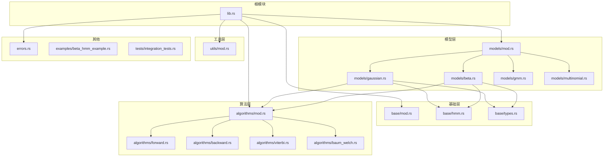
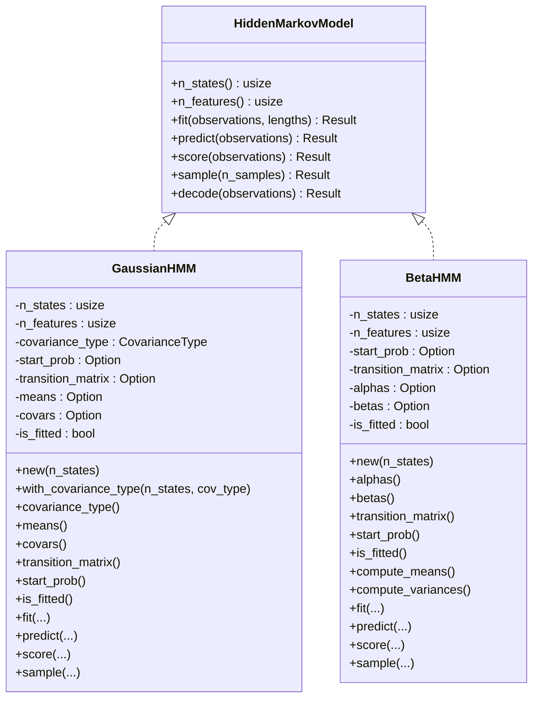
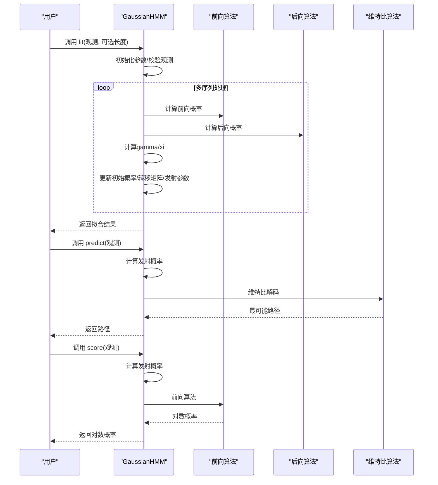
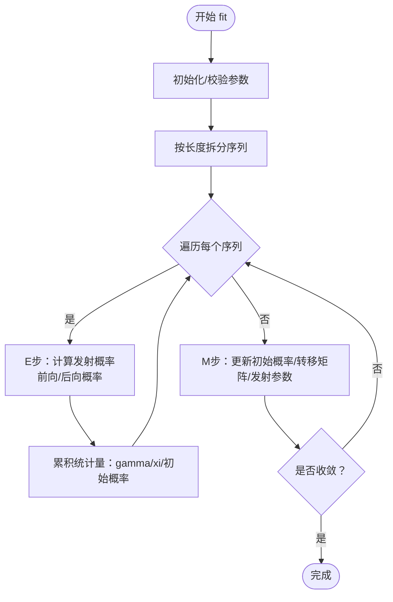
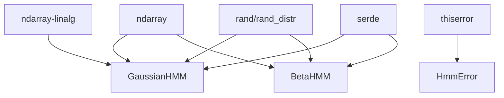

# 项目概述

<cite>
**本文引用的文件**
- [README.md](file://README.md)
- [Cargo.toml](file://Cargo.toml)
- [src/lib.rs](file://src/lib.rs)
- [src/base/mod.rs](file://src/base/mod.rs)
- [src/base/hmm.rs](file://src/base/hmm.rs)
- [src/base/types.rs](file://src/base/types.rs)
- [src/models/mod.rs](file://src/models/mod.rs)
- [src/models/gaussian.rs](file://src/models/gaussian.rs)
- [src/models/beta.rs](file://src/models/beta.rs)
- [src/algorithms/mod.rs](file://src/algorithms/mod.rs)
- [src/algorithms/forward.rs](file://src/algorithms/forward.rs)
- [src/algorithms/backward.rs](file://src/algorithms/backward.rs)
- [src/algorithms/viterbi.rs](file://src/algorithms/viterbi.rs)
- [src/algorithms/baum_welch.rs](file://src/algorithms/baum_welch.rs)
- [src/utils/mod.rs](file://src/utils/mod.rs)
- [src/errors.rs](file://src/errors.rs)
- [examples/beta_hmm_example.rs](file://examples/beta_hmm_example.rs)
- [tests/integration_tests.rs](file://tests/integration_tests.rs)
</cite>

## 目录
1. [引言](#引言)
2. [项目结构](#项目结构)
3. [核心组件](#核心组件)
4. [架构总览](#架构总览)
5. [详细组件分析](#详细组件分析)
6. [依赖关系分析](#依赖关系分析)
7. [性能考量](#性能考量)
8. [故障排查指南](#故障排查指南)
9. [结论](#结论)
10. [附录](#附录)

## 引言
rhmm 是一个用 Rust 实现的隐马尔可夫模型（HMM）库，灵感来源于 Python 的 hmmlearn。它提供了高效且数值稳定的 HMM 实现，专注于以下目标：
- 提供多种 HMM 模型类型：高斯 HMM、贝塔 HMM、多项式 HMM（开发中）、高斯混合模型 HMM（GMM-HMM，开发中）
- 提供标准 HMM 算法：前向算法、后向算法、维特比算法、Baum-Welch 算法
- 基于 ndarray 的高性能数值计算与良好的内存效率
- 通过 trait 抽象统一模型接口，支持多态扩展与组合

本库适合需要在 Rust 生态中进行统计建模、时间序列状态推断与参数估计的场景，如语音识别、金融状态检测、传感器数据分析、转化率建模等。

## 项目结构
仓库采用按职责分层的模块化组织方式：
- 根模块导出：lib.rs 统一 re-export 常用类型与 trait
- 基础层：base 模块定义核心 trait 与通用类型别名
- 模型层：models 模块包含具体模型实现（高斯、贝塔、GMM、多项式）
- 算法层：algorithms 模块封装前向、后向、维特比、Baum-Welch 等算法
- 工具层：utils 模块提供归一化、采样、序列处理与校验工具
- 错误层：errors 定义统一错误类型与 Result 类型别名
- 示例与测试：examples 展示典型用法；tests 提供集成测试

图表来源
- [src/lib.rs](file://src/lib.rs#L1-L28)
- [src/base/mod.rs](file://src/base/mod.rs#L1-L8)
- [src/models/mod.rs](file://src/models/mod.rs#L1-L12)
- [src/algorithms/mod.rs](file://src/algorithms/mod.rs#L1-L12)
- [src/utils/mod.rs](file://src/utils/mod.rs#L1-L12)

章节来源
- [src/lib.rs](file://src/lib.rs#L1-L28)
- [src/base/mod.rs](file://src/base/mod.rs#L1-L8)
- [src/models/mod.rs](file://src/models/mod.rs#L1-L12)
- [src/algorithms/mod.rs](file://src/algorithms/mod.rs#L1-L12)
- [src/utils/mod.rs](file://src/utils/mod.rs#L1-L12)

## 核心组件
- 核心 trait：HiddenMarkovModel 定义了所有 HMM 模型必须实现的标准方法族，包括拟合、预测（维特比）、评分（对数概率）、采样与解码（同时返回对数概率与路径）。
- 通用类型别名：为转移矩阵、初始概率、观测序列与状态序列提供清晰的类型别名，提升可读性与一致性。
- 协方差类型枚举：CovarianceType 支持 Full、Diagonal、Spherical、Tied，用于高斯 HMM 的协方差建模。
- 错误体系：HmmError 使用 thiserror 提供一致的错误表示，覆盖参数无效、维度不匹配、模型未拟合、收敛失败、数值错误等场景。

章节来源
- [src/base/hmm.rs](file://src/base/hmm.rs#L1-L62)
- [src/base/types.rs](file://src/base/types.rs#L1-L61)
- [src/errors.rs](file://src/errors.rs#L1-L105)

## 架构总览
rhmm 的架构以“trait 抽象 + 模块化实现”为核心设计原则：
- 抽象层：通过 HiddenMarkovModel trait 将不同模型统一到同一接口，便于替换与扩展
- 算法层：独立的算法模块提供前向、后向、维特比、Baum-Welch 等通用能力，被各模型复用
- 模型层：各模型实现具体的发射分布与参数更新策略，但共享相同的训练与推理流程
- 工具层：提供序列切分、概率向量校验、数组归一化等通用工具，支撑训练稳定性
- 错误层：集中处理输入校验、数值稳定与运行时异常，保证健壮性

图表来源
- [src/base/hmm.rs](file://src/base/hmm.rs#L1-L62)
- [src/models/gaussian.rs](file://src/models/gaussian.rs#L1-L681)
- [src/models/beta.rs](file://src/models/beta.rs#L1-L734)
- [src/base/types.rs](file://src/base/types.rs#L1-L61)

## 详细组件分析

### 隐藏马尔可夫模型核心接口
- 方法职责
  - n_states/n_features：查询模型规模
  - fit：训练模型（支持单序列或多序列拼接，长度可选）
  - predict：维特比解码，返回最可能的状态序列
  - score：计算对数似然
  - sample：从已拟合模型生成观测与状态
  - decode：同时返回对数概率与路径
- 设计要点
  - 所有方法均返回 Result，确保错误传播一致
  - 对观测维度进行严格校验，避免运行时维度不匹配

章节来源
- [src/base/hmm.rs](file://src/base/hmm.rs#L1-L62)

### 高斯 HMM（GaussianHMM）
- 发射分布：高斯分布，支持多种协方差类型（全、对角、球面、绑定）
- 训练流程：基于 Baum-Welch 的 E/M 步迭代，使用前向/后向算法计算期望
- 关键实现点
  - 参数初始化：基于数据方差与随机选择观测初始化均值与协方差
  - 发射概率：根据协方差类型选择不同的密度函数实现
  - 更新规则：基于状态占用概率 gamma 与转移概率 xi 更新初始概率、转移矩阵与发射参数
  - 数值稳定：log 概率域计算，避免下溢

图表来源
- [src/models/gaussian.rs](file://src/models/gaussian.rs#L337-L491)
- [src/algorithms/forward.rs](file://src/algorithms/forward.rs#L20-L47)
- [src/algorithms/backward.rs](file://src/algorithms/backward.rs)
- [src/algorithms/viterbi.rs](file://src/algorithms/viterbi.rs#L20-L74)

章节来源
- [src/models/gaussian.rs](file://src/models/gaussian.rs#L1-L681)

### 贝塔 HMM（BetaHMM）
- 发射分布：贝塔分布，适用于 [0,1] 区间的比例或比率数据（如转化率、份额）
- 训练流程：与高斯 HMM 类似的 Baum-Welch 流程，但发射概率由贝塔 PDF 计算
- 关键实现点
  - 参数初始化：基于各状态样本的均值与方差，通过矩估计转换为 α/β 参数
  - 发射概率：对每个特征使用对数贝塔 PDF 并求乘积
  - 更新规则：基于加权矩估计更新 α/β 参数

图表来源
- [src/models/beta.rs](file://src/models/beta.rs#L393-L547)
- [src/algorithms/forward.rs](file://src/algorithms/forward.rs#L20-L47)
- [src/algorithms/backward.rs](file://src/algorithms/backward.rs)
- [src/algorithms/baum_welch.rs](file://src/algorithms/baum_welch.rs)

章节来源
- [src/models/beta.rs](file://src/models/beta.rs#L1-L734)

### 算法模块（前向/后向/维特比/Baum-Welch）
- 前向算法：计算前向概率矩阵，用于概率与期望统计
- 后向算法：计算后向概率矩阵，配合前向得到期望统计量
- 维特比算法：在 log 概率域进行动态规划，回溯最优路径
- Baum-Welch：EM 迭代框架，结合前向/后向计算 gamma/xi 并更新参数

章节来源
- [src/algorithms/forward.rs](file://src/algorithms/forward.rs#L1-L129)
- [src/algorithms/viterbi.rs](file://src/algorithms/viterbi.rs#L1-L118)
- [src/algorithms/baum_welch.rs](file://src/algorithms/baum_welch.rs)

### 工具与验证
- 序列处理：支持多序列拼接与长度切分，确保跨序列边界不越界
- 概率校验：校验初始概率与转移矩阵的合法范围
- 归一化：提供向量归一化工具，保障概率分布有效性
- 采样：为各模型提供从已拟合分布采样的能力

章节来源
- [src/utils/mod.rs](file://src/utils/mod.rs#L1-L12)
- [src/models/gaussian.rs](file://src/models/gaussian.rs#L351-L356)
- [src/models/beta.rs](file://src/models/beta.rs#L408-L412)

### 错误处理
- 统一错误类型：InvalidParameter、DimensionMismatch、InvalidProbability、ModelNotFitted、ConvergenceError、InvalidState、NumericalError、IoError
- 结果类型别名：Result<T> = Result<T, HmmError>
- 在模型调用链中贯穿错误传播，便于定位问题

章节来源
- [src/errors.rs](file://src/errors.rs#L1-L105)

## 依赖关系分析
- 外部依赖
  - ndarray：N 维数组，提供高性能数值计算
  - ndarray-linalg：线性代数运算（高斯模型中用于协方差相关操作）
  - rand/rand_distr：随机数生成与概率分布采样
  - thiserror：错误类型派生宏
  - serde：序列化支持（可选特性）
- 内部耦合
  - 模型实现依赖算法模块与基础类型
  - 训练流程统一走 Baum-Welch，E/M 步细节由各模型实现
  - 工具模块被广泛复用，降低重复与提高一致性

图表来源
- [Cargo.toml](file://Cargo.toml#L13-L19)
- [src/models/gaussian.rs](file://src/models/gaussian.rs#L1-L10)
- [src/models/beta.rs](file://src/models/beta.rs#L1-L12)
- [src/errors.rs](file://src/errors.rs#L1-L105)

章节来源
- [Cargo.toml](file://Cargo.toml#L1-L23)

## 性能考量
- ndarray 驱动的向量化计算与内存布局优化，减少分配与拷贝
- log 概率域计算，避免数值下溢
- 多序列训练时按序列独立处理，避免跨序列统计交叉
- 高斯模型的协方差类型选择影响计算复杂度与内存占用（全/对角/球面/绑定）
- 通过最小化热路径上的分配与循环展开提升吞吐

章节来源
- [README.md](file://README.md#L222-L229)
- [src/models/gaussian.rs](file://src/models/gaussian.rs#L383-L491)
- [src/models/beta.rs](file://src/models/beta.rs#L439-L547)

## 故障排查指南
- 模型未拟合即预测/评分：检查 fit 是否成功执行
- 观测维度不匹配：确认 n_features 与观测列数一致
- 空观测或空列：fit 会拒绝零行或零列输入
- 收敛失败：调整迭代次数、容差或初始化参数
- 数值错误：检查协方差正定性、参数范围与对数变换稳定性

章节来源
- [src/models/gaussian.rs](file://src/models/gaussian.rs#L494-L544)
- [src/models/beta.rs](file://src/models/beta.rs#L549-L599)
- [src/errors.rs](file://src/errors.rs#L1-L105)
- [tests/integration_tests.rs](file://tests/integration_tests.rs#L88-L102)

## 结论
rhmm 通过清晰的 trait 抽象、模块化的算法与模型实现、完善的错误处理与高性能数值库支持，为 Rust 生态提供了实用且可扩展的 HMM 能力。其多模型类型与标准算法组合，使其能够覆盖从连续观测到比例数据的广泛场景，并具备良好的工程化落地潜力。

## 附录

### 快速开始
- 安装与依赖
  - 通过 Cargo 添加依赖或从源码构建
  - 依赖包括 ndarray、ndarray-linalg、rand、rand_distr、thiserror、serde
- 基本用法
  - 高斯 HMM：创建模型、拟合并预测状态、计算对数概率、从模型采样
  - 贝塔 HMM：适合 [0,1] 比例数据，如转化率；同样支持拟合、预测、评分与采样
- 多序列训练
  - 通过 lengths 参数指定各序列长度，实现跨序列训练
- 高级用法
  - 高斯模型协方差类型选择（对角/球面/全/绑定）
  - 自定义初始化参数（在 fit 前设置初始概率与转移矩阵）

章节来源
- [README.md](file://README.md#L27-L303)
- [examples/beta_hmm_example.rs](file://examples/beta_hmm_example.rs#L1-L266)
- [tests/integration_tests.rs](file://tests/integration_tests.rs#L1-L103)